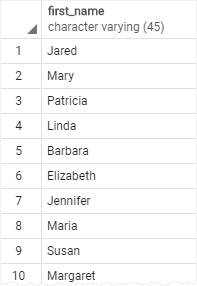

# SELECT

Keling, bitta jadvaldan ma'lumotlarni oladigan  `SELECT` bayonotining asosiy shaklidan boshlaylik .

Quyida bayonning sintaksisi tasvirlangan SELECT:

```sql
SELECT
    select_list
FROM
    table_name;
```

Keling, `SELECT` bayonotini batafsil ko'rib chiqaylik :

Birinchidan, ma'lumotlarni olmoqchi bo'lgan jadvaldagi ustun yoki ustunlar ro'yxati bo'lishi mumkin bo'lgan tanlangan ro'yxatni belgilang. Agar siz ustunlar ro'yxatini belgilasangiz, ularni `ajratish uchun` ikkita ustun orasiga vergul `(,)` qo'yishingiz kerak. Jadvalning barcha ustunlaridan ma'lumotlarni tanlashni istasangiz, `barcha ustun nomlari`ni ko'rsatish o'rniga yulduzcha `(*)` stenografiyasidan foydalanishingiz mumkin.<br>Tanlangan roʻyxatda ifodalar yoki harf qiymatlari ham boʻlishi mumkin.

Ikkinchidan, `FROM` kalit so'zdan keyin ma'lumotlarni so'ramoqchi bo'lgan jadval nomini belgilang.
`FROM` bandi ixtiyoriy. Agar biron bir jadvaldan ma'lumotlarni so'ramasangiz, `SELECT` bayonotdagi `FROM` bandni o'tkazib yuborishingiz mumkin .

PostgreSQL `SELECT` bayonotdagi `SELECT` banddan `FROM` oldingi bandni baholaydi:


> E'tibor bering, SQL kalit so'zlari katta-kichik harflarni sezmaydi. Bu yoki `SELECT` ga `select` yoki `Select` ekvivalent ekanligini bildiradi . An'anaga ko'ra, biz so'rovlarni o'qishni osonlashtirish uchun barcha SQL kalit so'zlarini `katta` harflar bilan ishlatamiz.

## PostgreSQL SELECT examples

Keling, PostgreSQL `SELECT` bayonotidan foydalanishning ba'zi misollarini ko'rib chiqaylik .

Namoyish uchun quyidagi [namunaviy](https://www.postgresqltutorial.com/wp-content/uploads/2019/05/dvdrental.zip) ma'lumotlar bazasida `customer` jadvalidan  foydalanamiz.


### 1. Bitta ustun misolidagi ma'lumotlarni so'rash uchun PostgreSQL SELECT bayonotidan foydalanish
Ushbu misol mijozlar jadvalidagi barcha mijozlarning ismlarini topish uchun `SELECT` iborasidan foydalanadi:
```sql
SELECT first_name FROM customer;
```


> E'tibor bering, biz `SELECT` bayonot oxirida nuqta-vergul (;) qo'yganmiz . Nuqtali vergul SQL iborasining bir qismi emas. U PostgreSQL-ga SQL bayonotining oxiri haqida signal berish uchun ishlatiladi. Nuqtali vergul ikkita SQL bayonotini ajratish uchun ham ishlatiladi.

### 2. Bir nechta ustunlar misolidan ma'lumotlarni so'rash uchun PostgreSQL SELECT bayonotidan foydalanish

Aytaylik, siz faqat mijozlarning ismi, familiyasi va elektron pochta manzilini bilmoqchi bo'lsangiz, quyidagi so'rovda ko'rsatilganidek, ushbu ustun nomlarini `SELECT` bandda belgilashingiz mumkin:

```sql
SELECT
   first_name,
   last_name,
   email
FROM
   customer;
```


### 3. Jadval misolining barcha ustunlaridan ma'lumotlarni so'rash uchun PostgreSQL SELECT bayonotidan foydalanish
Quyidagi so'rov jadvalning barcha ustunlaridan ma'lumotlarni tanlash uchun `SELECT` bayonotdan foydalanadi customer:

```sql
SELECT * FROM customer;
```


Ushbu misolda biz barcha ustunlar uchun stenografiya bo'lgan SELECT bandda yulduzcha (\*)dan foydalandik.
Biz `SELECT` banddagi barcha ustunlarni sanab o'tish o'rniga, biroz yozishni saqlash uchun yulduzcha (*) dan foydalandik .

Biroq, quyidagi sabablarga ko'ra `Go`, `Python` , `Java` , `Node.js` yoki `PHP` kabi dastur kodiga SQL iboralarini joylashtirganingizda `SELECT` bayonotda yulduzcha (\*) dan foydalanish yaxshi amaliyot emas:

1. Ma'lumotlar bazasining ishlashi. Faraz qilaylik, sizda ko'p ustunli va juda ko'p ma'lumotlardan iborat jadval mavjud bo'lsa, yulduzcha (\*) stenografiyasi mavjud bo'lgan SELECT bayonot jadvalning barcha ustunlaridan ma'lumotlarni tanlaydi, bu dastur uchun kerak bo'lmasligi mumkin.

2. Ilovaning ishlashi. Ma'lumotlar bazasidan keraksiz ma'lumotlarni olish ma'lumotlar bazasi serveri va dastur serveri o'rtasidagi trafikni oshiradi. Natijada, ilovalaringiz javob berishda sekinroq va kamroq kengaytirilishi mumkin.

Shu sabablarga ko'ra, ma'lumotlar bazasidan faqat kerakli ma'lumotlarni olish uchun imkon qadar `SELECT` banddagi ustun nomlarini aniq ko'rsatish yaxshi amaliyotdir.
Va faqat ma'lumotlar bazasidan ma'lumotlarni tekshiradigan maxsus so'rovlar uchun yulduzcha (\*) stenografiyasidan foydalaning.

### 4. PostgreSQL SELECT iborasini ifodalar misoli bilan ishlatish

Quyidagi misolda barcha mijozlarning to'liq ismlari va elektron pochta xabarlarini qaytarish uchun `SELECT` bayonot ishlatiladi:

```sql
SELECT 
   first_name || ' ' || last_name,
   email
FROM 
   customer;
```


Ushbu misolda biz har bir mijozning ismini, bo'sh joyini va familiyasini birlashtirish uchun `"||"` birlashtiruvchi operatordan foydalandik. 

Keyingi o'quv qo'llanmada iboralarni yanada mazmunli nomlar bilan belgilash uchun `ustun taxalluslaridan` qanday foydalanishni bilib olasiz.

### 5. PostgreSQL SELECT iborasidan misollar bilan foydalanish

Quyidagi misolda `SELECT` ifoda bilan ifodalangan. U quyidagi `FROM` bandni o'tkazib yuboradi:

```sql
SELECT 5 * 3;
```


Ushbu qo'llanmada siz bitta jadvaldan ma'lumotlarni so'rash uchun PostgreSQL `SELECT` bayonotining asosiy shaklidan qanday foydalanishni o'rgandingiz.