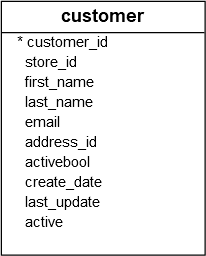
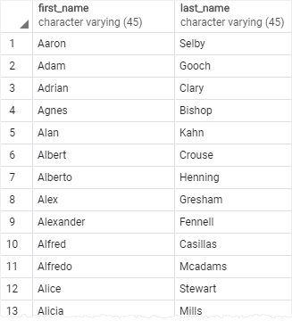
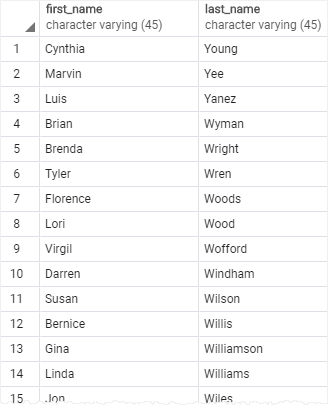
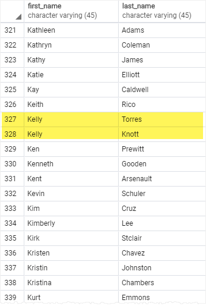
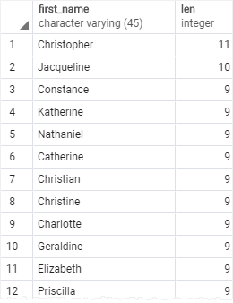
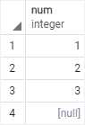
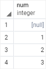
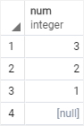

# ORDER BY
Ushbu qo'llanmada PostgreSQL `ORDER BY` bandidan foydalanib, `SELECT` bayonotdan  qaytarilgan natijalar to'plamini qanday saralashni o'rganasiz.

Jadvaldan ma'lumotlarni so'raganingizda, `SELECT` bayonot aniqlanmagan tartibda qatorlarni qaytaradi. Natijalar to'plamining qatorlarini saralash uchun siz `SELECT` bayonotdagi `ORDER BY` banddan foydalanasiz .

Ushbu `ORDER BY` band sizga  `SELECT` band tomonidan qaytarilgan qatorlarni tartiblash ifodasi asosida `o'sish` yoki `kamayish` tartibida  tartiblash imkonini beradi .

Quyida `ORDER BY` bandning sintaksisi tasvirlangan :

```sql
SELECT
	select_list
FROM
	table_name
ORDER BY
	sort_expression1 [ASC | DESC],
        ...
	sort_expressionN [ASC | DESC];
```

Ushbu sintaksisda:

* Birinchidan, `ORDER BY` kalit so'zlardan keyin saralashni xohlagan ustun yoki ifoda bo'lishi mumkin bo'lgan tartiblash ifodasini belgilang . Agar siz natijalar to'plamini bir nechta ustunlar yoki iboralar asosida saralashni istasangiz, ularni ajratish uchun ikkita ustun yoki iboralar orasiga vergul (`,`) qo'yishingiz kerak .

* Ikkinchidan, siz satrlarni `ASC` o'sish tartibida va satrlarni `DESC` kamayish tartibida saralash opsiyasidan foydalanasiz. Agar `ASC yoki DESC` variantini o'tkazib yuborsangiz, sukut bo'yicha `ORDER BY ASC` foydalanadi.

`PostgreSQL SELECT` bayonotdagi `FROM, SELECT va ORDER BY` bandlarni quyidagi tartibda baholaydi:


Baholash tartibidan kelib chiqib, `SELECT` bandda ustun taxallus mavjud bo'lsa , uni `ORDER BY` bandda ishlatishingiz mumkin.

Keling, PostgreSQL `ORDER BY` bandidan foydalanishga misollar keltiraylik.

## PostgreSQL `ORDER BY` misollari

Namoyish uchun quyidagi [namunaviy](https://www.postgresqltutorial.com/wp-content/uploads/2019/05/dvdrental.zip) ma'lumotlar bazasida `customer` jadvalidan  foydalanamiz.



## 1. Satrlarni `bitta ustun` bo'yicha saralash uchun PostgreSQL `ORDER BY` bandidan foydalanish

Quyidagi so'rov mijozlarni ismlari bo'yicha o'sish tartibida saralash uchun `ORDER BY` banddan foydalanadi:

```sql
SELECT
	first_name,
	last_name
FROM
	customer
ORDER BY
	first_name ASC;
```



`ASC` opsiyasi sukut bo'lgani uchun siz uni `ORDER BY` bandida quyidagi kabi o'tkazib yuborishingiz mumkin:

```sql
SELECT
	first_name,
	last_name
FROM
	customer
ORDER BY
	first_name;
```

## 2. Satrlarni `kamayish` bo'yicha `bitta ustun` bo'yicha tartiblash uchun PostgreSQL `ORDER BY` bandidan foydalanish
Quyidagi bayonot customer jadvaldan ism va familiyani tanlaydi va satrlarni familiya ustunidagi qiymatlar bo'yicha kamayish tartibida tartiblaydi:

```sql
SELECT
       first_name,
       last_name
FROM
       customer
ORDER BY
       last_name DESC;
```



## 3. Satrlarni bir nechta ustunlar bo'yicha saralash uchun PostgreSQL ORDER BY bandidan foydalanish

Quyidagi bayonot mijozlar jadvalidan ism va familiyani tanlaydi va qatorlarni ism va familiya bo'yicha o'sish tartibida va kamayish tartibida tartiblaydi:

```sql
SELECT
	first_name,
	last_name
FROM
	customer
ORDER BY
	first_name ASC,
	last_name DESC;
```


Bu misolda `ORDER BY` bandi satrlarni `first_name` ustunidagi qiymatlar bo'yicha tartiblaydi. Va keyin `last_name` ustunidagi qiymatlar bo'yicha tartiblangan qatorlarni saralaydi.

Natijadan aniq ko'rinib turibdiki, bir xil `Kellyf` ismli ikkita mijozning familiyasi kamayish tartibida tartiblangan.

## 4. Satrlarni `ifodalar` bo'yicha saralash uchun PostgreSQL `ORDER BY` bandidan foydalanish

`LENGTH()` funktsiyasi satrni qabul qiladi va ushbu satr uzunligini qaytaradi.

Quyidagi bayonotda birinchi ismlar va ularning uzunligi tanlanadi. U qatorlarni birinchi nomlarning uzunligi bo'yicha tartiblaydi:

```sql
SELECT 
	first_name,
	LENGTH(first_name) len
FROM
	customer
ORDER BY 
	len DESC;
```



`ORDER BY` `SELECT` banddan keyin baholanganligi sababli , ustun taxallus `len` mavjud va u `ORDER BY` bandda ishlatilishi mumkin.

## PostgreSQL `ORDER BY` band va `NULL`

Ma'lumotlar bazasi dunyosida `NULL` yetishmayotgan ma'lumotlarni ko'rsatadigan yoki yozib olish vaqtida ma'lumotlar noma'lum bo'lgan marker.

`NULL`ni o'z ichiga olgan qatorlarni saralaganingizda, ORDER BY bandining `NULLS FIRST` yoki `NULLS LAST` opsiyasidan foydalanib, boshqa `null` bo'lmagan qiymatlar bilan `NULL` tartibini belgilashingiz mumkin:

```sql 
ORDER BY sort_expresssion [ASC | DESC] [NULLS FIRST | NULLS LAST]
```

`NULLS FIRST` bandi boshqa `NULL` null bo'lmagan qiymatlardan oldin va  `NULL LAST` parametr boshqa `NULL` null bo'lmagan qiymatlardan keyin joylashadi.

Keling, namoyish uchun jadval tuzamiz .

```sql
-- create a new table
CREATE TABLE sort_demo(
	num INT
);

-- insert some data
INSERT INTO sort_demo(num)
VALUES(1),(2),(3),(null);
```

> E'tibor bering, siz `CREATE TABLE` va `INSERT` bayonotlarini tushunishingiz shart emas. Siz shunchaki uni bajarishingiz `pgAdmin` yoki `psql` orqali `sort_demo` jadval yaratishingiz va unga ma'lumotlarni kiritishingiz kerak.

Quyidagi so'rov `sort_demo` jadvaldan ma'lumotlarni qaytaradi :

```sql
SELECT num
FROM sort_demo
ORDER BY num;
```



Ushbu misolda, ORDER BY band `sort_demo` jadval `num` ustunidagi qiymatlarni o'sish tartibida tartiblaydi. U boshqa `NULL` qiymatlardan keyin joylashadi.

Shunday qilib, agar siz `ASC` variantdan foydalansangiz,`ORDER BY` band sukut bo'yicha `NULLS LAST` variantdan foydalanadi. Shunday qilib, quyidagi so'rov bir xil natijani qaytaradi:

```sql
SELECT num
FROM sort_demo
ORDER BY num NULLS LAST;
```

`NULL` boshqa `null` bo'lmagan qiymatlardan oldin joylashtirish uchun siz quyidagi `NULLS FIRST` parametrdan foydalanasiz:

```sql
SELECT num
FROM sort_demo
ORDER BY num NULLS FIRST;
```



Quyidagi bayonot `sort_demo` jadval `num` ustunidagi qiymatlarni kamayish tartibida tartiblaydi:

```sql
SELECT num
FROM sort_demo
ORDER BY num DESC;
```

Chiqarishdan aniq ko'rinib turibdiki, `DESC` parametrli `ORDER BY` band sukut bo'yicha `NULLS FIRST` foydalanadi .

`ORDER BY` bekor qilish uchun siz quyidagi `NULLS LAST` variantdan foydalanishingiz mumkin:

```sql
SELECT num
FROM sort_demo
ORDER BY num DESC NULLS LAST;
```



## Xulosa
* Satrlarni saralash uchun `SELECT` bayonotdagi `ORDER BY` banddan foydalaning.
* Satrlarni o'sish tartibida `ASC` va satrlarni kamayish tartibida `DESC` saralash opsiyasidan foydalaning. Ushbu band sukut bo'yicha `ORDER BY ASC` variantdan foydalanadi .
* Boshqa null bo'lmagan qiymatlar bilan `NULL` tartibni aniq belgilash uchun `NULLS FIRST` va `NULLS LAST` parametrlaridan foydalaning. 

