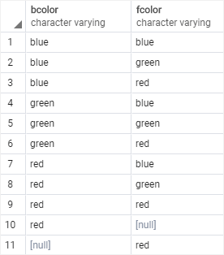

# SELECT DISTINCT

Ushbu qo'llanmada siz so'rov orqali qaytarilgan natijalar to'plamidan takroriy qatorlarni olib tashlash uchun PostgreSQL `SELECT DISTINCT` bandidan qanday foydalanishni o'rganasiz.

Natijalar to'plamidan takroriy qatorlarni olib tashlash uchun `SELECT` bandida `DISTINCT` ishlatiladi. Ushbu `DISTINCT` bandi har bir takroriy guruh uchun bitta qatorni saqlaydi, tanlangan ro'yxatidagi bir yoki bir nechta ustunlarga qo'llanilishi mumkin.

Quyida `DISTINCT` bandning sintaksisi tasvirlangan:

```sql
SELECT
   DISTINCT column1
FROM
   table_name;
```

Ushbu bayonotda ustundagi qiymatlar `column1` dublikatni baholash uchun ishlatiladi.

Agar siz bir nechta ustunlarni belgilasangiz, `DISTINCT` band ushbu ustunlar qiymatlarining kombinatsiyasi asosida dublikatni baholaydi.

```sql
SELECT
   DISTINCT column1, column2
FROM
   table_name;
```

Bunday holda, ikki nusxadagi qiymatlarni baholash uchun ikkala column1 va column2 ustunlardagi qiymatlar kombinatsiyasi qo'llaniladi.

PostgreSQL shuningdek, `DISTINCT ON (expression)` quyidagi sintaksisdan foydalangan holda har bir dublikat guruhining `"birinchi"` qatorini saqlashni ta'minlaydi:

```sql
SELECT
   DISTINCT ON (column1) column_alias,
   column2
FROM
   table_name
ORDER BY
   column1,
   column2;
```

`SELECT` bayonotdan qaytarilgan qatorlar tartibi aniqlanmagan, shuning uchun dublikatning har bir guruhining `"birinchi"` qatori ham aniqlanmagan.

`DISTINCT ON(expression)` natijalar to'plamini bashorat qilish uchun har doim `ORDER BY` banddan foydalanish yaxshi amaliyotdir .

E'tibor bering, `DISTINCT ON` ifodasi `ORDER BY` bandidagi eng chap ifodaga mos kelishi kerak.

## PostgreSQL `SELECT DISTINCT` misollari

Keling, `distinct_demo` yangi jadval yaratamiz va  unga `DISTINCT` bandni mashq qilish uchun  ma'lumotlarni kiritamiz.

> E'tibor bering, siz keyingi qo'llanmada jadval yaratish va jadvalga ma'lumotlarni kiritishni o'rganasiz. Ushbu qo'llanmada siz bayonotlarni bajarish uchun `psql` yoki `pgAdmin`da faqat bayonotni bajarasiz.

Birinchidan, `id, bcolor, fcolor` uchta ustundan iborat `distinct_demo` jadval yaratish uchun  quyidagi `CREATE TABLE` bayonotdan foydalaning:

```sql
CREATE TABLE distinct_demo (
	id serial NOT NULL PRIMARY KEY,
	bcolor VARCHAR,
	fcolor VARCHAR
);
```

Ikkinchidan, quyidagi `INSERT` ibora yordamida `distinct_demo` jadvalga bir nechta qatorlarni kiriting :

```sql
INSERT INTO distinct_demo (bcolor, fcolor)
VALUES
	('red', 'red'),
	('red', 'red'),
	('red', NULL),
	(NULL, 'red'),
	('red', 'green'),
	('red', 'blue'),
	('green', 'red'),
	('green', 'blue'),
	('green', 'green'),
	('blue', 'red'),
	('blue', 'green'),
	('blue', 'blue');
```

Uchinchidan, `SELECT` bayonot yordamida `distinct_demo` jadvaldagi ma'lumotlarni so'rang:

```sql
SELECT
	id,
	bcolor,
	fcolor
FROM
	distinct_demo ;
```


## PostgreSQL `DISTINCT` `bitta` ustunli misol

Quyidagi bayonot t1 jadvaldagi bcolor ustundagi noyob qiymatlarni tanlaydi va natija to'plamini ORDER BY banddan foydalangan holda alifbo tartibida tartiblaydi .

```sql
SELECT
	DISTINCT bcolor
FROM
	distinct_demo
ORDER BY
	bcolor;
```


## PostgreSQL `DISTINCT` `bir nechta` ustunlar

Quyidagi bayonot bir nechta ustunlarda `DISTINCT` banddan qanday foydalanishni ko'rsatadi:

```sql
SELECT
	DISTINCT bcolor,
	fcolor
FROM
	distinct_demo
ORDER BY
	bcolor,
	fcolor;
```



Biz bandda ikkala `bcolor` va `fcolor` ustunlarni ko'rsatganimiz sababli, PostgreSQL `SELECT DISTINCT` satrlarning o'ziga xosligini baholash uchun ikkala `bcolor` va `fcolor` ustunlardagi qiymatlarni birlashtirdi.  

So'rov `distinct_demo` jadvaldan `bcolor` va `fcolor` ning noyob kombinatsiyasini qaytaradi. E'tibor bering, `distinct_demo` jadvalda ikkala satr `bcolor` va `fcolor`   ustunlar `red` qiymatiga   ega. Ikkala ustunga ham `DISTINCT` qo'llaganimizda, natijalar to'plamidan bitta satr olib tashlandi, chunki u dublikatdir.

## PostgreSQL `DISTINCT ON` misoli

Quyidagi ibora bcolor va fcolor  orqali o'rnatilgan natijani tartiblaydi va keyin har bir takroriy guruh uchun qaytarilgan natijalar to'plamida birinchi qatorni saqlaydi.

```sql
SELECT
	DISTINCT ON (bcolor) bcolor,
	fcolor
FROM
	distinct_demo 
ORDER BY
	bcolor,
	fcolor;
```

Mana natija:


Ushbu qo'llanmada siz so'rov orqali qaytarilgan ikki nusxadagi qatorlarni olib tashlash uchun PostgreSQL `SELECT DISTINCT` bayonotidan qanday foydalanishni o'rgandingiz .

