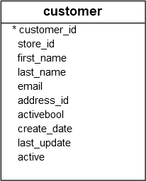
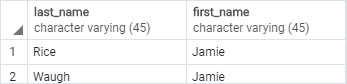
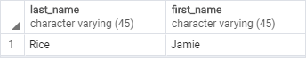

# WHERE

Ushbu qo'llanmada siz PostgreSQL `SELECT` bandidan `WHERE` bayonot orqali qaytarilgan qatorlarni filtrlash uchun qanday foydalanishni o'rganasiz .

`SELECT` bayonot jadvaldagi bir yoki bir nechta ustunlarning barcha satrlarini qaytaradi. Belgilangan shartni qondiradigan qatorlarni tanlash uchun siz `WHERE` banddan foydalanasiz.

PostgreSQL `WHERE` bandining sintaksisi quyidagicha:

```sql
SELECT select_list
FROM table_name
WHERE condition
ORDER BY sort_expression;
```

`WHERE` bandi `SELECT` iborasining `FROM` bandidan keyin darhol paydo bo'ladi. `WHERE` bandi `SELECT` bandidan qaytarilgan qatorlarni filtrlash uchun shartdan foydalanadi.

Shart haqiqiy, noto'g'ri yoki noma'lum deb baholanishi kerak. Bu `AND` va `OR` operatorlari yordamida mantiqiy ifoda yoki mantiqiy ifodalar birikmasi bo'lishi mumkin.

So'rov faqat `WHERE` bandidagi shartni qondiradigan qatorlarni qaytaradi. Boshqacha qilib aytadigan bo'lsak, faqat shartni `rost` deb baholaydigan qatorlar natijalar to'plamiga kiritiladi.

PostgreSQL `WHERE` bandini `FROM` bandidan keyin va `SELECT` va `ORDER BY` bandidan oldin baholaydi:


Agar siz `SELECT` bandida ustun taxalluslaridan foydalansangiz, ularni `WHERE` bandida ishlata olmaysiz.

`SELECT` iborasidan tashqari, siz yangilanadigan yoki o'chiriladigan qatorlarni belgilash uchun `UPDATE` va `DELETE` bayonotidagi `WHERE` bandidan foydalanishingiz mumkin. `WHERE` bandidagi shartni shakllantirish uchun siz taqqoslash va mantiqiy operatorlardan foydalanasiz:

| Operator |                                    Description                                |
| -------- | ------------------------------------------------------------------------------|
| =	       | Teng                                                                          |
| >	       | dan kattaroq                                                                  |
| <	       | dan kichik; .. dan kamroq                                                     |
| >=       | Kattaroq yoki teng                                                            |
| <=       | Kattaroq yoki teng                                                            |
| <> or != | Teng emas                                                                     |
| AND      | Mantiqiy operator AND                                                         | 
| OR       | Mantiqiy operator OR                                                          | 
| IN       | Agar qiymat roʻyxatdagi istalgan qiymatga mos kelsa, true qiymatini qaytaring | 
| BETWEEN  | Agar qiymat qiymatlar oralig'ida bo'lsa, true qiymatini qaytaring             |
| LIKE     | Agar qiymat naqshga mos kelsa, true qiymatini qaytaring                       | 
| IS NULL  | Agar qiymat NULL bo'lsa, true qiymatini qaytaring                             | 
| NOT      | Boshqa operatorlarning natijasini rad eting                                   | 

## PostgreSQL `WHERE` bandiga misollar

Keling, WHERE banddan foydalanishning ba'zi misollari bilan mashq qilaylik.
Namoyish uchun quyidagi [namunaviy](https://www.postgresqltutorial.com/wp-content/uploads/2019/05/dvdrental.zip) ma'lumotlar bazasida `customer` jadvalidan  foydalanamiz.



### 1. `WHERE` bandini teng `(=)` operatori misolida ishlatish
Quyidagi bayonotda ismlari `Jeymi` bo'lgan mijozlar `WHERE` bandidan foydalaniladi:

```sql
SELECT
	last_name,
	first_name
FROM
	customer
WHERE
	first_name = 'Jamie';
```



### 2. `AND` operator misoli bilan `WHERE` bandidan foydalanish

Quyidagi misolda ikkita mantiqiy ifodani birlashtirish uchun `AND` mantiqiy operatoridan foydalangan holda ismi va familiyasi `Jeymi` va `Rays` bo'lgan mijozlar topiladi:

```sql
SELECT
	last_name,
	first_name
FROM
	customer
WHERE
	first_name = 'Jamie' AND 
        last_name = 'Rice';
```



### 3. `OR` operatori misolida `WHERE` bandidan foydalanish

Ushbu misol `OR` operatoridan foydalangan holda familiyasi `Rodriges yoki ismi `Adam` bo'lgan mijozlarni topadi:

```sql
SELECT
	first_name,
	last_name
FROM
	customer
WHERE
	last_name = 'Rodriguez' OR 
	first_name = 'Adam';
```


### 4. `IN` operatori misolida `WHERE` bandidan foydalanish

Agar siz satrni roʻyxatdagi istalgan satr bilan moslashtirmoqchi boʻlsangiz, `IN` operatoridan foydalanishingiz mumkin. Masalan, quyidagi bayonot `Ann`, `Anne` yoki `Enni` bo'lgan mijozlarni qaytaradi:

```sql
SELECT
	first_name,
	last_name
FROM
	customer
WHERE 
	first_name IN ('Ann','Anne','Annie');
```


### 5. `LIKE` operatori misolida `WHERE` bandidan foydalanish

Belgilangan naqshga mos keladigan satrni topish uchun siz `LIKE` operatoridan foydalanasiz. Quyidagi misol ismlari `Ann` qatori bilan `boshlangan` barcha mijozlarni qaytaradi:

```sql
SELECT
	first_name,
	last_name
FROM
	customer
WHERE 
	first_name LIKE 'Ann%'
```


> % har qanday satrga mos keladigan `joker belgi` deb ataladi. `"Ann%"` naqsh "Ann" bilan boshlanadigan har qanday qatorga mos keladi.

### 6. `BETWEEN` operatori misolida `WHERE` bandidan foydalanish

Quyidagi misolda `BETWEEN` operatoridan foydalangan holda ismlari `A` harfi bilan `boshlangan` va `3` dan `5` gacha belgidan iborat mijozlar topiladi. Agar qiymat qiymatlar oralig'ida bo'lsa, `BETWEEN` operatori `true` qiymatini qaytaradi.

```sql
SELECT
	first_name,
	LENGTH(first_name) name_length
FROM
	customer
WHERE 
	first_name LIKE 'A%' AND
	LENGTH(first_name) BETWEEN 3 AND 5
ORDER BY
	name_length;
```


Ushbu misolda biz `LENGTH()` funksiyasidan foydalanganmiz, kirish satrining belgilar sonini oladi.

### 7. `WHERE` bandini teng bo'lmagan operator `(<>)` bilan ishlatish misoli

Ushbu misolda ismlari `Bra` bilan boshlangan va familiyalari `Motley` bo'lmagan mijozlar topiladi:

```sql
SELECT 
	first_name, 
	last_name
FROM 
	customer 
WHERE 
	first_name LIKE 'Bra%' AND 
	last_name <> 'Motley';
```


> E'tibor bering, siz != operatori va <> operatorini bir-birining o'rnida ishlatishingiz mumkin, chunki ular ekvivalentdir.

Ushbu qo'llanmada siz belgilangan shart asosida qatorlarni filtrlash uchun SELECT iborasidagi PostgreSQL WHERE bandidan qanday foydalanishni o'rgandingiz.