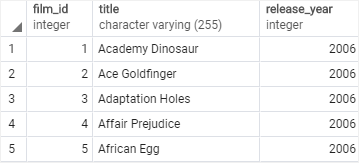
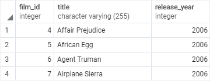
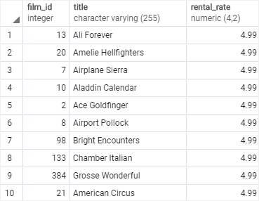

# Limit

Ushbu qo'llanmada siz so'rov orqali yaratilgan qatorlar to'plamini olish uchun `PostgreSQL LIMIT` bandidan qanday foydalanishni o'rganasiz.

PostgreSQL LIMIT so'rov tomonidan qaytariladigan qatorlar sonini cheklovchi SELECT bayonotning ixtiyoriy bandidir.

Quyida LIMIT bandning sintaksisi tasvirlangan:

```sql
SELECT select_list 
FROM table_name
ORDER BY sort_expression
LIMIT row_count
```
Bayonot so'rov tomonidan yaratilgan `row_count` satrlarini qaytaradi. Agar `row_count` nolga teng bo'lsa, so'rov bo'sh to'plamni qaytaradi. Agar `row_count` `NULL` bo'lsa, so'rovda LIMIT bandi yo'qligi sababli bir xil natija to'plamini qaytaradi.

Qator_hisob qatorlarini qaytarishdan oldin bir qator qatorlarni oʻtkazib yubormoqchi boʻlsangiz, `LIMIT` bandidan keyin qoʻyilgan `OFFSET` bandidan quyidagi ibora sifatida foydalanasiz:

```sql
SELECT select_list
FROM table_name
LIMIT row_count OFFSET row_to_skip;
```

Bayonot so'rov tomonidan yaratilgan `row_count` satrlarini qaytarishdan oldin birinchi navbatda row_to_skip  qator  larini o'tkazib yuboradi. Agar `row_to_skip` nolga teng bo'lsa, bayonot `OFFSET` bandi yo'qdek ishlaydi.

Jadval qatorlarni aniqlanmagan tartibda saqlashi mumkinligi sababli, `LIMIT` bandidan foydalanganda, satr tartibini boshqarish uchun har doim `ORDER BY` bandidan foydalaning. 

## PostgreSQL `LIMIT` misollar
Keling, PostgreSQL `LIMIT` bandidan foydalanishga misollar keltiraylik. Namoyish uchun [namunaviy](https://www.postgresqltutorial.com/wp-content/uploads/2019/05/dvdrental.zip) ma'lumotlar bazasida `film` jadvalidan  foydalanamiz. ma'lumotlar bazasidagi kino jadvalidan foydalanamiz.


### 1. Qaytarilgan qatorlar sonini cheklash uchun PostgreSQL `LIMIT` dan foydalanish misoli

Ushbu misol film_id bo'yicha saralangan dastlabki beshta filmni olish uchun LIMIT bandidan foydalanadi:

```sql
SELECT
	film_id,
	title,
	release_year
FROM
	film
ORDER BY
	film_id
LIMIT 5;
```



### 2. `OFFSET` misolida PostgreSQL `LIMIT`dan foydalanish

`film_id` tomonidan buyurtma qilingan `to'rtinchi` filmdan boshlab `4 ta` filmni olish uchun siz `LIMIT` va `OFFSET` bandlaridan quyidagi tarzda foydalanasiz:

```sql
SELECT
	film_id,
	title,
	release_year
FROM
	film
ORDER BY
	film_id
LIMIT 4 OFFSET 3;
```



### 3. Yuqori/pastki N qatorlarni olish uchun PostgreSQL `LIMIT OFFSSET` dan foydalanish

Odatda jadvaldan eng yuqori yoki eng past qiymatga ega qatorlarni tanlash uchun `LIMIT` bandidan foydalanasiz.

Masalan, ijaraga olish bo'yicha eng qimmat 10 ta filmni olish uchun siz filmlarni ijara stavkasi bo'yicha kamayish tartibida saralaysiz va birinchi 10 ta filmni olish uchun `LIMIT` bandidan foydalanasiz. Quyidagi so'rov fikrni ko'rsatadi:

```sql
SELECT
	film_id,
	title,
	rental_rate
FROM
	film
ORDER BY
	rental_rate DESC
LIMIT 10;
```

So'rov natijasi quyidagicha:



Ushbu qo'llanmada siz so'rov orqali qaytarilgan qatorlar to'plamini olish uchun PostgreSQL `LIMIT OFFSET` bandidan qanday foydalanishni o'rgandingiz.