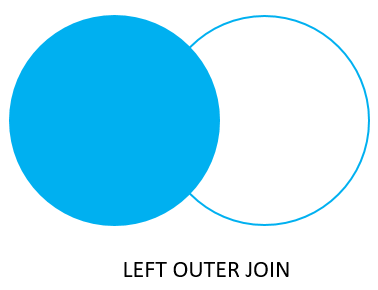
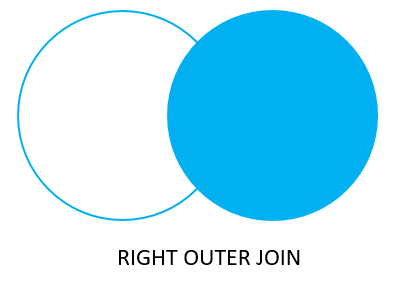
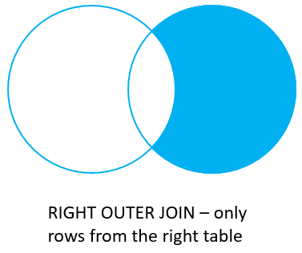
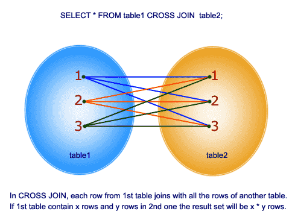
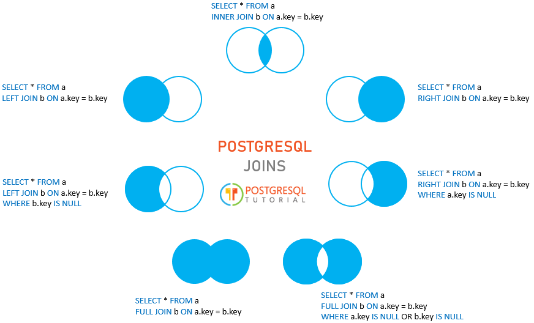

# Joins
## Inner Join
```sql
SELECT
    a,
    fruit_a,
    b,
    fruit_b
FROM
    basket_a
INNER JOIN basket_b
    ON fruit_a = fruit_b;
```


<br>

## Left Outer Join
```sql
SELECT
    a,
    fruit_a,
    b,
    fruit_b
FROM
    basket_a
LEFT JOIN basket_b
    ON fruit_a=fruit_b;
```


<br>

## Left Outer Join Only
```sql
SELECT
    a,
    fruit_a,
    b,
    fruit_b
FROM
    basket_a
LEFT JOIN basket_b
    ON fruit_a=fruit_b
WHERE b IS NULL;
```


<br>

## Right Outer Join
```sql
SELECT
    a,
    fruit_a,
    b,
    fruit_b
FROM
    basket_a
RIGHT JOIN basket_b
    ON fruit_a=fruit_b;
```



<br>

## Right Outer Join Only
```sql
SELECT
    a,
    fruit_a,
    b,
    fruit_b
FROM
    basket_a
RIGHT JOIN basket_b
    ON fruit_a=fruit_b
WHERE a IS NULL;
```




<br>

## Full Outer Join

```sql
SELECT
    a,
    fruit_a,
    b,
    fruit_b
FROM
    basket_a
FULL OUTER JOIN basket_b
    ON fruit_a=fruit_b;
```


<br>

## Full Outer Join Only

```sql
SELECT
    a,
    fruit_a,
    b,
    fruit_b
FROM
    basket_a
FULL OUTER JOIN basket_b
    ON fruit_a=fruit_b
WHERE a IS NULL OR b IS NULL;
```


<br>


## Cross Join

```sql
SELECT
    a,
    fruit_a,
    b,
    fruit_b
FROM
    basket_a
CROSS JOIN basket_b;
```



<br>
<h2 text-align="center"> <b>References:</b> </h2>

