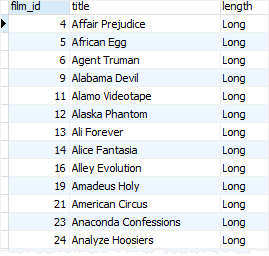
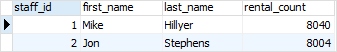
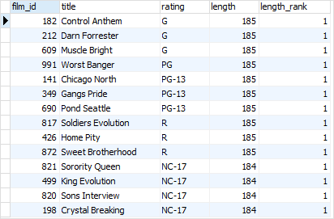

# PostgreSQL CTE

Ushbu qo'llanmada siz murakkab so'rovlarni soddalashtirish uchun PostgreSQL `CTE` (umumiy jadval ifodalari`(common table expressions)`) dan qanday foydalanishni o'rganasiz.

Umumiy jadval ifodasi vaqtinchalik natijalar to'plami bo'lib, siz boshqa SQL iborasida, jumladan, `SELECT`, `INSERT`, `UPDATE` yoki `DELETE` orqali murojaat qilishingiz mumkin.

Umumiy jadval iboralari vaqtinchalik, chunki ular faqat so'rovni bajarish paytida mavjud bo'ladi.

Quyida `CTE` yaratish sintaksisi ko'rsatilgan:

```sql
WITH cte_name (column_list) AS (
    CTE_query_definition 
)
statement;  
```

Ushbu sintaksisda: 

* Birinchidan, ixtiyoriy ustunlar ro'yxatidan keyin CTE nomini belgilang.
* Ikkinchidan, `WITH` bandining tanasi ichida natijalar to'plamini qaytaradigan so'rovni belgilang. Agar siz CTE nomidan keyin ustunlar ro'yxatini aniq ko'rsatmasangiz, `CTE_query_definition` ning tanlangan ro'yxati CTE ustunlar ro'yxatiga aylanadi.

* Uchinchidan, `SELECT`, `INSERT`, `UPDATE` yoki `DELETE` bo'lishi mumkin bo'lgan bayonotdagi jadval yoki ko'rinish kabi `CTE` dan foydalaning.

Umumiy jadval ifodalari yoki `CTE` odatda PostgreSQL-da murakkab birlashmalar va pastki so'rovlarni soddalashtirish uchun ishlatiladi.

## PostgreSQL CTE misollari

Keling, yaxshiroq tushunish uchun `CTE` dan foydalanishga misollar keltiraylik.

### Oddiy PostgreSQL CTE misoli

Namoyish uchun [namunaviy](https://www.postgresqltutorial.com/wp-content/uploads/2019/05/dvdrental.zip) ma'lumotlar bazasidagi `film` va `rental` jadvallaridan foydalanamiz.

Quyidagi misolga qarang:

```sql
WITH cte_film AS (
    SELECT 
        film_id, 
        title,
        (CASE 
            WHEN length < 30 THEN 'Short'
            WHEN length < 90 THEN 'Medium'
            ELSE 'Long'
        END) length    
    FROM
        film
)
SELECT
    film_id,
    title,
    length
FROM 
    cte_film
WHERE
    length = 'Long'
ORDER BY 
    title;
```

Mana qisman chiqish:



E'tibor bering, ushbu misol namoyish qilish uchun mo'ljallangan.

Ushbu misolda biz birinchi navbatda `WITH` bandidan foydalanib `cte_film` nomli umumiy jadval ifodasini quyidagicha aniqladik:

```sql
WITH cte_film AS (
    SELECT 
        film_id, 
        title,
        (CASE 
            WHEN length < 30 
                THEN 'Short'
            WHEN length >= 30 AND length < 90 
                THEN 'Medium'
            WHEN length >=  90 
                THEN 'Long'
        END) length    
    FROM
        film
)
```

Umumiy jadval ifodasi ikki qismdan iborat:

* Birinchi qism `CTE` nomini belgilaydi, ya'ni `cte_film`.

* Ikkinchi qism ifodani qatorlar bilan to'ldiradigan `SELECT` iborasini belgilaydi.

Keyin biz `SELECT` bayonotida `cte_film` `CTE dan faqat uzunligi` "Long"` filmlarni qaytarish uchun foydalandik.

### JOIN bilan CTE jadval misollari

Quyidagi misolda biz `rental` va `staff` jadvalidan foydalanamiz:

Quyidagi bayonot `CTE` ga jadval bilan qanday qo'shilish kerakligini ko'rsatadi:

```sql
WITH cte_rental AS (
    SELECT staff_id,
        COUNT(rental_id) rental_count
    FROM   rental
    GROUP  BY staff_id
)
SELECT s.staff_id,
    first_name,
    last_name,
    rental_count
FROM staff s
    INNER JOIN cte_rental USING (staff_id);
```

Ushbu misolda:

* Birinchidan, `CTE` xodimlar identifikatori va ijaralar sonini o'z ichiga olgan natijalar to'plamini qaytaradi.
* Keyin, `staff_id` ustunidan foydalanib, `staff` jadvaliga CTE bilan qo'shiling.

Mana natija:



### Oyna funktsiyasi misoli bilan CTE dan foydalanish

Quyidagi bayonot CTE dan `RANK()` oyna funksiyasi bilan qanday foydalanishni ko'rsatadi:

```sql
WITH cte_film AS  (
    SELECT film_id,
        title,
        rating,
        length,
        RANK() OVER (
            PARTITION BY rating
            ORDER BY length DESC) 
        length_rank
    FROM 
        film
)
SELECT *
FROM cte_film
WHERE length_rank = 1;
```

Ushbu misolda:

* Birinchidan, biz har bir film reytingi uchun filmlar reytingini uzunligi bo'yicha qaytaradigan CTE ni aniqladik.
* Ikkinchidan, biz faqat uzunligi reytingi bitta bo'lgan filmlarni tanladik.

Quyidagi rasmda chiqish ko'rsatilgan:



### PostgreSQL CTE afzalliklari

Quyidagilar umumiy jadval ifodalari yoki CTE lardan foydalanishning ba'zi afzalliklari:

* Murakkab so'rovlarni o'qish qobiliyatini yaxshilashi. Siz murakkab so'rovlarni yanada tartibli va o'qilishi mumkin bo'lgan tarzda tashkil qilish uchun CTE'lardan foydalanasiz.

* Rekursiv so'rovlarni yaratish qobiliyati. Rekursiv so'rovlar o'z-o'ziga havola qiladigan so'rovlardir. Rekursiv so'rovlar tashkilot jadvali yoki materiallar ro'yxati kabi ierarxik ma'lumotlarni so'rashni xohlaganingizda foydali bo'ladi.

* Oyna funksiyalari bilan birgalikda foydalanish. Dastlabki natijalar to'plamini yaratish uchun CTE'larni oyna funktsiyalari bilan birgalikda ishlatishingiz va ushbu natijalar to'plamini keyingi qayta ishlash uchun boshqa tanlash bayonotidan foydalanishingiz mumkin.

Ushbu qo'llanmada siz PostgreSQL `CTE` yoki murakkab so'rovlarni soddalashtirish uchun umumiy jadval ifodasi haqida bilib oldingiz.