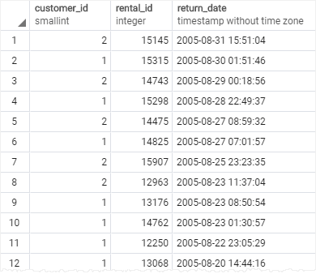
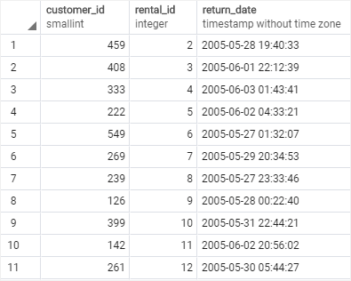
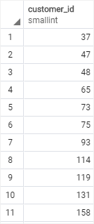
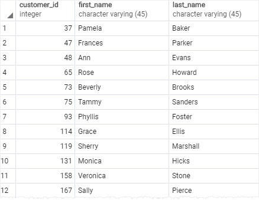

# IN

Ushbu qo'llanmada siz qiymat ro'yxatdagi har qanday qiymatga mos kelishini tekshirish uchun `WHERE` bandidagi PostgreSQL `IN` operatoridan qanday foydalanishni o'rganasiz.

Qiymat qiymatlar ro'yxatidagi biron bir qiymatga mos kelishini tekshirish uchun `WHERE` bandidagi `IN` operatoridan foydalanasiz. `IN` operatorining sintaksisi quyidagicha:

```sql
value IN (value1,value2,...)
```

Agar `qiymat` ro'yxatdagi istalgan qiymatga mos kelsa, `IN` operatori rost qiymatini qaytaradi, masalan, `value1` , `value2` , … 

Qiymatlar ro'yxati raqamlar, satrlar yoki `SELECT` iborasining natijasi kabi so'zma-so'z qiymatlar ro'yxati bo'lishi mumkin:

```sql
value IN (SELECT column_name FROM table_name);
```

Qavslar ichidagi so'rov `pastki so'rov(subquery)` deb ataladi, bu boshqa so'rovning ichiga joylashtirilgan so'rovdir. E'tibor bering, siz keyingi qo'llanmada `subquery` haqida ko'proq bilib olasiz.

## PostgreSQL `IN` operatoriga misollar

Aytaylik, siz mijoz identifikatori 1 va 2 ning ijara ma'lumotlarini bilmoqchi bo'lsangiz, `WHERE` bandidagi `IN` operatoridan quyidagicha foydalanishingiz mumkin:

```sql
SELECT customer_id,
	rental_id,
	return_date
FROM
	rental
WHERE
	customer_id IN (1, 2)
ORDER BY
	return_date DESC;
```



Quyidagi so'rovda `IN` operatori o'rniga teng `(=)` va `OR` operatorlari qo'llaniladi. Bu yuqoridagi so'rovga teng:
```sql
SELECT
	rental_id,
	customer_id,
	return_date
FROM
	rental
WHERE
	customer_id = 1 OR customer_id = 2
ORDER BY
	return_date DESC;
```

`IN` operatoridan foydalanadigan so'rov teng `(=)` va `OR` operatorlarini ishlatadigan so'rovga qaraganda qisqaroq va o'qilishi mumkin. Bundan tashqari, PostgreSQL `IN` operatori bilan so'rovni `OR` operatorlari ro'yxatidan foydalanadigan so'rovga qaraganda ancha tezroq bajaradi.

## PostgreSQL `NOT IN` operatori

Qiymati roʻyxatdagi qiymatlarga mos kelmaydigan qatorlarni tanlash uchun `IN` operatorini `NOT` operatori bilan birlashtira olasiz. Misol uchun, quyidagi bayonotda mijoz identifikatori 1 yoki 2 bo'lmagan barcha ijaralar topiladi.

```sql
SELECT
	customer_id,
	rental_id,
	return_date
FROM
	rental
WHERE
	customer_id NOT IN (1, 2);
```



`IN` operatoriga o'xshab, `NOT IN` operatorini yozish uchun teng emas `(<>)` va `AND` operatorlaridan foydalanishingiz mumkin:

```sql
SELECT
	customer_id,
	rental_id,
	return_date
FROM
	rental
WHERE
	customer_id <> 1
AND customer_id <> 2;
```

Bu so'rov yuqoridagi so'rov kabi `NOT IN` operatoridan foydalanadigan natijani qaytaradi.

## Pastki so'rov(subquery) bilan PostgreSQL IN

Quyidagi so'rov `ijara` jadvalidan mijoz identifikatorlari ro'yxatini qaytaradi, qaytish sanasi 2005-05-27:

```sql
SELECT customer_id
FROM rental
WHERE CAST (return_date AS DATE) = '2005-05-27'
ORDER BY customer_id;
```




Ushbu so'rov qiymatlar ro'yxatini qaytargani uchun siz undan `IN` operatorining kirishi sifatida foydalanishingiz mumkin:

```sql
SELECT
	customer_id,
	first_name,
	last_name
FROM
	customer
WHERE
	customer_id IN (
		SELECT customer_id
		FROM rental
		WHERE CAST (return_date AS DATE) = '2005-05-27'
	)
ORDER BY customer_id;
```



Ushbu qo'llanmada siz qiymatlar ro'yxatidagi qiymatga mos kelishini tekshirish uchun PostgreSQL `IN` operatoridan qanday foydalanishni o'rgandingiz.