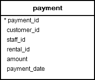
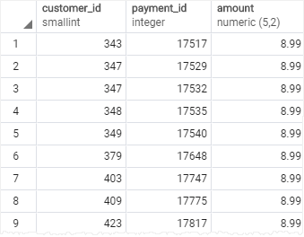
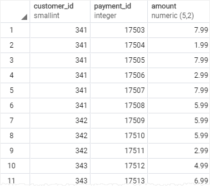
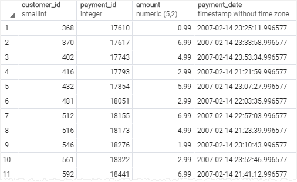

# BETWEEN

Ushbu qo'llanmada siz qiymatni bir qator qiymatlarga moslashtirish uchun PostgreSQL `BETWEEN` operatoridan qanday foydalanishni o'rganasiz.

Qiymatni qiymatlar oralig'iga moslashtirish uchun `BETWEEN` operatoridan foydalanasiz. Quyida `BETWEEN` operatorining sintaksisi tasvirlangan:

```sql
value BETWEEN low AND high;
```

Agar `qiymat` `past` qiymatdan katta yoki unga teng va `yuqori` qiymatdan kichik yoki teng bo'lsa, ifoda rost, aks holda noto'g'ri qiymatni qaytaradi.

Siz `BETWEEN` operatorini katta yoki teng `(>=)` yoki kichik yoki teng `(<=)` operatorlaridan foydalanib qayta yozishingiz mumkin:

```sql
value >= low and value <= high;
```

Agar `qiymat` diapazondan tashqarida ekanligini tekshirishni istasangiz, `NOT` operatorini `BETWEEN` operatori bilan quyidagi tarzda birlashtirasiz:

```sql
value NOT BETWEEN low AND high;
```

Quyidagi ifoda `NOT` va `BETWEEN` operatorlaridan foydalanadigan ifodaga ekvivalentdir:

```sql
value < low OR value > high;
```

Siz tez-tez `SELECT`, `INSERT`, `UPDATE` yoki `DELETE` iboralarining `WHERE` bandida `BETWEEN` operatoridan foydalanasiz.

## PostgreSQL `BETWEEN` operatoriga misollar

Keling, [namunaviy](https://www.postgresqltutorial.com/wp-content/uploads/2019/05/dvdrental.zip) maʼlumotlar bazasidagi `payments` jadvalini koʻrib chiqaylik.



Quyidagi so'rov miqdori 8 dan 9 (AQSh dollari) gacha bo'lgan to'lovlarni tanlash uchun `BETWEEN` operatoridan foydalanadi:

```sql
SELECT
	customer_id,
	payment_id,
	amount
FROM
	payment
WHERE
	amount BETWEEN 8 AND 9;
```



Miqdori 8 va 9 oralig'ida bo'lmagan to'lovlarni olish uchun siz quyidagi so'rovdan foydalanasiz:

```sql
SELECT
	customer_id,
	payment_id,
	amount
FROM
	payment
WHERE
	amount NOT BETWEEN 8 AND 9;
```



Agar siz qiymatni sana diapazonlariga nisbatan tekshirishni istasangiz, ISO 8601 formatida, ya'ni YYYY-MM-DD formatida haqiqiy sanadan foydalaning. Masalan, toʻlov sanasi `2007-02-07`  va `2007-02-15` orasida boʻlgan toʻlovni olish uchun siz quyidagi soʻrovdan foydalanasiz:

```sql
SELECT
	customer_id,
	payment_id,
	amount,
 payment_date
FROM
	payment
WHERE
	payment_date BETWEEN '2007-02-07' AND '2007-02-15';
```



Ushbu qoʻllanmada siz qiymatlar oraligʻida boʻlgan qiymatni tanlash uchun PostgreSQL `BETWEEN` operatoridan qanday foydalanishni oʻrgandingiz.