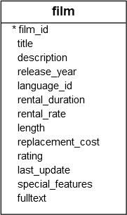

# FETCH

Ushbu qo'llanmada siz so'rov orqali qaytarilgan qatorlarning bir qismini olish uchun PostgreSQL `FETCH` bandidan qanday foydalanishni o'rganasiz.

So'rov orqali qaytariladigan qatorlar sonini cheklash uchun siz ko'pincha `LIMIT` bandidan foydalanasiz. `LIMIT` bandi `MySQL`, `H2` va `HSQLDB` kabi ko'plab `relyatsion` ma'lumotlar bazasini boshqarish tizimlari tomonidan keng qo'llaniladi. Biroq, `LIMIT` bandi `SQL standarti emas`.

SQL standartiga mos kelish uchun PostgreSQL so'rov orqali qaytarilgan qatorlarni olish uchun `FETCH` bandini qo'llab-quvvatlaydi. FETCH bandi `SQL:2008` da kiritilganligini unutmang.

Quyida PostgreSQL `FETCH` bandining sintaksisi tasvirlangan:
```sql
OFFSET start { ROW | ROWS }
FETCH { FIRST | NEXT } [ row_count ] { ROW | ROWS } ONLY
```

Ushbu sintaksisda:

* `ROW` - `ROWS` so'zining sinonimi, `FIRST` - `NEXT` ning sinonimi. Shuning uchun siz ularni bir-birining o'rnida ishlatishingiz mumkin
* `start` butun son bo'lib, u nol yoki musbat bo'lishi kerak. Odatiy bo'lib, agar OFFSET bandi ko'rsatilmagan bo'lsa, u nolga teng. Agar `start` natija to'plamidagi qatorlar sonidan katta bo'lsa, hech qanday satr qaytarilmaydi;
* `row_count` 1 yoki undan katta. Odatiy bo'lib, agar siz uni aniq ko'rsatmasangiz, `row_count` ning standart qiymati 1 ga teng.

Jadvalda saqlangan qatorlar tartibi aniqlanmaganligi sababli, qaytarilgan natijalar to'plamidagi qatorlar tartibini izchil qilish uchun har doim `FETCH` bandidan `ORDER BY` bandi bilan foydalanish kerak.

E'tibor bering, `OFFSET` bandi `SQL:2008 da FETCH` bandidan oldin kelishi kerak. Biroq, `OFFSET` va `FETCH` bandlari PostgreSQL-da istalgan tartibda paydo bo'lishi mumkin.

## `FETCH` vs. `LIMIT`

`FETCH` bandi `LIMIT` bandiga funksional ekvivalentdir. Agar siz ilovangizni boshqa ma'lumotlar bazasi tizimlari bilan mos qilishni rejalashtirmoqchi bo'lsangiz, `FETCH` bandidan foydalanishingiz kerak, chunki u standart SQL-ga amal qiladi.

# PostgreSQL `FETCH` misollari

Namoyish uchun [namunaviy](https://www.postgresqltutorial.com/wp-content/uploads/2019/05/dvdrental.zip) ma'lumotlar bazasida `film` jadvalidan  foydalanamiz. ma'lumotlar bazasidagi kino jadvalidan foydalanamiz.



Quyidagi so'rovda sarlavhalar bo'yicha o'sish tartibida saralangan birinchi filmni tanlash uchun `FETCH` bandidan foydalaniladi:

```sql
SELECT
    film_id,
    title
FROM
    film
ORDER BY
    title 
FETCH FIRST ROW ONLY;
```


Bu quyidagi so'rovga teng:

```sql
SELECT
    film_id,
    title
FROM
    film
ORDER BY
    title 
FETCH FIRST 1 ROW ONLY;
```

Quyidagi so'rovda nomlar bo'yicha saralangan dastlabki beshta filmni tanlash uchun `FETCH` bandidan foydalaniladi:

```sql
SELECT
    film_id,
    title
FROM
    film
ORDER BY
    title 
FETCH FIRST 5 ROW ONLY;
```


Quyidagi bayonot sarlavhalar bo'yicha saralangan dastlabki beshta filmdan keyingi beshta filmni qaytaradi:

```sql
SELECT
    film_id,
    title
FROM
    film
ORDER BY
    title 
OFFSET 5 ROWS 
FETCH FIRST 5 ROW ONLY; 
```


Ushbu qo'llanmada siz so'rov orqali qaytarilgan qatorlarning bir qismini olish uchun PostgreSQL `FETCH` bandidan qanday foydalanishni o'rgandingiz.