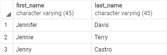
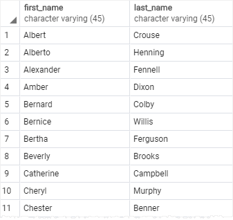
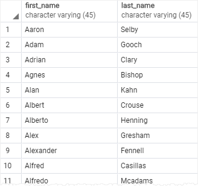
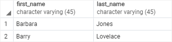

# LIKE

Ushbu qo'llanmada siz PostgreSQL `LIKE` va `ILIKE` operatorlaridan naqsh mosliklari yordamida ma'lumotlarni so'rash uchun qanday foydalanishni o'rganasiz.

Aytaylik, siz mijoz topmoqchisiz, lekin uning ismini aniq eslay olmaysiz. Biroq, uning ismi `Jen` kabi bir narsa bilan boshlanganini eslashingiz mumkin. 

Ma'lumotlar bazasidan aniq mijozni qanday topish mumkin? `Jen` bilan boshlanadigan qiymat bor yoki yoʻqligini bilish uchun ism ustuniga qarab, `mijozlar` jadvalida mijozni topishingiz mumkin. Biroq, agar mijoz jadvalida ko'p qatorlar bo'lsa, bu jarayon ko'p vaqt talab qilishi mumkin.

Yaxshiyamki, siz PostgreSQL `LIKE` operatoridan mijozning ismini quyidagi so'rov yordamida satr bilan moslashtirishingiz mumkin:

```sql
SELECT
	first_name,
        last_name
FROM
	customer
WHERE
	first_name LIKE 'Jen%';
```



> E'tibor bering, `WHERE` bandida maxsus ibora mavjud: `first_name`, `LIKE` operatori va foiz belgisi `(%)` o'z ichiga olgan qator. `"Jen%"` qatori naqsh deb ataladi.

So'rov `first_name` ustunidagi qiymatlari `Jen` bilan boshlanadigan va har qanday belgilar ketma-ketligidan keyin kelishi mumkin bo'lgan satrlarni qaytaradi. Ushbu uslub naqshni moslashtirish deb ataladi.

Siz literal qiymatlarni joker belgilar bilan birlashtirib naqsh tuzasiz va mosliklarni topish uchun `LIKE` yoki `NOT LIKE` operatoridan foydalaning. PostgreSQL sizga ikkita `joker` belgilarni taqdim etadi:

* Foiz belgisi `(%)` nol yoki undan ortiq belgilarning istalgan ketma-ketligiga mos keladi.
* Pastki chiziq belgisi `(_)`  har qanday bitta belgiga mos keladi.

PostgreSQL `LIKE` operatorining sintaksisi quyidagicha:

```sql
value LIKE pattern
```

Qiymat naqshga `mos kelsa`, ifoda `true` ni qaytaradi.

`LIKE` operatorini bekor qilish uchun siz `NOT` operatoridan quyidagi tarzda foydalanasiz:

```sql
value NOT LIKE pattern
```

Qiymat naqshga `mos kelmasa` `NOT LIKE` operatori `true` qiymatini qaytaradi.

Agar naqshda joker belgi bo'lmasa, `LIKE` operatori o'zini teng `(=)` operatori kabi tutadi.

## PostgreSQL `LIKE` operatori - naqshga mos keladigan misollar

Keling, `LIKE` operatoridan foydalanishga misollar keltiraylik

### Oddiy PostgreSQL `LIKE` misollari 

Quyidagi misolga qarang:

```sql
SELECT
	'foo' LIKE 'foo', -- true
	'foo' LIKE 'f%', -- true
	'foo' LIKE '_o_', -- true
	'bar' LIKE 'b_'; -- false
```

U qanday ishlaydi.
 
 * Birinchi ifoda `rost` qaytaradi, chunki `foo pattern` hech qanday joker belgini o'z ichiga olmaydi, shuning uchun `LIKE` operatori teng `(=)` operatori kabi ishlaydi.
 * Ikkinchi ifoda `haqiqat`ni qaytaradi, chunki u `f` harf bilan boshlanadigan  va har qanday belgilar sonidan keyin har qanday qatorga mos keladi.
 * Uchinchi ifoda `haqiqat`ni qaytaradi, chunki naqsh `(_o_)` har qanday bitta belgi bilan boshlanadigan, `o` harfdan keyin va istalgan bitta belgi bilan tugaydigan har qanday satrga mos keladi.
 * To'rtinchi ibora `noto'g'ri` qaytaradi, chunki naqsh  `b_` harf bilan boshlanadigan  `b` va har qanday bitta belgidan keyin har qanday satrga mos keladi.

 Naqshning boshida va/yoki oxirida `joker` belgilardan foydalanish mumkin.

 Masalan, quyidagi so'rov ismlarida `Jenifer`, `Kimberly` va `er` hokazo qatorni o'z ichiga olgan mijozlarni qaytaradi.

```sql
SELECT
	first_name,
        last_name
FROM
	customer
WHERE
	first_name LIKE '%er%'
ORDER BY 
        first_name;
```



`_her%` naqsh har qanday qatorga mos keladi:

* Har qanday bitta `(_)` belgi bilan boshlang
* Va so'zidan keyin uning to'g'ridan-to'g'ri qatori keladi. * Va har qanday belgilar soni bilan tugaydi.

Qaytarilgan birinchi ismlar - `Cheryl`, `Sherri`, `Sherry` and `Therasa`.

### PostgreSQL `NOT LIKE` misollar

Quyidagi so'rovda ismlari `Jen` bilan `boshlanmagan` mijozlarni topish uchun `NOT LIKE` operatoridan foydalaniladi:

```sql
SELECT
	first_name,
	last_name
FROM
	customer
WHERE
	first_name NOT LIKE 'Jen%'
ORDER BY 
        first_name;
```



### PostgreSQL `LIKE` operatorining kengaytmalari

PostgreSQL `LIKE` operatori kabi ishlaydigan `ILIKE` operatorini qo'llab-quvvatlaydi. Bundan tashqari, `ILIKE` operatori katta-kichik-kichik harflarga mos keladi. Masalan:

```sql
SELECT
	first_name,
	last_name
FROM
	customer
WHERE
	first_name ILIKE 'BAR%';
```


`BAR%` naqshi `BAR`, `Bar`, `BaR` va boshqalar bilan boshlanadigan har qanday qatorga mos keladi. Agar uning o'rniga `LIKE` operatoridan foydalansangiz, so'rov hech qanday qatorni qaytarmaydi.

PostgreSQL shuningdek, quyida ko'rsatilganidek, `LIKE`, `NOT LIKE`, `ILIKE` va `NOT ILIKE` operatorlari kabi ishlaydigan ba'zi operatorlarni taqdim etadi:

| Operator | Equivalent |
| -------- | ---------- |
|  ~~      | LIKE       |
|  ~~*     | ILIKE      |
|  !~~     | NOT LIKE   |
|  !~~*    | NOT ILIKE  |

Ushbu o'quv qo'llanmada siz PostgreSQL `LIKE` va `ILIKE` operatorlaridan naqsh moslashtirish yordamida ma'lumotlarni so'rash uchun qanday foydalanishni o'rgandingiz.