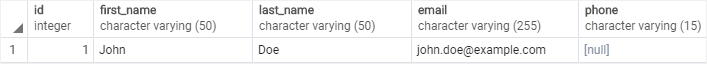
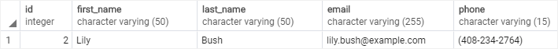

# IS NULL

Ushbu qo'llanmada siz qiymat `NULL` yoki yo'qligini tekshirish uchun PostgreSQL `IS NULL` operatoridan qanday foydalanishni o'rganasiz.

Ma'lumotlar bazasi dunyosida `NULL` ma'lumotlar etishmayotgan yoki qo'llanilmaydi degan ma'noni anglatadi. `NULL` qiymat emas, shuning uchun uni raqamlar yoki satrlar kabi boshqa qiymatlar bilan taqqoslab bo'lmaydi.

`NULL`ni qiymat bilan taqqoslash har doim `NULL`ga olib keladi, bu noma'lum natijani bildiradi. Bundan tashqari, `NULL` `NULL` ga `teng emas`, shuning uchun quyidagi ifoda `NULL`ni qaytaradi:

```sql
NULL = NULL
```
Agar sizda ism, familiya, elektron pochta va kontaktlarning telefon raqamini saqlaydigan `kontaktlar` jadvali mavjud deb hisoblasangiz. Kontaktni yozib olish vaqtida siz kontaktning telefon raqamini bilmasligingiz mumkin.

Buni hal qilish uchun siz `telefon` ustunini `null` bo'ladigan ustun sifatida belgilang va kontakt ma'lumotlarini saqlaganingizda telefon ustuniga `NULL`ni qo'shing.

```sql
CREATE TABLE contacts(
    id INT GENERATED BY DEFAULT AS IDENTITY,
    first_name VARCHAR(50) NOT NULL,
    last_name VARCHAR(50) NOT NULL,
    email VARCHAR(255) NOT NULL,
    phone VARCHAR(15),
    PRIMARY KEY (id)
);
```

> E'tibor bering, siz keyingi qo'llanmada `yangi jadval`yaratishni o'rganasiz. Hozircha `kontaktlar` jadvalini yaratish uchun yuqoridagi bayonotni bajarish kifoya.

`CREATE TABLE` iborasini bajarishda xatoga yo'l qo'ysangiz, PostgreSQL versiyangiz `identifikatsiya` ustuni sintaksisini qo'llab-quvvatlamasligi mumkin. Bunday holda siz quyidagi bayonotdan foydalanishingiz mumkin:

```sql
CREATE TABLE contacts(
    id SERIAL,
    first_name VARCHAR(50) NOT NULL,
    last_name VARCHAR(50) NOT NULL,
    email VARCHAR(255) NOT NULL,
    phone VARCHAR(15),
    PRIMARY KEY (id)
);
```

Quyidagi bayonot ikkita kontaktni kiritadi, birida telefon raqami bor, ikkinchisida esa yo'q:

```sql
INSERT INTO contacts(first_name, last_name, email, phone)
VALUES ('John','Doe','john.doe@example.com',NULL),
    ('Lily','Bush','lily.bush@example.com','(408-234-2764)');
```

Telefon raqamiga ega bo'lmagan kontaktni topish uchun siz quyidagi bayonotni topishingiz mumkin:

```sql
SELECT
    id,
    first_name,
    last_name,
    email,
    phone
FROM
    contacts
WHERE
    phone = NULL;
```

Bayonot hech qanday qatorni qaytarmaydi. Buning sababi, `WHERE` bandidagi `phone = NULL` ifodasi har doim `yolg'on`ni qaytaradi.

`phone` ustunida `NULL` bo'lsa ham, `NULL = NULL` ifodasi `yolg'on`ni qaytaradi. Buning sababi, `NULL` hech qanday qiymatga teng emas, hatto o'zi ham. Qiymat `NULL` yoki yo'qligini tekshirish uchun uning o'rniga `IS NULL` operatoridan foydalaning:

```sql
value IS NULL
```

Agar qiymat `NULL` bo'lsa, ifoda `rost`, bo'lmasa `noto'g'ri` qiymatini qaytaradi. Shunday qilib, phone ustunida saqlangan telefon raqami bo'lmagan kontaktni olish uchun uning o'rniga quyidagi bayonotdan foydalaning:

```sql
SELECT
    id,
    first_name,
    last_name,
    email,
    phone
FROM
    contacts
WHERE
    phone IS NULL;
```
Mana natija:


## PostgreSQL `IS NOT NULL` operatori

Qiymat `NULL` emasligini tekshirish uchun siz `IS NOT NULL` operatoridan foydalanasiz:

```sql
value IS NOT NULL
```

Qiymat `NULL` bo'lmasa, ibora `to'g'ri` qiymatini yoki qiymat `NULL` bo'lsa, `noto'g'ri` qiymatini qaytaradi. 

Masalan, telefon raqamiga ega bo'lgan kontaktni topish uchun siz quyidagi bayonotdan foydalanasiz:

```sql
SELECT
    id,
    first_name,
    last_name,
    email,
    phone
FROM
    contacts
WHERE
    phone IS NOT NULL;
```

Chiqish:



Ushbu qo'llanmada siz qiymat `NULL` yoki yo'qligini tekshirish uchun PostgreSQL `IS NULL` operatoridan qanday foydalanishni o'rgandingiz.