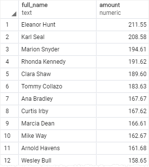

# GROUP BY

Ushbu qo'llanmada siz PostgreSQL `GROUP BY` bandidan foydalanib, qatorlarni guruhlarga qanday ajratishni o'rganasiz.

`GROUP BY` bandi `SELECT` iborasidan qaytarilgan qatorlarni guruhlarga ajratadi. Har bir guruh uchun elementlar yig'indisini hisoblash uchun  `SUM()` yoki guruhlardagi elementlar sonini olish uchun `COUNT()`  funksiyasini qo'llashingiz mumkin.

Quyidagi bayonot `GROUP BY` bandining asosiy sintaksisini ko'rsatadi:

```sql
SELECT 
   column_1, 
   column_2,
   ...,
   aggregate_function(column_3)
FROM 
   table_name
GROUP BY 
   column_1,
   column_2,
   ...;
```

Ushbu sintaksisda:
* Birinchidan, guruhlash kerak bo'lgan ustunlarni tanlang, masalan, 1-ustun va 2-ustun va yig'ish funksiyasini qo'llamoqchi bo'lgan ustunlar (3-ustun).

* Ikkinchidan, `GROUP BY` bandida guruhlamoqchi bo'lgan ustunlarni sanab o'ting.

Bayonot bandi qatorlarni `GROUP BY` bandida ko'rsatilgan ustunlar qiymatlariga ajratadi va har bir guruh uchun qiymatni hisoblab chiqadi.

`GROUP BY` bandi bilan `SELECT` iborasining boshqa bandlaridan foydalanish mumkin.

PostgreSQL `GROUP BY` bandini `FROM` va `WHERE` bandlaridan keyin va `HAVING` `SELECT`, `DISTINCT`, `ORDER BY` va `LIMIT` bandlaridan oldin baholaydi.


## PostgreSQL `GROUP BY` bandiga misollar

Keling, [namunaviy](https://www.postgresqltutorial.com/wp-content/uploads/2019/05/dvdrental.zip) ma'lumotlar bazasidagi to'lov jadvalini ko'rib chiqaylik.


### 1. PostgreSQL `GROUP BY` dan umumiy funksiya misolisiz foydalanish

`GROUP BY` bandidan jamlash funksiyasini qo'llamasdan foydalanishingiz mumkin. Quyidagi so'rov `payment` jadvalidan ma'lumotlarni oladi va natijani mijoz identifikatori bo'yicha guruhlaydi.

```sql
SELECT
   customer_id
FROM
   payment
GROUP BY
   customer_id;
```


Bunday holda, `GROUP BY` `DISTINCT` bandi kabi ishlaydi, u natijalar to'plamidan takroriy qatorlarni olib tashlaydi.

### 2. `SUM()` funktsiyasi misolida PostgreSQL `GROUP BY` dan foydalanish

`GROUP BY` bandi `agregat` funksiya bilan birgalikda ishlatilganda foydali bo'ladi.

Misol uchun, har bir mijoz to'langan umumiy summani tanlash uchun siz `payment` jadvalidagi qatorlarni mijoz identifikatori bo'yicha guruhlangan guruhlarga bo'lish uchun `GROUP BY` bandidan foydalanasiz.

Har bir guruh uchun siz `SUM()` funksiyasidan foydalanib jami summalarni hisoblaysiz.

```sql
SELECT
	customer_id,
	SUM (amount)
FROM
	payment
GROUP BY
	customer_id;
```


`GROUP BY` bandi mijoz identifikatori bo'yicha o'rnatilgan natijani saralaydi va xuddi shu mijozga tegishli miqdorni qo'shadi. `customer_id` har doim o'zgarganda, u qatorni qaytarilgan natijalar to'plamiga qo'shadi.

Quyidagi bayonotda guruhlarni saralash uchun `ORDER BY` bandidan `GROUP BY` bandidan foydalaniladi:

```sql
SELECT
	customer_id,
	SUM (amount)
FROM
	payment
GROUP BY
	customer_id
ORDER BY
	SUM (amount) DESC;
```


### 3. `JOIN` bandi bilan PostgreSQL `GROUP BY` bandidan foydalanish

Quyidagi bayonotda `GROUP BY` bandidan `INNER JOIN` bandi har bir mijoz tomonidan to'langan umumiy miqdorni olish uchun ishlatiladi.

Oldingi misoldan farqli o'laroq, bu so'rov to'lov jadvalini mijozlar jadvali bilan birlashtiradi va mijozlarni nomlari bo'yicha guruhlaydi.

```sql
SELECT
	first_name || ' ' || last_name full_name,
	SUM (amount) amount
FROM
	payment
INNER JOIN customer USING (customer_id)    	
GROUP BY
	full_name
ORDER BY amount DESC;
```



### 4. `COUNT()` funktsiyasi misolida PostgreSQL `GROUP BY` dan foydalanish

Har bir xodim bajargan toʻlov tranzaksiyalari sonini topish uchun siz `payment` jadvalidagi qatorlarni `staff_id` ustunidagi qiymatlar boʻyicha guruhlaysiz va tranzaksiyalar sonini olish uchun `COUNT()` funksiyasidan foydalaning:

```sql
SELECT
	staff_id,
	COUNT (payment_id)
FROM
	payment
GROUP BY
	staff_id;
```


`GROUP BY` bandi toʻlovdagi qatorlarni guruhlarga ajratadi va ularni `staff_id` ustunidagi qiymat boʻyicha guruhlaydi. Har bir guruh uchun `COUNT()` funksiyasidan foydalanib, qatorlar sonini qaytaradi.

### 5. PostgreSQL `GROUP BY`-dan bir nechta ustunlar bilan foydalanish

Quyidagi misol `GROUP BY` bandida bir nechta ustunlardan foydalanadi:

```sql
SELECT 
	customer_id, 
	staff_id, 
	SUM(amount) 
FROM 
	payment
GROUP BY 
	staff_id, 
	customer_id
ORDER BY 
    customer_id;
```

Ushbu misolda `GROUP BY` bandi to'lov jadvalidagi qatorlarni `customer_id` va `staff_id` ustunlaridagi qiymatlarga ajratadi. Har bir guruh uchun (`customer_id`, `staff_id`) `SUM()` umumiy miqdorni hisoblab chiqadi.


### 6. Sana ustuni bilan PostgreSQL `GROUP BY` bandidan foydalanish

`payment_date` vaqt belgisi ustunidir. Toʻlovlarni sanalar boʻyicha guruhlash uchun avval vaqt belgilarini sanaga aylantirish uchun `DATE()` funksiyasidan foydalanasiz, soʻngra toʻlovlarni natija sanasi boʻyicha guruhlaysiz:

```sql
SELECT 
	DATE(payment_date) paid_date, 
	SUM(amount) sum
FROM 
	payment
GROUP BY
	DATE(payment_date);
```


Ushbu qo'llanmada siz qatorlarni guruhlarga bo'lish va har bir guruhga agregat funksiyasini qo'llash uchun PostgreSQL `GROUP BY` bandidan qanday foydalanishni o'rgandingiz.