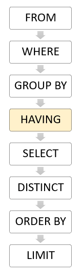
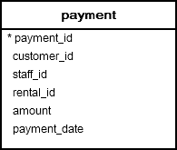
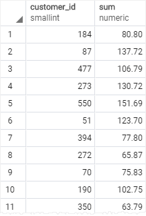
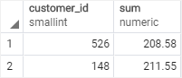
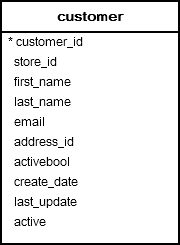
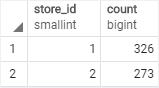
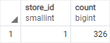

# HAVING

Ushbu qo'llanmada siz guruh yoki agregat uchun qidiruv shartini belgilash uchun PostgreSQL `HAVING` bandidan qanday foydalanishni o'rganasiz.

`HAVING` bandi guruh yoki agregat uchun qidiruv shartini belgilaydi. `HAVING` bandi ko'pincha `GROUP BY` bandi bilan guruhlar yoki agregatlarni belgilangan shart asosida filtrlash uchun ishlatiladi.

Quyidagi bayonot `HAVING` bandini asosiy sintaksisini ko'rsatadi:

```sql
SELECT
	column1,
	aggregate_function (column2)
FROM
	table_name
GROUP BY
	column1
HAVING
	condition;
```

Ushbu sintaksisda band bo'yicha guruhlash `column1` bo'yicha guruhlangan qatorlarni qaytaradi. `HAVING` bandi guruhlarni filtrlash shartini belgilaydi.

`SELECT` iborasining `JOIN`, `LIMIT`, `FETCH` kabi boshqa bandlarini qo'shish mumkin.

PostgreSQL `HAVING` bandini `FROM`, `WHERE`, `GROUP BY` dan keyin va `SELECT`, `DISTINCT`, `ORDER BY` va `LIMIT` bandlaridan oldin baholaydi.



`HAVING` bandi `SELECT` bandidan oldin baholanganligi sababli, `HAVING` bandida ustun taxalluslaridan foydalana olmaysiz. Chunki `HAVING` bandini baholash vaqtida `SELECT` bandida ko'rsatilgan ustun taxalluslari mavjud emas.

### HAVING vs. WHERE

`WHERE` bandi belgilangan shart asosida qatorlarni filtrlash imkonini beradi. Biroq, `HAVING` bandi belgilangan shart bo'yicha qatorlar guruhlarini filtrlash imkonini beradi.

## PostgreSQL `HAVING` bandiga misollar

Keling, [namunaviy](https://www.postgresqltutorial.com/wp-content/uploads/2019/05/dvdrental.zip) ma'lumotlar bazasidagi `payment` jadvalini ko'rib chiqaylik.



### 1. `SUM()` funktsiyasi misolida PostgreSQL `HAVING` bandidan foydalanish

Quyidagi so'rov har bir mijozning umumiy miqdorini topish uchun `SUM()` funksiyasi bilan `GROUP BY` bandidan foydalanadi:

```sql
SELECT
	customer_id,
	SUM (amount)
FROM
	payment
GROUP BY
	customer_id;
```



Quyidagi bayonotda `200` dan ortiq pul sarflagan yagona mijozlarni tanlash uchun `HAVING`  bandi qo'shilgan:

```sql
SELECT
	customer_id,
	SUM (amount)
FROM
	payment
GROUP BY
	customer_id
HAVING
	SUM (amount) > 200;
```



### 2. `COUNT()` misol bilan PostgreSQL `HAVING` bandi

Namuna ma'lumotlar bazasidan quyidagi `customer` jadvaliga qarang:



Quyidagi so'rovda `GROUP BY` bandidan do'konga to'g'ri keladigan xaridorlar sonini topish uchun foydalaniladi:

```sql
SELECT
	store_id,
	COUNT (customer_id)
FROM
	customer
GROUP BY
	store_id
```



Quyidagi bayonotda `300` dan ortiq xaridorga ega bo'lgan do'konni tanlash uchun `HAVING` bandi qo'shiladi:

```sql
SELECT
	store_id,
	COUNT (customer_id)
FROM
	customer
GROUP BY
	store_id
HAVING
	COUNT (customer_id) > 300;
```




`GROUP BY` bandi tomonidan qaytarilgan guruh yoki agregat uchun qidiruv shartini belgilash uchun `HAVING` bandidan foydalaning.