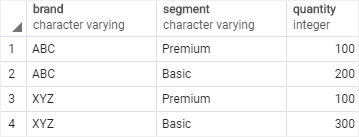
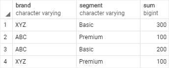
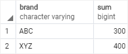
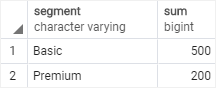
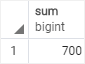
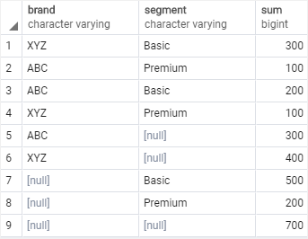
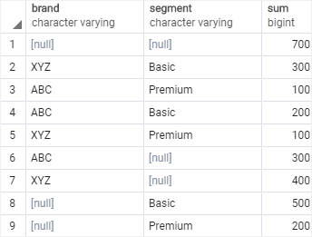
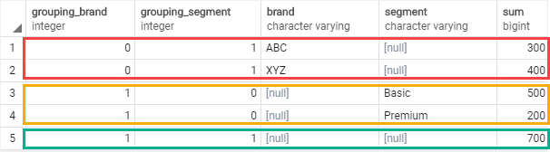
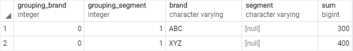

# GROUPING SETS

Ushbu qo'llanmada siz guruhlash to'plamlari va so'rovda bir nechta guruhlash to'plamlarini yaratish uchun PostgreSQL GROUPING SETS bandidan qanday foydalanish haqida bilib olasiz.

Namoyish uchun `sales` deb nomlangan yangi jadval yaratishni boshlaylik.

```sql
DROP TABLE IF EXISTS sales;
CREATE TABLE sales (
    brand VARCHAR NOT NULL,
    segment VARCHAR NOT NULL,
    quantity INT NOT NULL,
    PRIMARY KEY (brand, segment)
);

INSERT INTO sales (brand, segment, quantity)
VALUES
    ('ABC', 'Premium', 100),
    ('ABC', 'Basic', 200),
    ('XYZ', 'Premium', 100),
    ('XYZ', 'Basic', 300);
```



`sales` jadvali tovar va segment bo'yicha sotilgan mahsulotlar sonini saqlaydi.

`grouping set` - bu `GROUP BY` bandidan foydalanib guruhlangan ustunlar to'plami.

Guruhlash to'plami qavslar ichida joylashgan vergul bilan ajratilgan ustunlar ro'yxati bilan belgilanadi

```sql
(column1, column2, ...)
```

Misol uchun, quyidagi so'rovda tovar va segment bo'yicha sotilgan mahsulotlar sonini qaytarish uchun `GROUP BY` bandidan foydalaniladi. Boshqacha qilib aytganda, u (`brand, segment`) bilan belgilanadigan brand va segmentning guruhlash majmuini belgilaydi.

```sql
SELECT
    brand,
    segment,
    SUM (quantity)
FROM
    sales
GROUP BY
    brand,
    segment;
```



Quyidagi so'rov brand tomonidan sotilgan mahsulotlar sonini topadi. U guruhlash to'plamini `(brandni)` belgilaydi:

```sql
SELECT
    brand,
    SUM (quantity)
FROM
    sales
GROUP BY
    brand;
```



Quyidagi so'rov segmentlar bo'yicha sotilgan mahsulotlar sonini topadi. U guruhlash to'plamini `(segmentini)` belgilaydi:

```sql
SELECT
    segment,
    SUM (quantity)
FROM
    sales
GROUP BY
    segment;
```



Quyidagi so'rov barcha brendlar va segmentlar uchun sotilgan mahsulotlar sonini topadi. U ``()`` bilan belgilangan bo'sh guruhlash to'plamini belgilaydi.

```sql
SELECT SUM (quantity) FROM sales;
```



Aytaylik, siz bitta so'rov yordamida barcha guruhlash to'plamlarini olishni xohlaysiz. Bunga erishish uchun yuqoridagi barcha so'rovlarni birlashtirish uchun `UNION ALL` dan foydalanishingiz mumkin.

`UNION ALL` barcha natijalar to'plamida mos keladigan ma'lumotlar turlariga ega bir xil sonli ustunlarga ega bo'lishini talab qilganligi sababli, quyida ko'rsatilganidek, har birining tanlov ro'yxatiga `NULL` qo'shish orqali so'rovlarni sozlashingiz kerak:

```sql
SELECT
    brand,
    segment,
    SUM (quantity)
FROM
    sales
GROUP BY
    brand,
    segment

UNION ALL

SELECT
    brand,
    NULL,
    SUM (quantity)
FROM
    sales
GROUP BY
    brand

UNION ALL

SELECT
    NULL,
    segment,
    SUM (quantity)
FROM
    sales
GROUP BY
    segment

UNION ALL

SELECT
    NULL,
    NULL,
    SUM (quantity)
FROM
    sales;
```



Ushbu so'rov barcha guruhlash to'plamlari uchun agregatlar bilan bitta natija to'plamini yaratdi.

Yuqoridagi so'rov siz kutganingizdek ishlayotgan bo'lsa ham, unda ikkita asosiy muammo bor.

* Birinchidan, bu juda uzoq.
* Ikkinchidan, unumdorlik muammosi bor, chunki PostgreSQL har bir so'rov uchun savdo jadvalini alohida skanerlashi kerak.

Uni samaraliroq qilish uchun PostgreSQL `GROUP BY` bandining pastki bandi bo'lgan `GROUPING SETS` bandini taqdim etadi.

`GROUPING SETS` bir xil so'rovda bir nechta guruhlash to'plamlarini aniqlash imkonini beradi.

`GROUPING SETS`ning umumiy sintaksisi quyidagicha:

```sql
SELECT
    c1,
    c2,
    aggregate_function(c3)
FROM
    table_name
GROUP BY
    GROUPING SETS (
        (c1, c2),
        (c1),
        (c2),
        ()
);
```

Ushbu sintaksisda bizda to'rtta guruhlash to'plami mavjud `(c1,c2), (c1), (c2) va ()`.

Ushbu sintaksisni yuqoridagi misolga qo'llash uchun `UNION ALL` bandi o'rniga `GROUPING SETS` bandidan foydalanishingiz mumkin:

```sql
SELECT
    brand,
    segment,
    SUM (quantity)
FROM
    sales
GROUP BY
    GROUPING SETS (
        (brand, segment),
        (brand),
        (segment),
        ()
    );
```



Ushbu so'rov ancha qisqa va o'qilishi mumkin. Bundan tashqari, PostgreSQL `sales` jadvalini skanerlash sonini optimallashtiradi va bir necha marta skanerlamaydi.

## Guruhlash funktsiyasi

`GROUPING()` funksiyasi ustun nomi yoki ifoda bo'lishi mumkin bo'lgan argumentni qabul qiladi:

```sql
GROUPING( column_name | expression)
```
`column_name` yoki `expression` `GROUP BY` bandida ko'rsatilganiga mos kelishi kerak.

`GROUPING()` funktsiyasi, agar argument joriy guruhlash to'plamining a'zosi bo'lsa, `0` bitini va aks holda `1` bitni qaytaradi.

Quyidagi misolga qarang:
```sql
SELECT
	GROUPING(brand) grouping_brand,
	GROUPING(segment) grouping_segment,
	brand,
	segment,
	SUM (quantity)
FROM
	sales
GROUP BY
	GROUPING SETS (
		(brand),
		(segment),
		()
	)
ORDER BY
	brand,
	segment;
```



Skrinshotda ko'rsatilganidek, `grouping_brand` qiymati 0 bo'lsa, yig'indisi ustuni `brand`ning oraliq jamini ko'rsatadi.

`grouping_segment`idagi qiymat nolga teng bo'lsa, yig'indi ustuni `segment`ning oraliq jamini ko'rsatadi.

`HAVING` bandidagi `GROUPING()` funksiyasidan har bir brendning oraliq jamini quyidagi tarzda topish mumkin:

```sql
SELECT
	GROUPING(brand) grouping_brand,
	GROUPING(segment) grouping_segment,
	brand,
	segment,
	SUM (quantity)
FROM
	sales
GROUP BY
	GROUPING SETS (
		(brand),
		(segment),
		()
	)
HAVING GROUPING(brand) = 0	
ORDER BY
	brand,
	segment;
```



Ushbu qo'llanmada siz bir nechta guruhlash to'plamlarini yaratish uchun PostgreSQL `GROUPING SETS`-dan qanday foydalanishni o'rgandingiz.