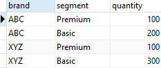
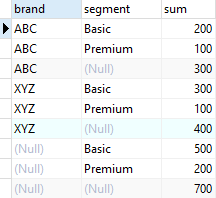
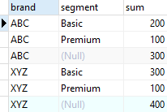

# CUBE

Ushbu qo'llanmada siz bir nechta guruhlash to'plamlarini yaratish uchun PostgreSQL CUBE dan qanday foydalanishni o'rganasiz.

PostgreSQL `CUBE` `GROUP BY` bandining kichik bandidir. `CUBE` bir nechta guruhlash to'plamlarini yaratishga imkon beradi.

`grouping set` - bu siz guruhlamoqchi bo'lgan ustunlar to'plami. Guruhlash to'plamlari haqida qo'shimcha ma'lumot olish uchun uni `GROUPING SETS` bo'yicha o'quv qo'llanmasiga qarang.

Quyida `CUBE` kichik bandining sintaksisi tasvirlangan:

```sql
SELECT
    c1,
    c2,
    c3,
    aggregate (c4)
FROM
    table_name
GROUP BY
    CUBE (c1, c2, c3);
```

Umuman olganda, agar `CUBE` da ko'rsatilgan ustunlar soni n bo'lsa, sizda <code>2<sup>n</sup></code> ta kombinatsiya bo'ladi.

PostgreSQL hisoblangan agregatlar sonini kamaytirish uchun qisman kubni bajarishga imkon beradi. Quyida sintaksis ko'rsatilgan:

```sql
SELECT
    c1,
    c2,
    c3,
    aggregate (c4)
FROM
    table_name
GROUP BY
    c1,
    CUBE (c1, c2);
```

## PostgreSQL `CUBE` misollari

Namoyish uchun biz `GROUPING SETS` o'quv qo'llanmasida yaratilgan `sales` jadvalidan foydalanamiz.



Quyidagi so'rov bir nechta guruhlash to'plamlarini yaratish uchun `CUBE` pastki bandidan foydalanadi:

```sql
SELECT
    brand,
    segment,
    SUM (quantity)
FROM
    sales
GROUP BY
    CUBE (brand, segment)
ORDER BY
    brand,
    segment;
```

Mana natija:



Quyidagi so'rov qisman kubni amalga oshiradi:

```sql
SELECT
    brand,
    segment,
    SUM (quantity)
FROM
    sales
GROUP BY
    brand,
    CUBE (segment)
ORDER BY
    brand,
    segment;
```



Ushbu qo'llanmada siz bir nechta guruhlash to'plamlarini yaratish uchun PostgreSQL `CUBE`-dan qanday foydalanishni o'rgandingiz.