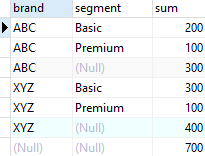
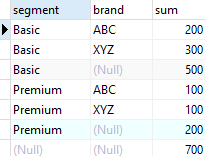
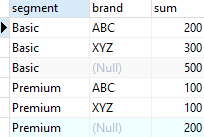
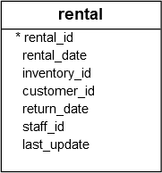
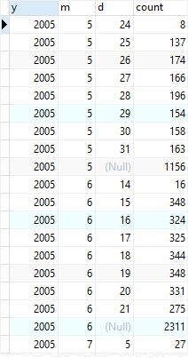

# ROLL UP

Ushbu qo'llanmada siz bir nechta guruhlash to'plamlarini yaratish uchun PostgreSQL `ROLLUP`-dan qanday foydalanishni 
o'rganasiz.

PostgreSQL `ROLLUP` - bu `GROUP BY` bandining kichik bandi bo'lib, u bir nechta guruhlash to'plamlarini aniqlash uchun stenografiyani taklif qiladi. Guruhlash to'plami - bu siz guruhlaydigan ustunlar to'plami. Batafsil ma'lumot uchun guruhlash to'plamlari qo'llanmasini ko'rib chiqing.

`CUBE` kichik bandidan farqli o'laroq, `ROLLUP` belgilangan ustunlar asosida barcha mumkin bo'lgan guruhlash to'plamlarini yaratmaydi. Bu shunchaki ularning kichik to'plamini yaratadi.

`ROLLUP` kirish ustunlari orasidagi ierarxiyani qabul qiladi va ierarxiyani hisobga olgan holda mantiqiy bo'lgan barcha guruhlash to'plamlarini yaratadi. Shuning uchun `ROLLUP` ko'pincha hisobotlar uchun oraliq jamlamalar va umumiy jami yaratish uchun ishlatiladi.

Masalan, `CUBE (c1,c2,c3)` barcha mumkin bo'lgan sakkizta guruhlash to'plamini yaratadi:

```sql
(c1, c2, c3)
(c1, c2)
(c2, c3)
(c1,c3)
(c1)
(c2)
(c3)
()
```

Biroq, `ROLLUP(c1,c2,c3)` `c1 > c2 > c3` ierarxiyasini quyidagi tarzda qabul qilib, faqat to'rtta guruhlash to'plamini hosil qiladi:

```sql
(c1, c2, c3)
(c1, c2)
(c1)
()
```

`ROLLUP` dan keng tarqalgan foydalanish ierarxiya `yil > oy > sanani` hisobga olgan holda yil, oy va sana boʻyicha maʼlumotlar yigʻindisini hisoblashdir.

Quyida PostgreSQL `ROLLUP` sintaksisi tasvirlangan:

```sql
SELECT
    c1,
    c2,
    c3,
    aggregate(c4)
FROM
    table_name
GROUP BY
    ROLLUP (c1, c2, c3);
```

Yaratilgan oraliqlar sonini kamaytirish uchun qisman yig'ish ham mumkin.

```sql
SELECT
    c1,
    c2,
    c3,
    aggregate(c4)
FROM
    table_name
GROUP BY
    c1, 
    ROLLUP (c2, c3);
```

## PostgreSQL ROLLUP misollari

Agar siz savdo jadvalini yaratmagan bo'lsangiz, quyidagi skriptdan foydalanishingiz mumkin:

```sql
DROP TABLE IF EXISTS sales;
CREATE TABLE sales (
    brand VARCHAR NOT NULL,
    segment VARCHAR NOT NULL,
    quantity INT NOT NULL,
    PRIMARY KEY (brand, segment)
);

INSERT INTO sales (brand, segment, quantity)
VALUES
    ('ABC', 'Premium', 100),
    ('ABC', 'Basic', 200),
    ('XYZ', 'Premium', 100),
    ('XYZ', 'Basic', 300);
```

Quyidagi so'rovda brend bo'yicha (jami jami) va barcha brendlar va segmentlar (jami) bo'yicha sotilgan mahsulotlar sonini topish uchun `ROLLUP` bandidan foydalaniladi

```sql
SELECT
    brand,
    segment,
    SUM (quantity)
FROM
    sales
GROUP BY
    ROLLUP (brand, segment)
ORDER BY
    brand,
    segment;
```



Chiqarishdan aniq ko'rinib turibdiki, uchinchi qatorda `ABC` brendining sotuvi, oltinchi qatorda `XYZ` brendining sotuvi ko'rsatilgan.Oxirgi qatorda barcha brendlar va segmentlar uchun umumiy summa ko'rsatilgan. Bu misolda ierarxiya `brand > segment` hisoblanadi.

Agar siz brend va segment tartibini o'zgartirsangiz, natija quyidagicha farq qiladi:

```sql
SELECT
    segment,
    brand,
    SUM (quantity)
FROM
    sales
GROUP BY
    ROLLUP (segment, brand)
ORDER BY
    segment,
    brand;
```



Bunday holda, ierarxiya `segment > brand`dir.

Quyidagi bayonot qisman yig'ishni amalga oshiradi:

```sql
SELECT
    segment,
    brand,
    SUM (quantity)
FROM
    sales
GROUP BY
    segment,
    ROLLUP (brand)
ORDER BY
    segment,
    brand;
```



[Namunaviy](https://www.postgresqltutorial.com/wp-content/uploads/2019/05/dvdrental.zip) maʼlumotlar bazasidan quyidagi ijara jadvaliga qarang.



Quyidagi bayonot `ROLLUP` yordamida kunlik, oylik va yildagi ijaralar sonini topadi:

```sql
SELECT
    EXTRACT (YEAR FROM rental_date) y,
    EXTRACT (MONTH FROM rental_date) M,
    EXTRACT (DAY FROM rental_date) d,
    COUNT (rental_id)
FROM
    rental
GROUP BY
    ROLLUP (
        EXTRACT (YEAR FROM rental_date),
        EXTRACT (MONTH FROM rental_date),
        EXTRACT (DAY FROM rental_date)
    );
```



Ushbu qo'llanmada siz bir nechta guruhlash to'plamlarini yaratish uchun PostgreSQL `ROLLUP`-dan qanday foydalanishni o'rgandingiz.