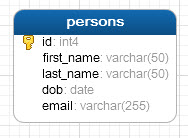
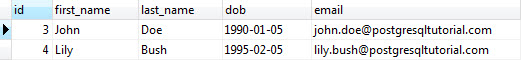
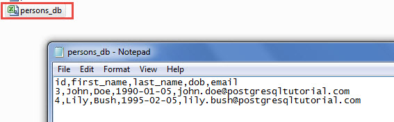
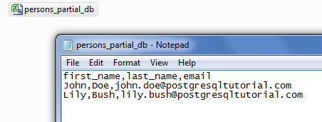
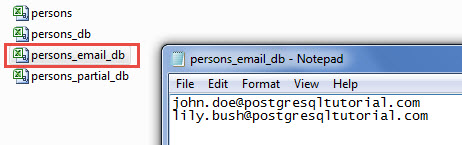

# Export PostgreSQL Table to CSV file

Ushbu qo'llanmada siz PostgreSQL jadvallaridan CSV fayllariga ma'lumotlarni eksport qilishning turli usullarini o'rganasiz.

Oldingi qo'llanmada biz CSV faylidan ma'lumotlarni jadvalga qanday import qilishni ko'rsatdik. CSV faylidan ma'lumotlarni import qilish uchun biz yaratgan shaxslar jadvalidan foydalanamiz.



Keling, `persons` jadvali ma'lumotlarini tekshiramiz.

```sql
SELECT
	*
FROM
	persons;
```



Jadvalda ikkita rekord mavjud.

## `COPY` bayonoti yordamida jadvaldan ma'lumotlarni `CSV` ga eksport qiling

Jadval ma'lumotlarini CSV fayliga eksport qilishning eng oson yo'li `COPY` bayonotidan foydalanishdir. Masalan, agar siz `persons` jadvali ma'lumotlarini `C:\tmp` jildidagi `persons_db.csv` nomli CSV fayliga eksport qilmoqchi bo'lsangiz, quyidagi bayonotdan foydalanishingiz mumkin:

```sql
COPY persons TO 'C:\tmp\persons_db.csv' DELIMITER ',' CSV HEADER;
```

PostgreSQL `persons` jadvalining barcha ustunlaridagi barcha ma'lumotlarni `persons_db.csv` fayliga eksport qiladi.



Ba'zi hollarda siz jadvalning ayrim ustunlaridagi ma'lumotlarni CSV fayliga eksport qilishni xohlaysiz. Buning uchun siz `COPY` kalit so'zidan keyin ustun nomlarini jadval nomi bilan birga belgilaysiz. Masalan, quyidagi bayonot `persons` jadvalidagi `first_name`, `last_name`, va `email`  ustunlaridagi maʼlumotlarni `person_partial_db.csv` ga eksport qiladi.

```sql
COPY persons(first_name,last_name,email) 
TO 'C:\tmp\persons_partial_db.csv' DELIMITER ',' CSV HEADER;
```



Jadvalning ustun nomlarini o'z ichiga olgan sarlavhani eksport qilishni xohlamasangiz, `COPY` bayonotidagi `HEADER` bayrog'ini olib tashlang. Quyidagi bayonot faqat `persons` jadvalining `email` ustunidagi ma'lumotlarni CSV fayliga eksport qiladi.

```sql
COPY persons(email) 
TO 'C:\tmp\persons_email_db.csv' DELIMITER ',' CSV;
```



`COPY` buyrug'ida ko'rsatgan `CSV` fayl nomi to'g'ridan-to'g'ri server tomonidan yozilishi kerakligiga e'tibor bering. Bu shuni anglatadiki, CSV fayli mahalliy kompyuteringizda emas, balki ma'lumotlar bazasi serverida joylashgan bo'lishi kerak. `CSV` fayli PostgreSQL serveri ishlaydigan foydalanuvchi tomonidan ham yozilishi kerak.

## `\copy` buyrug'i yordamida jadvaldan CSV fayliga ma'lumotlarni eksport qiling

Agar siz PostgreSQL ma'lumotlar bazasi serveriga masofaviy kirish imkoniga ega bo'lsangiz, lekin undagi faylga yozish uchun etarli imtiyozlarga ega bo'lmasangiz, PostgreSQL o'rnatilgan `\copy` buyrug'idan foydalanishingiz mumkin.

`\copy` buyrug'i asosan yuqoridagi `COPY` iborasini ishga tushiradi. Biroq, server `CSV` faylini yozish o'rniga, psql `CSV` faylini yozadi va ma'lumotlarni serverdan mahalliy fayl tizimingizga uzatadi. `\copy` buyrug'ini ishlatish uchun siz faqat mahalliy mashinangiz uchun etarli imtiyozlarga ega bo'lishingiz kerak. Bu PostgreSQL superuser imtiyozlarini talab qilmaydi.

Masalan, agar siz `persons` jadvalining barcha ma'lumotlarini `persons_client.csv` fayliga eksport qilmoqchi bo'lsangiz, psql mijozidan `\copy` buyrug'ini quyidagicha bajarishingiz mumkin:

```sql
\copy (SELECT * FROM persons) to 'C:\tmp\persons_client.csv' with csv
```

Ushbu o'quv qo'llanmada jadvaldan CSV fayllariga ma'lumotlarni eksport qilish uchun `COPY` bayonoti va `\copy` buyrug'idan qanday foydalanishni ko'rsatdik.

© [postgresqltutorial.com](https://www.postgresqltutorial.com/postgresql-tutorial/export-postgresql-table-to-csv-file/)