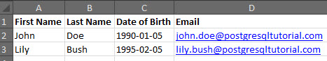
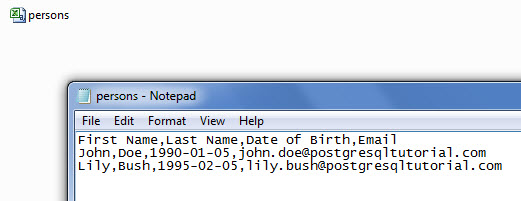
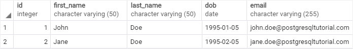
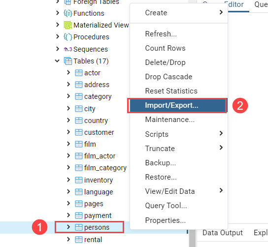
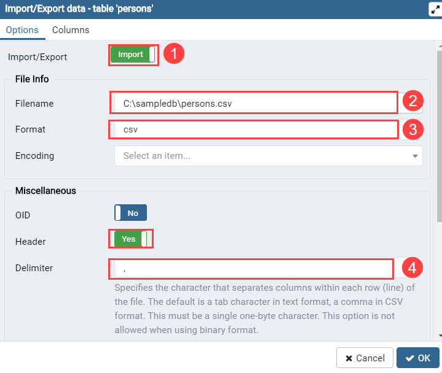
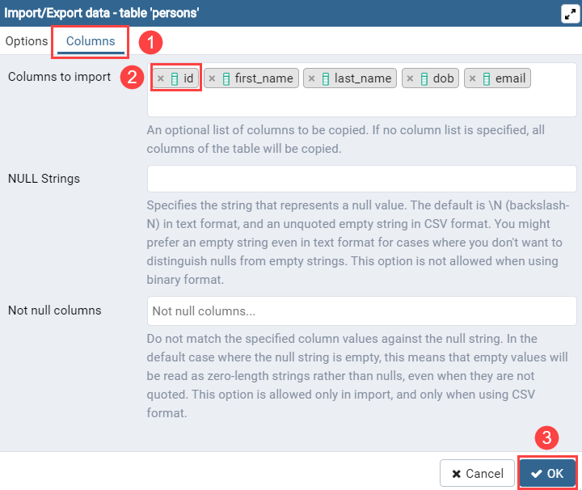
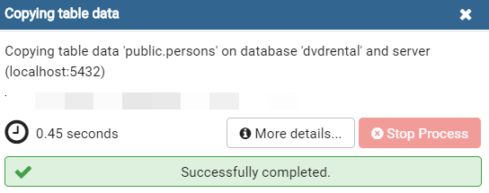

# Import CSV file into Table

Ushbu qo'llanmada biz sizga CSV faylini PostgreSQL jadvaliga import qilishning turli usullarini ko'rsatamiz.

Birinchidan, quyidagi ustunlar bilan `persons` nomli yangi jadval yarating:

* `id`: shaxs identifikatori 
* `first_name`: ism 
* `last_name`: familiya
* `dob`: tug'ilgan sanasi
* `email`: elektron pochta manzili

```sql
CREATE TABLE persons (
  id SERIAL,
  first_name VARCHAR(50),
  last_name VARCHAR(50),
  dob DATE,
  email VARCHAR(255),
  PRIMARY KEY (id)
)
```


Ikkinchidan, quyidagi formatdagi CSV ma'lumotlar faylini tayyorlang:





CSV faylining yo'li quyidagicha: `C:\sampledb\persons.csv`

Download the [persons.csv](<persons.csv>) file

## CSV faylini `COPY` bayonotidan foydalanib jadvalga import qiling

Ushbu CSV faylini `persons` jadvaliga import qilish uchun siz `COPY` bayonotidan quyidagi tarzda foydalanasiz:

```sql
COPY persons(first_name, last_name, dob, email)
FROM 'C:\sampledb\persons.csv'
DELIMITER ','
CSV HEADER;
```

PostgreSQL quyidagi xabarni qaytaradi:

```sql
COPY 2
```

Bu ikki qatordan nusxa olinganligini anglatadi. Keling, `persons` jadvalini tekshiramiz.

```sql
SELECT * FROM persons;
```



Kutilganidek ishlaydi.

Keling, `COPY` bayonotiga batafsilroq to'xtalib o'tamiz.

Birinchidan, siz `COPY` kalit so'zidan keyin ustun nomlari bilan jadvalni belgilaysiz. Ustunlar tartibi CSV faylidagi bilan bir xil bo'lishi kerak. Agar CSV faylida jadvalning barcha ustunlari bo'lsa, ularni aniq ko'rsatish shart emas, masalan:

```sql
COPY sample_table_name
FROM 'C:\sampledb\sample_data.csv' 
DELIMITER ',' 
CSV HEADER;
```

Ikkinchidan, `CSV` fayl yo'lini `FROM` kalit so'zidan keyin qo'yasiz. CSV fayl formati ishlatilganligi uchun siz `CSV` bandlari bilan bir qatorda `DELIMITER`ni ham belgilashingiz kerak.

Uchinchidan, `CSV` faylida sarlavha mavjudligini ko'rsatish uchun `HEADER` kalit so'zini belgilang. `COPY` buyrug'i ma'lumotlarni import qilganda, u faylning sarlavhasini e'tiborsiz qoldiradi.

E'tibor bering, fayl mijoz ilovasi tomonidan emas, balki bevosita PostgreSQL serveri tomonidan o'qilishi kerak. Shuning uchun unga PostgreSQL server mashinasi orqali kirish mumkin bo'lishi kerak. Bundan tashqari, `COPY` bayonotini muvaffaqiyatli bajarish uchun superfoydalanuvchi ruxsatiga ega bo'lishingiz kerak.

## pgAdmin yordamida CSV faylini jadvalga import qiling

Agar siz CSV faylini kompyuteringizdan PostgreSQL ma'lumotlar bazasi serveridagi jadvalga import qilishingiz kerak bo'lsa, pgAdmin-dan foydalanishingiz mumkin.

Quyidagi bayonot ma'lumotlarni qayta import qilishingiz uchun `persons` jadvalini qisqartiradi.

```sql
TRUNCATE TABLE persons 
RESTART IDENTITY;
```

Birinchidan, `persons` jadvalini o'ng tugmasini bosing va **Import/Eksport…** menyu bandini tanlang:



Ikkinchidan, (1) importga o'ting, (2) import fayliga o'ting, (3) formatni CSV sifatida tanlang, (4) ajratuvchini vergul (`,`) sifatida tanlang:



Uchinchidan, ustunlar yorlig'ini bosing, id ustunidan belgini olib tashlang va OK tugmasini bosing:



Nihoyat, import jarayoni tugashini kuting. Quyida import jarayoni haqida ma'lumot beruvchi dialog oynasi ko'rsatilgan:



Ushbu qo'llanmada siz CSV faylidan `COPY` bayonoti va pgAdmin vositasi yordamida PostgreSQL ma'lumotlar bazasi serveridagi jadvalga ma'lumotlarni import qilishni o'rgandingiz.

© [postgresqltutorial.com](https://www.postgresqltutorial.com/postgresql-tutorial/import-csv-file-into-posgresql-table/)