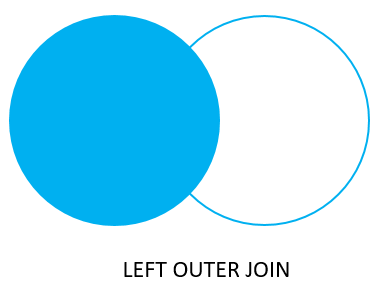
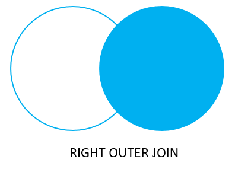
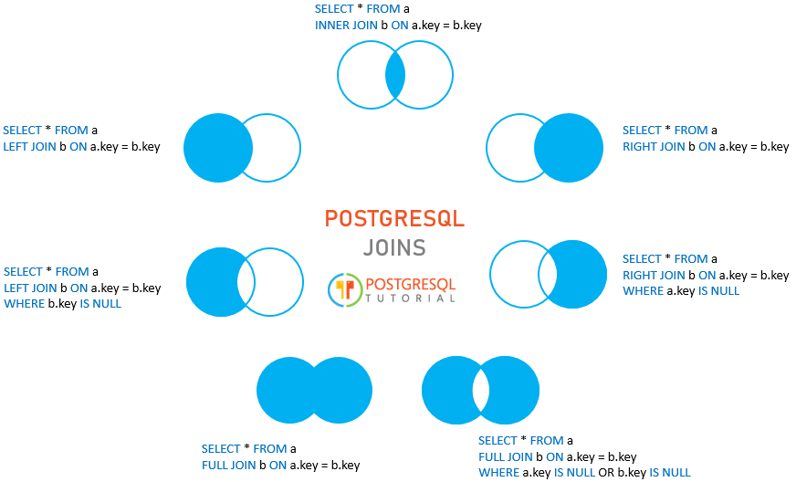

# JOINS

Ushbu qo'llanmada siz PostgreSQL `JOIN` larning har xil turlari, jumladan, ichki birlashma (`inner-join`), chapga qo'shilish (`left-join`), o'ngga qo'shilish (`right-join`) va to'liq tashqi birlashma (`full outer join`) haqida bilib olasiz.

PostgreSQL birlashmasi tegishli jadvallar orasidagi umumiy ustunlar qiymatlari asosida bir yoki bir nechta jadvallardan ustunlarni birlashtirish uchun ishlatiladi. Umumiy ustunlar odatda birinchi jadvalning asosiy kalit ustunlari va ikkinchi jadvalning tashqi kalit ustunlaridir.

PostgreSQL ichki qo'shilish, chapga qo'shilish, o'ngga qo'shilish, to'liq tashqi qo'shilish, o'zaro qo'shilish, tabiiy birlashma va o'z-o'zidan qo'shilish deb ataladigan maxsus qo'shilish turini qo'llab-quvvatlaydi.

Aytaylik, sizda mevalarni saqlaydigan `basket_a` va `basket_b` nomli ikkita jadval mavjud:

```sql
CREATE TABLE basket_a (
    a INT PRIMARY KEY,
    fruit_a VARCHAR (100) NOT NULL
);

CREATE TABLE basket_b (
    b INT PRIMARY KEY,
    fruit_b VARCHAR (100) NOT NULL
);

INSERT INTO basket_a (a, fruit_a)
VALUES
    (1, 'Apple'),
    (2, 'Orange'),
    (3, 'Banana'),
    (4, 'Cucumber');

INSERT INTO basket_b (b, fruit_b)
VALUES
    (1, 'Orange'),
    (2, 'Apple'),
    (3, 'Watermelon'),
    (4, 'Pear');
```

Jadvallarda `apple` va `orange` kabi umumiy mevalar mavjud.

Quyidagi bayonot `basket_a` jadvalidagi ma'lumotlarni qaytaradi:


Va quyidagi bayonot `basket_b` jadvalidagi ma'lumotlarni qaytaradi:


## PostgreSQL INNER JOIN

Quyidagi ibora `fruit_a` va `fruit_b` ustunlaridagi qiymatlarni moslashtirish orqali birinchi jadvalni `(basket_a)` ikkinchi jadval `(basket_b)` bilan birlashtiradi:

```sql
SELECT
    a,
    fruit_a,
    b,
    fruit_b
FROM
    basket_a
INNER JOIN basket_b
    ON fruit_a = fruit_b;
```


Ichki birlashma birinchi jadvaldagi `(basket_a)` har bir qatorni tekshiradi . U `fruit_a` ustunidagi qiymatni ikkinchi jadvaldagi `(basket_b)` har bir satrning `fruit_b` ustunidagi qiymat bilan solishtiradi. Agar bu qiymatlar teng bo'lsa, ichki birlashma ikkala jadvalning ustunlarini o'z ichiga olgan yangi qator yaratadi va natija to'plamiga ushbu yangi qatorni qo'shadi.

Quyidagi `Venn diagrammasi` ichki birikmani ko'rsatadi:


## PostgreSQL LEFT JOIN

Quyidagi bayonot `basket_a` jadvalini `basket_b` jadvaliga qo'shish uchun chap qo'shilish bandidan foydalanadi. Chap qo'shilish kontekstida birinchi jadval chap jadval deb ataladi va ikkinchi jadval o'ng jadval deb ataladi.

```sql
SELECT
    a,
    fruit_a,
    b,
    fruit_b
FROM
    basket_a
LEFT JOIN basket_b 
   ON fruit_a = fruit_b;
```


Chap qo'shilish chap jadvaldan ma'lumotlarni tanlashni boshlaydi. U `fruit_a` ustunidagi qiymatlarni `backet_b` jadvalidagi `fruit_b` ustunidagi qiymatlar bilan taqqoslaydi.

Agar bu qiymatlar teng bo'lsa, chap qo'shilish ikkala jadvalning ustunlarini o'z ichiga olgan yangi qator yaratadi va bu yangi qatorni natijalar to'plamiga qo'shadi. (natijalar to'plamidagi №1 va 2-qatorga qarang).

Agar qiymatlar teng bo'lmasa, chap qo'shilish ikkala jadvalning ustunlarini o'z ichiga olgan yangi qator yaratadi va uni natijalar to'plamiga qo'shadi. Biroq, u o'ng jadvalning ustunlarini `(basket_b)` null bilan to'ldiradi. (natijalar to'plamidagi №3 va 4-qatorga qarang).

Quyidagi `Venn diagrammasi` chap qo'shilishni ko'rsatadi:



Chap jadvaldan o'ng jadvalda mos bo'lmagan qatorlarni tanlash uchun siz `WHERE` bandi bilan chap qo'shilishdan foydalanasiz. Masalan:

```sql
SELECT
    a,
    fruit_a,
    b,
    fruit_b
FROM
    basket_a
LEFT JOIN basket_b 
    ON fruit_a = fruit_b
WHERE b IS NULL;
```

Chiqish:


> E'tibor bering, `LEFT JOIN` `LEFT OUTER JOIN` bilan bir xil, shuning uchun siz ularni bir-birining o'rnida ishlatishingiz mumkin.

Quyidagi `Venn diagrammasi` chap jadvaldan o'ng jadvaldan mos bo'lmagan satrlarni qaytaradigan chap qo'shishni ko'rsatadi:


## PostgreSQL `RIGHT JOIN`

O'ng birlashma chap qo'shilishning teskari versiyasidir. To'g'ri qo'shilish o'ng jadvaldan ma'lumotlarni tanlashni boshlaydi.

U o'ng jadvaldagi har bir satrning `fruit_b` ustunidagi har bir qiymatni `fruit_a` jadvalidagi har bir qatorning `fruit_a` ustunidagi har bir qiymat bilan solishtiradi.

Agar bu qiymatlar teng bo'lsa, o'ng qo'shilish ikkala jadvalning ustunlarini o'z ichiga olgan yangi qatorni yaratadi.

Agar bu qiymatlar teng bo'lmasa, o'ng qo'shilish ikkala jadvalning ustunlarini o'z ichiga olgan yangi qatorni ham yaratadi. Biroq, u chap jadvaldagi ustunlarni `NULL` bilan to'ldiradi.

Quyidagi ibora `basket_a` jadvalini `basket_b` jadvali bilan birlashtirish uchun o'ng qo'shilishdan foydalanadi:

```sql
SELECT
    a,
    fruit_a,
    b,
    fruit_b
FROM
    basket_a
RIGHT JOIN basket_b ON fruit_a = fruit_b;
```

Mana natija:


Quyidagi Venn diagrammasi to'g'ri birikmani ko'rsatadi:



Xuddi shunday, siz `WHERE` bandini quyidagi tarzda qo'shish orqali chap jadvaldan mos keladigan satrlarga ega bo'lmagan o'ng jadvaldan qatorlarni olishingiz mumkin:

```sql
SELECT
    a,
    fruit_a,
    b,
    fruit_b
FROM
    basket_a
RIGHT JOIN basket_b 
   ON fruit_a = fruit_b
WHERE a IS NULL;
```


> `RIGHT JOIN` `va RIGHT OUTER JOIN` bir xil, shuning uchun siz ularni bir-birining o'rnida ishlatishingiz mumkin.

Quyidagi `Venn diagrammasi` chap jadvalda mos keladigan qatorlarga ega bo'lmagan o'ng jadvaldan satrlarni qaytaradigan o'ng birlashmani ko'rsatadi:


## PostgreSQL FULL OUTER JOIN

To'liq tashqi qo'shilish yoki to'liq qo'shilish chap va o'ng jadvallarning barcha qatorlarini, agar mavjud bo'lsa, ikkala tomondan mos keladigan qatorlarni o'z ichiga olgan natijalar to'plamini qaytaradi. Agar moslik bo'lmasa, jadval ustunlari NULL bilan to'ldiriladi.

```sql
SELECT
    a,
    fruit_a,
    b,
    fruit_b
FROM
    basket_a
FULL OUTER JOIN basket_b 
    ON fruit_a = fruit_b;
```


Quyidagi Venn diagrammasi to'liq tashqi birikmani ko'rsatadi:


Jadvalning boshqasida mos bo'lmagan satrlarni qaytarish uchun siz WHERE bandi bilan to'liq birlashmadan foydalanasiz:

```sql
SELECT
    a,
    fruit_a,
    b,
    fruit_b
FROM
    basket_a
FULL JOIN basket_b 
   ON fruit_a = fruit_b
WHERE a IS NULL OR b IS NULL;
```

Mana natija:


Quyidagi Venn diagrammasi boshqa jadvalda mos keladigan qatorlarga ega bo'lmagan jadvaldagi satrlarni qaytaradigan to'liq tashqi birikmani ko'rsatadi:


Quyidagi rasmda biz batafsil sintaksis bilan muhokama qilgan barcha PostgreSQL ulanishlari ko'rsatilgan:



Ushbu qo'llanmada siz bir nechta tegishli jadvallardagi ma'lumotlarni birlashtirish uchun PostgreSQL birlashmalarining har xil turlaridan qanday foydalanishni o'rgandingiz.