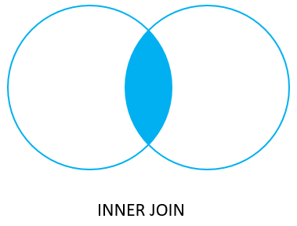

# INNER JOIN

Ushbu qo'llanmada siz PostgreSQL `INNER JOIN` bandidan foydalangan holda bir nechta jadvallardan ma'lumotlarni qanday tanlashni o'rganasiz.

Aloqa ma'lumotlar bazasida ma'lumotlar odatda bir nechta jadvallarda taqsimlanadi. To'liq ma'lumotlarni tanlash uchun siz ko'pincha bir nechta jadvallardan ma'lumotlarni so'rashingiz kerak.

Ushbu qo'llanmada biz `INNER JOIN` bandidan foydalangan holda bir nechta jadvallardagi ma'lumotlarni qanday birlashtirishga e'tibor qaratamiz.

Aytaylik, sizda ikkita `A` va `B` jadval mavjud. `A` jadvalida `pka` ustuni bor, uning qiymati `B` jadvalining `fka` ustunidagi qiymatlarga mos keladi.


Ikkala jadvaldagi ma'lumotlarni tanlash uchun siz `SELECT` iborasida `INNER JOIN` bandidan quyidagi tarzda foydalanasiz:

```sql
SELECT
	pka,
	c1,
	pkb,
	c2
FROM
	A
INNER JOIN B ON pka = fka;
```

`A` jadvalini `B` jadvali bilan birlashtirish uchun siz quyidagi amallarni bajaring:

* Birinchidan, `SELECT` bandida ma'lumotlarni tanlamoqchi bo'lgan ikkala jadvaldan ustunlarni belgilang.

* Ikkinchidan, `FROM` bandida asosiy jadvalni, ya'ni A jadvalini belgilang.

* Uchinchidan, `INNER JOIN` bandida ikkinchi jadvalni `(jadval B)` belgilang va `ON` kalit so'zidan keyin birlashma shartini bering. 

`INNER JOIN` qanday ishlaydi.\
`A` jadvalidagi har bir satr uchun ichki birlashma `pka` ustunidagi qiymatni `B` jadvalidagi har bir satrning `fka` ustunidagi qiymat bilan solishtiradi:
* Agar bu qiymatlar teng bo'lsa, ichki birlashma ikkala jadvalning barcha ustunlarini o'z ichiga olgan yangi qator yaratadi va uni natijalar to'plamiga qo'shadi.

* Agar bu qiymatlar teng bo'lmasa, ichki birlashma ularni e'tiborsiz qoldiradi va keyingi qatorga o'tadi.

Quyidagi Venn diagrammasi `INNER JOIN` bandi qanday ishlashini ko'rsatadi.



Ko'pincha siz qo'shilishni xohlagan jadvallar bir xil nomdagi ustunlarga ega bo'ladi, masalan, customer_id kabi id ustuni.

Agar so'rovda turli jadvallardagi bir xil nomdagi ustunlarga murojaat qilsangiz, siz xatoga yo'l qo'yasiz. Xatoga yo'l qo'ymaslik uchun siz quyidagi sintaksisdan foydalanib, ushbu ustunlarni to'liq kvalifikatsiya qilishingiz kerak:

```sql
table_name.column_name
```

Amalda, so'rovni o'qish uchun qulayroq qilish uchun birlashtirilgan jadvallarning qisqa nomlarini belgilash uchun jadval taxalluslaridan foydalanasiz.

## PostgreSQL `INNER JOIN` misollari

Keling, `INNER JOIN` bandidan foydalanishga misollar keltiraylik.

### 1. Ikki jadvalni birlashtirish uchun PostgreSQL `INNER JOIN`-dan foydalanish

Keling, [namunaviy](https://www.postgresqltutorial.com/wp-content/uploads/2019/05/dvdrental.zip) ma'lumotlar bazasida mijozlar va to'lov jadvallarini ko'rib chiqaylik.


Ushbu jadvallarda mijoz to'lovni amalga oshirganda, `payment` jadvaliga yangi qator qo'shiladi.

Har bir mijoz nol yoki ko'p to'lovga ega bo'lishi mumkin. Biroq, har bir to'lov faqat bitta mijozga tegishli. `customer_id` ustuni ikkita jadval o'rtasidagi munosabatni o'rnatadi.

Quyidagi bayonot ikkala jadvaldan ma'lumotlarni tanlash uchun `INNER JOIN` bandidan foydalanadi:

```sql
SELECT
	customer.customer_id,
	first_name,
	last_name,
	amount,
	payment_date
FROM
	customer
INNER JOIN payment 
    ON payment.customer_id = customer.customer_id
ORDER BY payment_date;
```


Quyidagi so'rov bir xil natijani qaytaradi. Biroq, u jadval taxalluslaridan foydalanadi.

```sql
SELECT
	c.customer_id,
	first_name,
	last_name,
	email,
	amount,
	payment_date
FROM
	customer c
INNER JOIN payment p 
    ON p.customer_id = c.customer_id
WHERE
    c.customer_id = 2;
```

Ikkala jadvalda bir xil `customer_id` ustuni bo'lgani uchun siz `USING` sintaksisidan foydalanishingiz mumkin:

```sql
SELECT
	customer_id,
	first_name,
	last_name,
	amount,
	payment_date
FROM
	customer
INNER JOIN payment USING(customer_id)
ORDER BY payment_date;
```

### 2. PostgreSQL `INNER JOIN`-dan uchta jadvalni birlashtirish uchun foydalaning

Quyidagi diagramma uchta jadval o'rtasidagi munosabatni ko'rsatadi: `staff, payment, and customer`.

* Har bir xodim nol yoki ko'p to'lovlarni amalga oshiradi. Va har bir to'lov bitta va faqat bitta xodim tomonidan amalga oshiriladi.
* Har bir mijoz nol yoki ko'p to'lovlarni amalga oshirdi. Har bir to'lov bitta mijoz tomonidan amalga oshiriladi.


Uchta jadvalga qo'shilish uchun birinchi `INNER JOIN` bandidan keyin ikkinchi `INNER JOIN` bandini quyidagi so'rov sifatida qo'ying:

```sql
SELECT
	c.customer_id,
	c.first_name customer_first_name,
	c.last_name customer_last_name,
	s.first_name staff_first_name,
	s.last_name staff_last_name,
	amount,
	payment_date
FROM
	customer c
INNER JOIN payment p 
    ON p.customer_id = c.customer_id
INNER JOIN staff s 
    ON p.staff_id = s.staff_id
ORDER BY payment_date;
```


Uchdan ortiq jadvalga qo'shilish uchun siz bir xil texnikani qo'llaysiz.

Ushbu qo'llanmada siz PostgreSQL `INNER JOIN` bandidan foydalanib, bir nechta jadvallardan ma'lumotlarni qanday tanlashni o'rgandingiz.