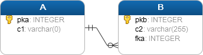
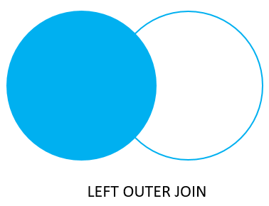
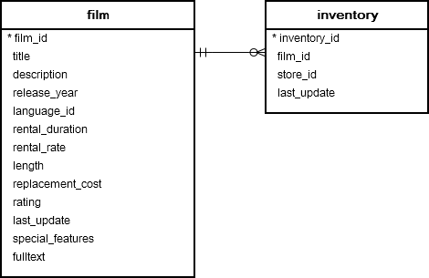
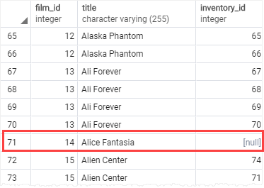
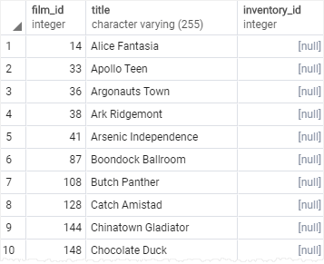

# LEFT JOIN

Ushbu qo'llanmada siz bir nechta jadvallardan ma'lumotlarni tanlash uchun PostgreSQL `LEFT JOIN` bandidan qanday foydalanishni o'rganasiz.

Aytaylik, sizda ikkita jadval mavjud: A va B.



`A` jadvalidagi har bir satr `B` jadvalidagi nol yoki bir nechta mos qatorlarga ega bo'lishi mumkin, `B` jadvalidagi har bir satr esa A jadvalidagi bitta va faqat bitta mos qatorga ega .

Ushbu jadvaldan ma'lumotlarni tanlash uchun, agar `B` jadvalida tegishli satrlar bo'lmasligi mumkin yoki bo'lmasligi mumkin, siz `LEFT JOIN` foydalanasiz.

Quyidagi bayonot `A` jadvalini `B` jadvali bilan birlashtiruvchi `LEFT JOIN` sintaksisini ko'rsatadi:

```sql
SELECT
	pka,
	c1,
	pkb,
	c2
FROM
	A
LEFT JOIN B ON pka = fka;
```

Jadvalni A jadval B jadvali bilan chap birlashma yordamida birlashtirish uchun siz quyidagi amallarni bajaring:

* Birinchidan, ikkala jadvaldagi `SELECT` bandidagi ma'lumotlarni tanlamoqchi bo'lgan ustunlarni belgilang.

* Ikkinchidan, `FROM` bandida chap jadvalni (jadval A) belgilang.

* Uchinchidan, `LEFT JOIN` bandida o'ng jadvalni (jadval B) va ON kalit so'zidan keyin qo'shilish shartini belgilang.

`LEFT JOIN` bandi chap jadvaldan ma'lumotlarni tanlashni boshlaydi. Chapdagi jadvaldagi har bir satr uchun `pka` ustunidagi qiymatni o'ng jadvaldagi `fka` ustunidagi har bir satrning qiymati bilan taqqoslaydi.

Agar bu qiymatlar teng bo'lsa, chap qo'shilish bandi `SELECT` bandida paydo bo'ladigan ustunlarni o'z ichiga olgan yangi qator yaratadi va bu qatorni natijalar to'plamiga qo'shadi.

Agar bu qiymatlar teng bo'lmasa, chap qo'shilish bandi `SELECT` bandida paydo bo'ladigan ustunlarni o'z ichiga olgan yangi qatorni ham yaratadi. Bundan tashqari, u o'ng jadvaldan keladigan ustunlarni `NULL` bilan to'ldiradi.

Quyidagi `Venn diagrammasi` `LEFT JOIN` bandi qanday ishlashini ko'rsatadi:



E'tibor bering, u  `LEFT JOIN` `LEFT OUTER JOIN` deb ham ataladi.

## PostgreSQL `LEFT JOIN` misollari

Keling, [namunaviy](https://www.postgresqltutorial.com/wp-content/uploads/2019/05/dvdrental.zip) ma'lumotlar bazasidan quyidagi filmva inventory jadvallarni ko'rib chiqaylik.



`Film` jadvalidagi har bir qatorda `inventory` jadvalidagi nol yoki ko'p qatorlar bo'lishi mumkin. `inventory` jadvalidagi har bir qatorda `film` jadvalida bitta va faqat bitta qator mavjud.

`film_id` ustuni `film` va `inventory` jadvallari o'rtasidagi aloqani o'rnatadi.

Quyidagi ibora `film` jadvalini `inventory` jadvaliga qo'shish uchun `LEFT JOIN` bandidan foydalanadi:

```sql
SELECT
	film.film_id,
	title,
	inventory_id
FROM
	film
LEFT JOIN inventory 
    ON inventory.film_id = film.film_id
ORDER BY title;
```



`Film` jadvalidagi qatorda `inventory` jadvalida mos keladigan qator bo'lmasa, ushbu qatorning `inventory_id` ustunining qiymati `NULL` bo'ladi.

Quyidagi bayonotda `inventory`da bo'lmagan filmlarni topish uchun `WHERE` bandi qo'shiladi:

```sql
SELECT
	film.film_id,
	film.title,
	inventory_id
FROM
	film
LEFT JOIN inventory 
   ON inventory.film_id = film.film_id
WHERE inventory.film_id IS NULL
ORDER BY title;
```

Quyidagi bayonot bir xil natijani qaytaradi. Farqi shundaki, u so'rovni yanada ixcham qilish uchun `jadval taxalluslari`dan foydalanadi:

```sql
SELECT
	f.film_id,
	title,
	inventory_id
FROM
	film f
LEFT JOIN inventory i
   ON i.film_id = f.film_id
WHERE i.film_id IS NULL
ORDER BY title;
```



Agar ikkala jadval ham `ON` bandida bir xil ustun nomiga ega bo'lsa, siz `USING` sintaksisidan quyidagi tarzda foydalanishingiz mumkin:

```sql
SELECT
	f.film_id,
	title,
	inventory_id
FROM
	film f
LEFT JOIN inventory i USING (film_id)
WHERE i.film_id IS NULL
ORDER BY title;
```

Ushbu uslub bitta jadvaldan boshqa jadvalda mos bo'lmagan qatorlarni tanlashni xohlaganingizda foydalidir.

Ushbu qo'llanmada siz boshqa jadvallarda mos keladigan yoki bo'lmasligi mumkin bo'lgan bir jadvaldan qatorlarni tanlash uchun PostgreSQL `LEFT JOIN` bandidan qanday foydalanishni o'rgandingiz.