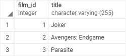
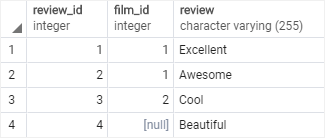
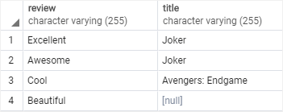
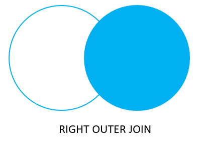
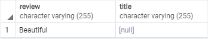

# RIGHT JOIN

Ushbu qo'llanmada siz ikkita jadvaldan ma'lumotlarni tanlash uchun PostgreSQL `RIGHT JOIN`dan qanday foydalanishni bilib olasiz.

Aytaylik, sizda ikkita jadvalli `film` va `film_reviews` bor:

```sql
DROP TABLE IF EXISTS films;
DROP TABLE IF EXISTS film_reviews;

CREATE TABLE films(
   film_id SERIAL PRIMARY KEY,
   title varchar(255) NOT NULL
);

INSERT INTO films(title)
VALUES('Joker'),
      ('Avengers: Endgame'),
      ('Parasite');

CREATE TABLE film_reviews(
   review_id SERIAL PRIMARY KEY,
   film_id INT,
   review VARCHAR(255) NOT NULL	
);

INSERT INTO film_reviews(film_id, review)
VALUES(1, 'Excellent'),
      (1, 'Awesome'),
      (2, 'Cool'),
      (NULL, 'Beautiful');
```

Film nol yoki ko'p sharhga ega bo'lishi mumkin va sharh nol yoki bitta filmga tegishli. `Films`dagi `film_id` ustuni `film_reviews` jadvalidagi `film_id` ustuniga havola qiladi.

Quyida filmlar mazmuni va `film_reviews` jadvallari ko'rsatilgan:

```sql
SELECT * FROM films;
```



```sql
SELECT * FROM film_reviews;
```



Film id 1 ikkita sharhga ega. Film identifikatori 2 1 ta sharhga ega. Id 3 filmiga sharhlar yo'q. Ko'rib chiqish identifikatori 4 hech qanday film bilan bog'lanmaydi.

## PostgreSQL `RIGHT JOIN` misollari

Quyidagi bayonot `films` va `film_reviews` jadvallaridan ma'lumotlarni tanlash uchun `RIGHT JOIN`-dan foydalanadi:

```sql
SELECT 
   review, 
   title
FROM 
   films
RIGHT JOIN film_reviews 
   ON film_reviews.film_id = films.film_id;
```



Ushbu bayonotda `films` chap jadval va `film_reviews` o'ng jadvaldir. `RIGHT JOIN` bandi to'g'ri jadval(film_reviews)dan ma'lumotlarni tanlashni boshlaydi 

O'ng jadvaldagi (`film_reviews`) har bir qator uchun `film_reviews` jadvalining `film_id` ustunidagi qiymat chap jadvaldagi (`films`) har bir qatorning `film_id` ustunidagi qiymatga teng yoki yo'qligini tekshiradi.

Agar ular teng bo'lsa, `RIGHT JOIN` `SELECT` bandida ko'rsatilgan ikkala jadvalning ustunlarini o'z ichiga olgan yangi qator yaratadi va bu yangi qatorni natijalar to'plamiga kiritadi.

Aks holda, `RIGHT JOIN` hali ham ikkala jadvalning ustunlarini o'z ichiga olgan va natijalar to'plamiga ushbu yangi qatorni o'z ichiga olgan yangi qator yaratadi. Biroq, u chap jadvaldagi (films) ustunlarini `NULL` bilan to'ldiradi.

Boshqacha qilib aytadigan bo'lsak, `RIGHT JOIN` o'ng jadvaldagi barcha satrlarni chap jadvaldan mos keladigan satrlar bor yoki yo'qligini tanlaydi.

`Films` va `film_reviews` jadvallari ma'lumotlariga asoslanib:

* Id 1 bilan sharh `film_id` 1 bilan mos keladi.
* Id 2 bilan sharh `film_id` 2 bilan mos keladi.
* Id 3 bilan sharh `film_id` 2 bilan mos keladi.
* Identifikator 4 bo'lgan sharh hech qanday filmga mos kelmaydi, shuning uchun `sarlavha` ustuni `NULL` bilan to'ldirilgan.

> E'tibor bering, `RIGHT OUTER JOIN`, `RIGHT JOIN` bilan bir xil. `OUTER` kalit so'zi ixtiyoriy.
Quyidagi Venn diagrammasi `RIGHT JOIN` qanday ishlashini ko'rsatadi:



## `USING` sintaksisi bilan PostgreSQL `RIGHT JOIN`

Birlashtirilgan ustun bir xil nomga ega bo'lgani uchun (`film_id`), siz qo'shilish predikatida `USING` sintaksisidan foydalanishingiz mumkin:
```sql
SELECT review, title
FROM films
RIGHT JOIN film_reviews USING (film_id);
```

Bu so'rov xuddi `ON` bandini ishlatgandek natijani qaytaradi.

## `WHERE` bandi bilan PostgreSQL `RIGHT JOIN`

Chap jadvalda mos keladigan qatorlar bo'lmagan o'ng jadvaldagi qatorlarni topish uchun siz WHERE bandini quyidagi kabi qo'shishingiz kerak:

```sql
SELECT review, title
FROM films
RIGHT JOIN film_reviews using (film_id)
WHERE title IS NULL;
```



Ushbu qo'llanmada siz ikkita jadvaldagi ma'lumotlarni birlashtirish uchun PostgreSQL `RIGHT JOIN` bandidan qanday foydalanishni o'rgandingiz.