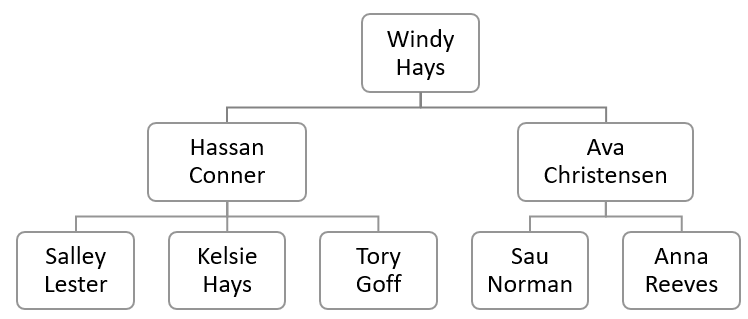
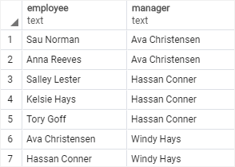
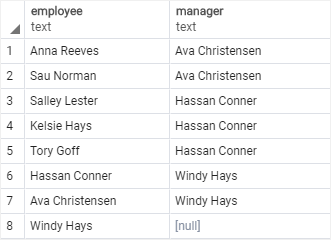

# PostgreSQL SELF JOIN
Ushbu qo'llanmada siz bir xil jadvaldagi satrlarni solishtirish uchun PostgreSQL o'z-o'zidan qo'shilish texnikasidan qanday foydalanishni o'rganasiz.

O'z-o'zidan qo'shilish - jadvalni o'ziga qo'shadigan muntazam birlashma. Amalda, siz odatda ierarxik ma'lumotlarni so'rash yoki bir xil jadval ichidagi satrlarni solishtirish uchun o'z-o'zidan qo'shilishdan foydalanasiz.

O'z-o'zidan qo'shilishni yaratish uchun siz bir xil jadvalni ikki marta turli jadval taxalluslari bilan belgilaysiz va `ON` kalit so'zidan keyin birlashma predikatini taqdim etasiz.

Quyidagi so'rov jadvalni o'ziga birlashtiradigan `INNER JOIN` dan foydalanadi:

```sql
SELECT select_list
FROM table_name t1
INNER JOIN table_name t2 ON join_predicate;
```

Bu sintaksisda table_name `INNER JOIN` bandi yordamida o'ziga birlashtiriladi.

Shuningdek, jadvalni o'ziga quyidagicha qo'shish uchun `LEFT JOIN` yoki `RIGHT JOIN` bandidan foydalanishingiz mumkin:

```sql
SELECT select_list
FROM table_name t1
LEFT JOIN table_name t2 ON join_predicate;
```

## PostgreSQL `SELF JOIN` misollari

Keling, o'z-o'zidan birlashmalardan foydalanishga misollar keltiraylik.
### 1. Ierarxik ma'lumotlarni so'rash misoli

Namoyish uchun namuna jadvalini tuzamiz.

Aytaylik, sizda quyidagi tashkiliy tuzilma mavjud:



Quyidagi bayonotlar `employee` jadvalini yaratadi va jadvalga ba'zi namunaviy ma'lumotlarni kiritadi.

```sql
CREATE TABLE employee (
	employee_id INT PRIMARY KEY,
	first_name VARCHAR (255) NOT NULL,
	last_name VARCHAR (255) NOT NULL,
	manager_id INT,
	FOREIGN KEY (manager_id) 
	REFERENCES employee (employee_id) 
	ON DELETE CASCADE
);
INSERT INTO employee (
	employee_id,
	first_name,
	last_name,
	manager_id
)
VALUES
	(1, 'Windy', 'Hays', NULL),
	(2, 'Ava', 'Christensen', 1),
	(3, 'Hassan', 'Conner', 1),
	(4, 'Anna', 'Reeves', 2),
	(5, 'Sau', 'Norman', 2),
	(6, 'Kelsie', 'Hays', 3),
	(7, 'Tory', 'Goff', 3),
	(8, 'Salley', 'Lester', 3);
```

Ushbu `employee` jadvalida `menejer_id` ustuni `employee_id` ustuniga havola qiladi.`manager_id` ustunidagi qiymat xodim bevosita bo'ysunadigan menejerni ko'rsatadi. `manager_id` ustunidagi qiymat `null` bo'lsa, bu xodim hech kimga hisobot bermaydi. Boshqacha qilib aytganda, u eng yaxshi menejer.

Quyidagi so'rov kim kimga hisobot berishini aniqlash uchun o'z-o'zidan qo'shilishdan foydalanadi:

```sql
SELECT
    e.first_name || ' ' || e.last_name employee,
    m .first_name || ' ' || m .last_name manager
FROM
    employee e
INNER JOIN employee m ON m .employee_id = e.manager_id
ORDER BY manager;

```



Ushbu so'rov employees jadvaliga ikki marta murojaat qiladi, biri xodim, ikkinchisi menejer. U xodim uchun `e` va menejer uchun `m` jadval taxalluslaridan foydalanadi.

Qo'shilish predikati `employee_id` va `menejer_id` ustunlaridagi qiymatlarni moslashtirish orqali xodim/menejer juftligini topadi.

> E'tibor bering, yuqori menejer chiqishda ko'rinmaydi.

Natijalar to'plamiga yuqori menejerni kiritish uchun quyidagi so'rovda ko'rsatilgandek `INNER JOIN` bandi o'rniga `LEFT JOIN` bandidan foydalanasiz:

```sql
SELECT
    e.first_name || ' ' || e.last_name employee,
    m .first_name || ' ' || m .last_name manager
FROM
    employee e
LEFT JOIN employee m ON m .employee_id = e.manager_id
ORDER BY manager;
```



### 2. Qatorlarni bir xil jadval bilan solishtirish

DVD ijarasi ma'lumotlar bazasidan quyidagi filmlar jadvaliga qarang:


Quyidagi so'rov bir xil uzunlikdagi barcha filmlar juftligini topadi:

```sql
SELECT
    f1.title,
    f2.title,
    f1.length
FROM
    film f1
INNER JOIN film f2 
    ON f1.film_id <> f2.film_id AND 
       f1.length = f2.length;
```


Birlashma predikati bir xil uzunlikdagi (f1.length = f2.length) ikki xil filmga (f1.film_id <> f2.film_id) mos keladi.

### Xulosa

* PostgreSQL `SELF JOIN` - bu `INNER JOIN` yoki `LEFT JOIN` yordamida jadvalni o'ziga birlashtiradigan oddiy birlashma.

* `SELF JOIN` ierarxik ma'lumotlarni so'rash yoki bitta jadval ichidagi satrlarni solishtirish uchun juda foydali.