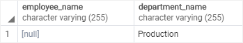

# PostgreSQL `FULL OUTER JOIN`

Ushbu qo'llanmada siz ikki yoki undan ortiq jadvallardan ma'lumotlarni so'rash uchun PostgreSQL `FULL OUTER JOIN`-dan qanday foydalanishni o'rganasiz.

Aytaylik, siz ikkita jadvalni toʻliq tashqi birlashtirishni amalga oshirmoqchisiz: A va B. Quyida `FULL OUTER JOIN` sintaksisi tasvirlangan:

```sql
SELECT * FROM A
FULL [OUTER] JOIN B on A.id = B.id;
```

Ushbu sintaksisda `OUTER` kalit so'zi ixtiyoriydir.

To'liq tashqi birlashma chap va o'ng birlashma natijalarini birlashtiradi.

Agar birlashtirilgan jadvaldagi satrlar mos kelmasa, to'liq tashqi birlashma mos keladigan qatorga ega bo'lmagan jadvalning har bir ustuni uchun `NULL` qiymatlarni o'rnatadi.

Agar bitta jadvaldagi satr boshqa jadvaldagi satrga to'g'ri kelsa, natija qatori ikkala jadvaldagi qatorlar ustunlaridan to'ldirilgan ustunlarni o'z ichiga oladi.

Quyidagi Venn diagrammasi `FULL OUTER JOIN` operatsiyasini tasvirlaydi:


## PostgreSQL `FULL OUTER JOIN` misoli

Birinchidan, namoyish qilish uchun ikkita yangi jadval yarating: `employees` va `departments`:

```sql
DROP TABLE IF EXISTS departments;
DROP TABLE IF EXISTS employees;

CREATE TABLE departments (
	department_id serial PRIMARY KEY,
	department_name VARCHAR (255) NOT NULL
);

CREATE TABLE employees (
	employee_id serial PRIMARY KEY,
	employee_name VARCHAR (255),
	department_id INTEGER
);
```

Har bir bo'limda nol yoki ko'p xodimlar mavjud va har bir xodim nol yoki bitta bo'limga tegishli.

Ikkinchidan, `departments` va `employees` jadvallariga namunaviy ma'lumotlarni kiriting.

```sql
INSERT INTO departments (department_name)
VALUES
	('Sales'),
	('Marketing'),
	('HR'),
	('IT'),
	('Production');

INSERT INTO employees (
	employee_name,
	department_id
)
VALUES
	('Bette Nicholson', 1),
	('Christian Gable', 1),
	('Joe Swank', 2),
	('Fred Costner', 3),
	('Sandra Kilmer', 4),
	('Julia Mcqueen', NULL);
```

Uchinchidan, `departments` va `employees` jadvallaridan ma'lumotlarni so'rash:

```sql
SELECT * FROM departments;
```


```sql
SELECT * FROM employees;
```


To'rtinchidan, `departments` va `employees` jadvallaridan ma'lumotlarni so'rash uchun `FULL OUTER JOIN` dan foydalaning.

```sql
SELECT
	employee_name,
	department_name
FROM
	employees e
FULL OUTER JOIN departments d 
        ON d.department_id = e.department_id;
```


Natijalar to'plamiga bo'limga tegishli bo'lgan har bir xodim va xodimi bo'lgan har bir bo'lim kiradi. Bundan tashqari, u bo'limga tegishli bo'lmagan har bir xodimni va xodimi bo'lmagan har bir bo'limni o'z ichiga oladi.

Xodimlari yo'q bo'limni topish uchun siz `WHERE` bandidan quyidagi tarzda foydalanasiz:

```sql
SELECT
	employee_name,
	department_name
FROM
	employees e
FULL OUTER JOIN departments d 
        ON d.department_id = e.department_id
WHERE
	employee_name IS NULL;
```



Natija shuni ko'rsatadiki, `Production` bo'limida xodimlar yo'q.

Hech qanday bo'limga tegishli bo'lmagan xodimni topish uchun siz `WHERE` bandidagi `department_name` `NULL` belgisini quyidagi bayonot sifatida tekshiring:

```sql
SELECT
	employee_name,
	department_name
FROM
	employees e
FULL OUTER JOIN departments d ON d.department_id = e.department_id
WHERE
	department_name IS NULL;
```


Natijadan aniq ko'rinib turibdiki,  `Juila Makkuin` hech qanday bo'limga tegishli emas.

Ushbu qoʻllanmada siz ikki yoki undan ortiq jadvallarni birlashtirish uchun PostgreSQL `FULL OUTER JOIN` bandidan qanday foydalanishni oʻrgandingiz.