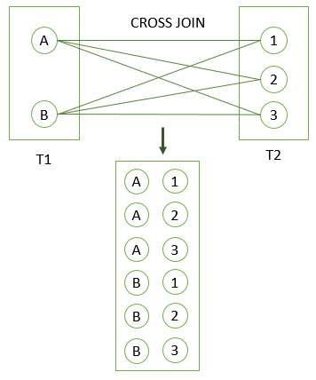

# CROSS JOIN

Ushbu qoʻllanmada siz PostgreSQL `CROSS JOIN` dan qanday qilib birlashtirilgan jadvallardan qatorlarning kartezian mahsulotini ishlab chiqarishni oʻrganasiz.

`CROSS JOIN` bandi ikki yoki undan ortiq jadvaldagi satrlarning dekart mahsulotini yaratishga imkon beradi.

`LEFT JOIN`  yoki `INNER JOIN`  kabi boshqa qo'shilish gaplaridan farqli o'laroq, `CROSS JOIN` bandida qo'shilish predikati yo'q.

Aytaylik, siz ikkita T1 va T2 jadvallarini `CROSS JOIN`ni bajarishingiz kerak.

Agar T1 `n` ta qatorga va T2 `m` qatorga ega bo'lsa, natijalar to'plami `nxm` qatorlarga ega bo'ladi. Misol uchun, T1 `1000` qatorga va T2 `1000` qatorga ega, natija to'plami `1000 x 1000 = 1 000 000` qatorga ega bo'ladi.

Quyida `CROSS JOIN` sintaksisi sintaksisi tasvirlangan:

```sql
SELECT select_list
FROM T1
CROSS JOIN T2;
```

Quyidagi bayonot yuqoridagi bayonotga tengdir:

```sql
SELECT select_list
FROM T1, T2;
```

Bundan tashqari, oʻzaro qoʻshilishni taqlid qilish uchun har doim rost deb baholanadigan shart bilan `INNER JOIN` bandidan foydalanishingiz mumkin:

```sql
SELECT *
FROM T1
INNER JOIN T2 ON true;
```

## PostgreSQL `CROSS JOIN` misoli

Quyidagi `CREATE TABLE` iboralari `T1` va `T2` jadvallarini yaratadi va o'zaro namoyish uchun ba'zi namunaviy ma'lumotlarni kiritadi.

```sql
DROP TABLE IF EXISTS T1;
CREATE TABLE T1 (label CHAR(1) PRIMARY KEY);

DROP TABLE IF EXISTS T2;
CREATE TABLE T2 (score INT PRIMARY KEY);

INSERT INTO T1 (label)
VALUES
	('A'),
	('B');

INSERT INTO T2 (score)
VALUES
	(1),
	(2),
	(3);
```

Quyidagi bayonot T1 jadvalini T2 jadvaliga qo'shish uchun `CROSS JOIN` operatoridan foydalanadi.

```sql
SELECT *
FROM T1
CROSS JOIN T2;

 label | score
-------+-------
 A     |     1
 B     |     1
 A     |     2
 B     |     2
 A     |     3
 B     |     3
(6 rows)
```

Quyidagi rasm T1 jadvalini T2 jadvaliga ulashda `CROSS JOIN` natijasini ko'rsatadi:



Ushbu oʻquv qoʻllanmada siz ikki yoki undan ortiq jadvaldagi qatorlarning kartezian mahsulotini yaratish uchun PostgreSQL `CROSS JOIN` bandidan qanday foydalanishni oʻrgandingiz.

© [postgresqltutorial.com](https://www.postgresqltutorial.com/postgresql-tutorial/postgresql-cross-join/)