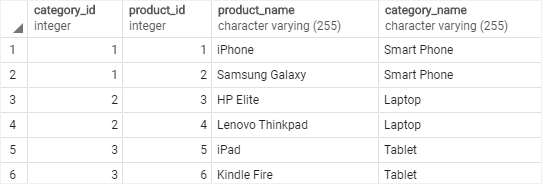
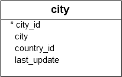

# NATURAL JOIN

Ushbu qo'llanmada siz ikki yoki undan ortiq jadvallardan ma'lumotlarni so'rash uchun PostgreSQL `NATURAL JOIN`-dan qanday foydalanishni o'rganasiz.

`NATURAL JOIN` - bu birlashtirilgan jadvallardagi bir xil ustun nomlari asosida yashirin birlashma hosil qiluvchi birlashma.

Quyida PostgreSQL tabiiy birikmasining sintaksisi ko'rsatilgan:

```sql
SELECT select_list
FROM T1
NATURAL [INNER, LEFT, RIGHT] JOIN T2;
```

`NATURAL JOIN` ichki birlashma, chap qo'shilish yoki o'ng qo'shilish bo'lishi mumkin. Agar siz birlashishni aniq ko'rsatmasangiz, masalan, `INNER JOIN`, `LEFT JOIN`, `RIGHT JOIN`, PostgreSQL sukut bo'yicha `INNER JOIN` dan foydalanadi.

Tanlangan ro'yxatda yulduzcha (*) dan foydalansangiz, natijada quyidagi ustunlar bo'ladi:

* Ikkala jadvalning bir xil nomga ega ustunlari bo'lgan barcha umumiy ustunlar.

* Ikkala jadvalning har bir ustuni, bu umumiy ustun emas.

## PostgreSQL `NATURAL JOIN` misollari

PostgreSQL tabiiy birikmasini namoyish qilish uchun biz ikkita jadval yaratamiz: `categories` va `products`.

Quyidagi `CREATE TABLE` iboralari toifalar va mahsulotlar jadvallarini yaratadi.

```sql
DROP TABLE IF EXISTS categories;
CREATE TABLE categories (
	category_id serial PRIMARY KEY,
	category_name VARCHAR (255) NOT NULL
);

DROP TABLE IF EXISTS products;
CREATE TABLE products (
	product_id serial PRIMARY KEY,
	product_name VARCHAR (255) NOT NULL,
	category_id INT NOT NULL,
	FOREIGN KEY (category_id) REFERENCES categories (category_id)
);
```

Har bir toifada nol yoki ko'p mahsulot mavjud va har bir mahsulot bitta va faqat bitta toifaga tegishli.

`products` jadvalidagi `category_id` ustuni toifalar jadvalining asosiy kalitiga havola qiluvchi tashqi kalit hisoblanadi. `category_id` - bu `natural join` amalga oshirish uchun foydalanadigan umumiy ustun.

Quyidagi `INSERT` iboralari `categories` va `products` jadvallariga ba'zi ma'lumotlarni kiritadi.

```sql
INSERT INTO categories (category_name)
VALUES
	('Smart Phone'),
	('Laptop'),
	('Tablet');

INSERT INTO products (product_name, category_id)
VALUES
	('iPhone', 1),
	('Samsung Galaxy', 1),
	('HP Elite', 2),
	('Lenovo Thinkpad', 2),
	('iPad', 3),
	('Kindle Fire', 3);
```

Quyidagi bayonot `products` jadvalini `categories` jadvali bilan birlashtirish uchun `NATURAL JOIN` bandidan foydalanadi:

```sql
SELECT * FROM products
NATURAL JOIN categories;
```



Yuqoridagi bayonot `INNER JOIN` bandidan foydalanadigan quyidagi bayonotga teng.

```sql
SELECT	* FROM products
INNER JOIN categories USING (category_id);
```

`NATURAL JOIN` ning qulayligi shundaki, u birlashma bandini ko'rsatishni talab qilmaydi, chunki u umumiy ustun asosida yashirin qo'shilish bandidan foydalanadi.

Biroq, iloji boricha `NATURAL JOIN` dan foydalanmaslik kerak, chunki bu baʼzan kutilmagan natijaga olib kelishi mumkin.

Misol uchun, [namunaviy](https://www.postgresqltutorial.com/wp-content/uploads/2019/05/dvdrental.zip) ma'lumotlar bazasidan quyidagi `city` va `counttry` jadvallarini ko'ring:




Ikkala jadvalda ham bir xil `country_id` ustuni mavjud, shuning uchun siz ushbu jadvallarga quyidagi tarzda qo'shilish uchun `NATURAL JOIN` dan foydalanishingiz mumkin:

```sql
SELECT * 
FROM city
NATURAL JOIN country;
```

So'rov bo'sh natijalar to'plamini qaytaradi.

Sababi shundaki,…

Ikkala jadvalda ham `last_update` deb nomlangan yana bir umumiy ustun mavjud bo'lib, uni birlashtirish uchun ishlatib bo'lmaydi. Biroq, `NATURAL JOIN` bandi faqat `last_update` ustunidan foydalanadi.

Ushbu qo'llanmada siz PostgreSQL `NATURAL JOIN` ishlari va undan umumiy ustunlarga ega bo'lgan ikki yoki undan ortiq jadvallardan ma'lumotlarni so'rash uchun qanday foydalanish haqida bilib oldingiz.

© [postgresqltutorial.com](https://www.postgresqltutorial.com/postgresql-tutorial/postgresql-natural-join/)