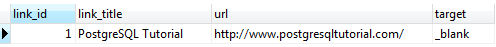

# ALTER TABLE

Ushbu qo'llanmada siz jadval tuzilishini o'zgartirish uchun PostgreSQL `ALTER TABLE` bayonotidan qanday foydalanishni o'rganasiz.

Mavjud jadvalning tuzilishini o'zgartirish uchun siz PostgreSQL `ALTER TABLE` iborasidan foydalanasiz.

Quyida `ALTER TABLE` iborasining asosiy sintaksisi tasvirlangan:

```sql
ALTER TABLE table_name action;
```

PostgreSQL sizga ko'p harakatlarni taqdim etadi:

* Add a column
* Drop a column
* Change the data type of a column
* Rename a column
* Set a default value for the column.
* Add a constraint to a column.
* Rename a table

Jadvalga yangi ustun qoʻshish uchun siz `ALTER TABLE ADD COLUMN` iborasidan foydalanasiz:

```sql
ALTER TABLE table_name 
ADD COLUMN column_name datatype column_constraint;
```

Jadvaldan ustun olish uchun siz `ALTER TABLE DROP COLUMN` iborasidan foydalanasiz:
```sql
ALTER TABLE table_name 
DROP COLUMN column_name;
```

Ustun nomini oʻzgartirish uchun siz `ALTER TABLE RENAME COLUMN TO` identifikatsiyasidan foydalanasiz:
```sql
ALTER TABLE table_name 
RENAME COLUMN column_name 
TO new_column_name;
```

Ustunning standart qiymatini oʻzgartirish uchun, `ALTER TABLE ALTER COLUMN SET DEFAULT` yoki `DROP DEFAULT` dan foydalaning:
```sql
ALTER TABLE table_name 
ALTER COLUMN column_name 
[SET DEFAULT value | DROP DEFAULT];
```

`NOT NULL` cheklovini oʻzgartirish uchun `ALTER TABLE ALTER COLUMN` iborasidan foydalanasiz:
```sql
ALTER TABLE table_name 
ALTER COLUMN column_name 
[SET NOT NULL| DROP NOT NULL];
```

`CHECK` cheklovini qo'shish uchun siz `ALTER TABLE ADD CHECK` iborasidan foydalanasiz:
```sql
ALTER TABLE table_name 
ADD CHECK expression;
```

Odatda, jadvalga cheklov qoʻshish uchun siz `ALTER TABLE ADD CONSTRAINT` iborasidan foydalanasiz:
```sql
ALTER TABLE table_name 
ADD CONSTRAINT constraint_name constraint_definition;
```

Jadval nomini oʻzgartirish uchun siz `ALTER TABLE RENAME TO` iborasidan foydalanasiz:
```sql
ALTER TABLE table_name 
RENAME TO new_table_name;
```

## PostgreSQL ALTER TABLE misollari

Keling, `ALTER TABLE` iborasi bilan mashq qilish uchun `links` deb nomlangan yangi jadval yarataylik.
```sql
DROP TABLE IF EXISTS links;

CREATE TABLE links (
   link_id serial PRIMARY KEY,
   title VARCHAR (512) NOT NULL,
   url VARCHAR (1024) NOT NULL
);
```

`active` nomli yangi ustun qo'shish uchun siz quyidagi bayonotdan foydalanasiz:
```sql
ALTER TABLE links
ADD COLUMN active boolean;
```

Quyidagi bayonot `active` ustunni `links`jadvalidan olib tashlaydi:
```sql
ALTER TABLE links 
DROP COLUMN active;
```

`title` ustuni nomini `link_title` ga oʻzgartirish uchun quyidagi bayonotdan foydalanasiz:
```sql
ALTER TABLE links 
RENAME COLUMN title TO link_title;
```

Quyidagi bayonot `links` jadvalga `target` nomli yangi ustun qo'shadi:
```sql
ALTER TABLE links 
ADD COLUMN target VARCHAR(10);
```

`_blank` ni `links` jadvaldagi `target` ustun uchun standart qiymat sifatida belgilash uchun siz quyidagi bayonotdan foydalanasiz:
```sql
ALTER TABLE links 
ALTER COLUMN target
SET DEFAULT '_blank';
```

Agar siz yangi qatorni `links` jadvaliga `target` ustun qiymatini belgilamasdan kiritsangiz, `target` ustun standart qiymat sifatida `_blank`ni oladi. Masalan:
```sql
INSERT INTO links (link_title, url)
VALUES('PostgreSQL Tutorial','https://www.postgresqltutorial.com/');
```

Quyidagi bayonot `links` jadvalidan ma'lumotlarni tanlaydi:
```sql
SELECT * FROM links;
```



Quyidagi bayonot `target` ustunga `CHECK` shartini qo'shadi, shunda `target` ustun faqat quyidagi qiymatlarni qabul qiladi: `_self, _blank, _parent va _top`:
```sql
ALTER TABLE links 
ADD CHECK (target IN ('_self', '_blank', '_parent', '_top'));
```

Agar maqsad ustun uchun oʻrnatilgan `CHECK` cheklovini buzadigan yangi qator qoʻshishga harakat qilsangiz, PostgreSQL quyidagi misolda koʻrsatilganidek xatolik chiqaradi:
```sql
INSERT INTO links(link_title,url,target) 
VALUES('PostgreSQL','http://www.postgresql.org/','whatever');
```
```sql
ERROR:  new row for relation "links" violates check constraint "links_target_check"
DETAIL:  Failing row contains (2, PostgreSQL, http://www.postgresql.org/, whatever).DETAIL:  Failing row contains (2, PostgreSQL, http://www.postgresql.org/, whatever).
```

Quyidagi bayonot `links` jadvalining `url` ustuniga `UNIQUE` cheklovni qo'shadi:
```sql
ALTER TABLE links 
ADD CONSTRAINT unique_url UNIQUE ( url );
```

Quyidagi bayonot allaqachon mavjud bo'lgan urlni kiritishga harakat qiladi:
```sql
INSERT INTO links(link_title,url) 
VALUES('PostgreSQL','https://www.postgresqltutorial.com/');
```

`unique_url` cheklovi tufayli xatolik yuzaga keladi:
```sql
ERROR:  duplicate key value violates unique constraint "unique_url"
DETAIL:  Key (url)=(https://www.postgresqltutorial.com/) already exists.
```

Quyidagi bayonot `links` jadvalining nomini `urls` ga o'zgartiradi:
```sql
ALTER TABLE links 
RENAME TO urls;
```

Ushbu qo'llanmada siz mavjud jadval tuzilishini o'zgartirish uchun PostgreSQL `ALTER TABLE` iborasidan qanday foydalanishni o'rgandingiz.

© [postgresqltutorial.com](https://www.postgresqltutorial.com/postgresql-tutorial/postgresql-alter-table/)

