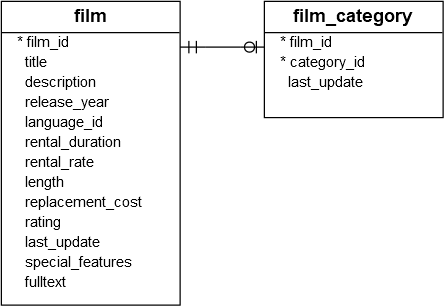
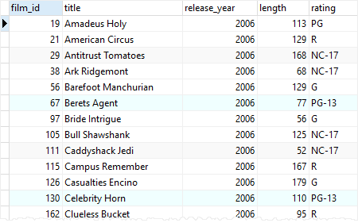
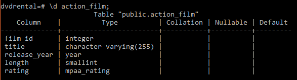
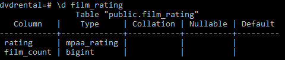

# CREATE TABLE AS 

Ushbu qo'llanmada siz so'rov natijalari to'plamidan yangi jadval yaratish uchun PostgreSQL `CREATE TABLE AS` iborasidan qanday foydalanishni o'rganasiz.

`CREATE TABLE AS` iborasi yangi jadval yaratadi va uni so'rov orqali qaytarilgan ma'lumotlar bilan to'ldiradi. Quyida `CREATE TABLE AS` iborasining sintaksisi ko'rsatilgan:

```sql
CREATE TABLE new_table_name
AS query;
```

Ushbu sintaksisda:

* Birinchidan, `CREATE TABLE` bandidan keyin yangi jadval nomini belgilang.
* Ikkinchidan, natijalar to'plami `AS` kalit so'zidan keyin yangi jadvalga qo'shiladigan so'rovni taqdim eting.

`TEMPORARY` yoki `TEMP` kalit so'zi vaqtinchalik jadval yaratishga imkon beradi:

```sql
CREATE TEMP TABLE new_table_name 
AS query; 
```

`UNLOGGED` kalit so'zi yangi jadvalni o'chirilgan jadval sifatida yaratishga imkon beradi:

```sql
CREATE UNLOGGED TABLE new_table_name
AS query;
```

Yangi jadvalning ustunlarida `SELECT` bandining chiqish ustunlari bilan bog'langan nomlar va ma'lumotlar turlari bo'ladi.

Jadval ustunlari turli nomlarga ega bo'lishini istasangiz, yangi jadval nomidan keyin yangi jadval ustunlarini belgilashingiz mumkin:

```sql
CREATE TABLE new_table_name ( column_name_list)
AS query;
```

Agar siz allaqachon mavjud bo'lgan yangi jadval yaratish orqali xatolikka yo'l qo'ymaslikni istasangiz, `IF NOT EXISTS` opsiyasidan quyidagi tarzda foydalanishingiz mumkin:

```sql
CREATE TABLE IF NOT EXISTS new_table_name
AS query;
```

PostgreSQL CREATE TABLE AS bayonotiga misollar

Namoyish uchun [namunaviy](https://www.postgresqltutorial.com/wp-content/uploads/2019/05/dvdrental.zip) maʼlumotlar bazasidagi `film` va `film_category` jadvalidan foydalanamiz.



Quyidagi bayonot birinchi toifaga tegishli bo'lgan jangovar filmlarni o'z ichiga olgan jadval yaratadi.

```sql
CREATE TABLE action_film AS
SELECT
    film_id,
    title,
    release_year,
    length,
    rating
FROM
    film
INNER JOIN film_category USING (film_id)
WHERE
    category_id = 1;
```

Jadval yaratilishini tekshirish uchun `action_film` jadvalidan ma'lumotlarni so'rashingiz mumkin:

```sql
SELECT * FROM action_film
ORDER BY title;
```



`action_film` tuzilishini tekshirish uchun psql asbobida quyidagi buyruqdan foydalanishingiz mumkin:

```sql
\d action_film;
```

U quyidagi chiqishni qaytaradi:



Chiqishda aniq ko'rsatilganidek, `action_film` jadvalining nomlari va ma'lumotlar turlari `SELECT` bandining ustunlaridan olingan.

Agar `SELECT` bandida ifodalar mavjud bo'lsa, ustunlarni bekor qilish yaxshi amaliyotdir, masalan:

```sql
CREATE TABLE IF NOT EXISTS film_rating (rating, film_count) 
AS 
SELECT
    rating,
    COUNT (film_id)
FROM
    film
GROUP BY
    rating;
```

Ushbu misol bayonoti yangi `film_rating` jadvalini yaratdi va uni `film` jadvalidagi xulosa ma'lumotlari bilan to'ldirdi. U `SELECT` bandidagi ustun nomlarini ishlatish o'rniga yangi jadval uchun ustun nomlarini aniq ko'rsatdi.

`film_rating` jadvalining tuzilishini tekshirish uchun siz psql asbobida quyidagi buyruqdan foydalanasiz:

```sql
\d film_rating
```

Quyidagi chiqish:



E'tibor bering, `CREATE TABLE AS` iborasi `SELECT INTO` operatoriga o'xshaydi, lekin `CREATE TABLE AS` operatoriga afzallik beriladi, chunki u PL/pgSQL da `SELECT INTO` sintaksisining boshqa qo'llanilishi bilan aralashmaydi. Bundan tashqari, `CREATE TABLE AS` iborasi `SELECT INTO` operatori tomonidan taklif qilingan funksiyalarning yuqori toʻplamini taqdim etadi.

Ushbu qo'llanmada siz so'rov natijasidan yangi jadval yaratish uchun PostgreSQL `CREATE TABLE AS` iborasidan qanday foydalanishni o'rgandingiz.