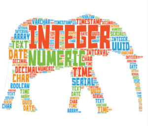

# Data types

Ushbu qo'llanmada siz PostgreSQL ma'lumotlar turlari, jumladan Boolean, belgilar, raqamli, vaqtinchalik, massiv, json, uuid va maxsus turlar haqida bilib olasiz.

## PostgreSQL ma'lumotlar turlarini umumiy ko'rinishi

PostgreSQL quyidagi ma'lumotlar turlarini qo'llab-quvvatlaydi:

* Boolean
* `Char`, `varchar` va `text` kabi belgilar turlari.
* `integer` va `floating-point` kabi sonli turlar.
* `date`, `time`, `timestamp` va `interval` kabi vaqtinchalik turlar.
* `UUID` Universal noyob identifikatorlarni saqlash uchun 
* `Array` qatorlar, raqamlar va boshqalarni massivi uchun
* `JSON` JSON ma'lumotlarini saqlaydi
* `hstore` kalit-qiymat juftligini saqlaydi 
* `Tarmoq manzili` va `geometrik ma'lumotlar` kabi maxsus turlar.

## Boolean

Mantiqiy ma'lumotlar turi uchta mumkin bo'lgan qiymatdan birini o'z ichiga olishi mumkin: true, false yoki null. Siz mantiqiy maʼlumotlar turiga ega ustunni eʼlon qilish uchun `boolean` yoki `bool` kalit soʻzidan foydalanasiz.

Ma'lumotni mantiqiy ustunga kiritganingizda, PostgreSQL uni mantiqiy qiymatga aylantiradi

* `1`, `yes`, `y`, `t`, `true` qiymatlar rostga aylantiriladi
* `0`, `no`, `false`, `f` qiymatlari yolg'onga aylantiriladi.

Mantiqiy ustundan maʼlumotlarni tanlaganingizda, PostgreSQL qiymatlarni qayta oʻzgartiradi, masalan, `t` ni `true`ga, `f` ni `false`ga va `boʻsh` joyni `null`ga oʻzgartiradi.

## Character

PostgreSQL uchta belgi ma'lumotlar turini taqdim etadi: `CHAR(n)`, `VARCHAR(n)` va `TEXT`

* `CHAR(n)` — boʻsh joy qoʻyilgan belgilangan uzunlikdagi belgi. Agar siz ustun uzunligidan qisqaroq satr qo'shsangiz, PostgreSQL bo'shliqlarni to'ldiradi. Agar siz ustun uzunligidan uzunroq satr kiritsangiz, PostgreSQL xatolik chiqaradi.

* `VARCHAR(n)` - o'zgaruvchan uzunlikdagi belgilar qatori. `VARCHAR(n)` yordamida  `n` tagacha belgi saqlashingiz mumkin. PostgreSQL saqlangan satr ustun uzunligidan qisqaroq bo'lsa, bo'sh joylarni to'ldirmaydi.

* TEXT bu oʻzgaruvchan uzunlikdagi belgilar qatoridir. Nazariy jihatdan, `text` ma'lumotlar cheksiz uzunlikdagi belgilar qatoridir.

## Raqamli

PostgreSQL ikki xil turdagi raqamlarni taqdim etadi:

* integers
* floating-point numbers

### Integer

PostgreSQL-da uch xil butun sonlar mavjud:

* Small integer(`SMALLINT`) -32,768 dan 32,767 gacha bo'lgan 2 baytli belgili butun son.
* Integer (`INT`) -2,147,483,648 dan 2,147,483,647 gacha bo'lgan diapazonga ega 4 baytli butun son.
* Serial butun son bilan bir xil, bundan tashqari PostgreSQL avtomatik ravishda qiymatlarni `SERIAL` ustuniga hosil qiladi va to'ldiradi. Bu MySQLdagi `AUTO_INCREMENT` ustuniga yoki SQLitedagi `AUTOINCREMENT` ustuniga o'xshaydi.

### Floating-point number

O'zgaruvchan nuqtali raqamlarning uchta asosiy turi mavjud:

* `float(n)` suzuvchi nuqtali raqam boʻlib, uning aniqligi kamida n, maksimal 8 baytgacha.
* `real` yoki `float8` - bu 4 baytli suzuvchi nuqtali raqam.
* `numeric` yoki `numeric(p,s)` oʻnli kasrdan keyin s raqami boʻlgan p-raqamli haqiqiy son. `numeric(p,s)` aniq raqamdir

## Vaqtinchalik ma'lumotlar turlari

Vaqtinchalik maʼlumotlar turlari sana va/yoki vaqt maʼlumotlarini saqlash imkonini beradi. PostgreSQL beshta asosiy vaqtinchalik ma'lumotlar turiga ega:

* `DATE` faqat sanalarni saqlaydi.

* `TIME` kunning vaqt qiymatini saqlaydi.
* `TIMESTAMP` sana va vaqt qiymatlarini saqlaydi.
* `TIMESTAMPTZ` vaqt mintaqasidan xabardor boʻlgan vaqt tamgʻasi maʼlumotlar turidir. Bu vaqt mintaqasi bilan vaqt tamg'asining qisqartmasi.
* `INTERVAL` vaqt davrlarini saqlaydi.

Bu `TIMESTAMPTZ` PostgreSQL-ning SQL standartining vaqtinchalik ma'lumotlar turlariga kengaytmasi.

## Arrays

PostgreSQL-da siz qatorlar qatorini, butun sonlar massivini va hokazolarni massiv ustunlarida saqlashingiz mumkin. Massiv ba'zi holatlarda foydali bo'ladi, masalan, haftaning kunlarini, yil oylarini saqlash.

## JSON

PostgreSQL ikkita `JSON` ma'lumot turini taqdim etadi: JSON ma'lumotlarini saqlash uchun `JSON` va `JSONB`.

`JSON` ma'lumotlar turi har bir qayta ishlash uchun qayta ishlashni talab qiladigan oddiy JSON ma'lumotlarini saqlaydi, `JSONB` ma'lumotlar turi esa `JSON` ma'lumotlarini qayta ishlash tezroq, lekin kiritish sekinroq bo'lgan ikkilik formatda saqlaydi.

## UUID

`UUID` maʼlumotlar turi RFC 4122 tomonidan belgilangan Universal noyob identifikatorlarni saqlash imkonini beradi. `UUID` qiymatlari `SERIAL`ga qaraganda yaxshiroq o'ziga xoslikni kafolatlaydi va URL manzilidagi `id` qiymatlari kabi ommaga ochiq bo'lgan maxfiy ma'lumotlarni yashirish uchun ishlatilishi mumkin.

## Maxsus ma'lumotlar turlari

PostgreSQL ibtidoiy ma'lumotlar turlaridan tashqari, geometrik va tarmoqqa oid bir nechta maxsus ma'lumotlar turlarini ham taqdim etadi.

* `box` - to'rtburchaklar quti.
* `lin` - nuqtalar to'plami.
* `point` - geometrik raqamlar juftligi.
* `lseg` - chiziq segmenti.
* `polygon` - yopiq geometrik.
* `inet` - IP4 manzili.
* `macaddr` - MAC manzili.

Ushbu qo'llanmada biz sizni PostgreSQL ma'lumotlar turlari bilan tanishtirdik, shunda siz ulardan keyingi qo'llanmada jadvallar yaratishda foydalanishingiz mumkin.

© [postgresqltutorial.com](https://www.postgresqltutorial.com/postgresql-tutorial/postgresql-data-types/)