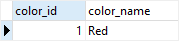
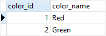
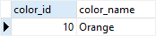
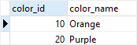
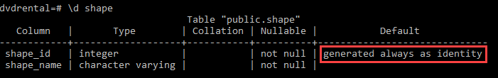
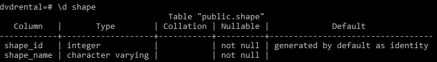

# Identity column

Ushbu qo'llanmada siz jadval uchun PostgreSQL identifikator ustunini yaratish uchun `GENERATED AS IDENTITY` cheklovidan qanday foydalanishni o'rganasiz.

PostgreSQL 10-versiyasida `identifikator sifatida yaratilgan` yangi cheklov joriy etildi, bu sizga avtomatik ravishda ustunga noyob raqam belgilash imkonini beradi.

`GENERATED AS IDENTITY` cheklovi eski `SERIAL` ustunining SQL standartiga mos variantidir.

Quyida `GENERATED AS IDENTITY` cheklovining sintaksisi tasvirlangan:

```sql
column_name type GENERATED { ALWAYS | BY DEFAULT } AS IDENTITY[ ( sequence_option ) ]
```

Ushbu sintaksisda:
* Turi SMALLINT, INT yoki BIGINT bo'lishi mumkin.
* `GENERATED ALWAYS` PostgreSQL-ga har doim identifikatsiya ustuni uchun qiymat yaratishni buyuradi. Agar siz qiymatlarni `GENERATED ALWAYS AS IDENTITY` ustuniga kiritishga (yoki yangilashga) harakat qilsangiz, PostgreSQL xatolik chiqaradi.
* `GENERATED BY BY DEFAULT` shuningdek, PostgreSQL-ga identifikatsiya ustuni uchun qiymat yaratishni buyuradi. Biroq, agar siz kiritish yoki yangilash uchun qiymat bersangiz, PostgreSQL tizim tomonidan yaratilgan qiymatdan foydalanish o'rniga identifikatsiya ustuniga kiritish uchun ushbu qiymatdan foydalanadi.

PostgreSQL sizga jadvalda bir nechta identifikatsiya ustuniga ega bo'lish imkonini beradi. `SERIAL` singari, `GENERATED AS IDENTITY` cheklovi ham `SEQUENCE` ob'ektini ichki sifatida ishlatadi.

## PostgreSQL identifikatsiya ustuniga misollar

### A. GENERATED ALWAYS 

Birinchidan, identifikatsiya ustuni sifatida color_id bilan rang nomli jadval yarating:
```sql
CREATE TABLE color (
    color_id INT GENERATED ALWAYS AS IDENTITY,
    color_name VARCHAR NOT NULL
);
```

Ikkinchidan, `colot` jadvaliga yangi qator qo'shing:

```sql
INSERT INTO color(color_name)
VALUES ('Red');
```

`color_id` ustunida `GENERATED AS IDENTITY` cheklovi mavjud bo'lganligi sababli, PostgreSQL quyidagi so'rovda ko'rsatilganidek, uning qiymatini yaratadi:

```sql
SELECT * FROM color;
```



Uchinchidan, color_id va color_name ustunlari uchun qiymatlarni kiritish orqali yangi qator qo'shing:
```sql
INSERT INTO color (color_id, color_name)
VALUES (2, 'Green');
```

PostgreSQL quyidagi xatoni chiqardi:

```sql
[Err] ERROR:  cannot insert into column "color_id"
DETAIL:  Column "color_id" is an identity column defined as GENERATED ALWAYS.
HINT:  Use OVERRIDING SYSTEM VALUE to override.
```

Xatoni tuzatish uchun siz `OVERRIDING SYSTEM VALUE` bandidan quyidagi tarzda foydalanishingiz mumkin:

```sql
INSERT INTO color (color_id, color_name)
OVERRIDING SYSTEM VALUE 
VALUES(2, 'Green');
```



Yoki uning o'rniga `GENERATED BY BY DEFAULT AS IDENTITY` dan foydalaning.

### B. GENERATED BY DEFAULT AS IDENTITY

Birinchidan, color jadvalini o'chiring va uni qayta yarating. Bu safar biz `GENERATED BY DEFAULT AS IDENTITY` dan foydalanamiz:
```sql
DROP TABLE color;

CREATE TABLE color (
    color_id INT GENERATED BY DEFAULT AS IDENTITY,
    color_name VARCHAR NOT NULL
);
```

Ikkinchidan, color jadvaliga qator qo'shing:
```sql
INSERT INTO color (color_name)
VALUES ('White');
```

Kutilganidek ishlaydi.

Uchinchidan, `color_id` ustuni qiymatiga ega boshqa qatorni kiriting:
```sql
INSERT INTO color (color_id, color_name)
VALUES (2, 'Yellow');
```

`GENERATED ALWAYS AS IDENTITY` cheklovidan foydalanadigan oldingi misoldan farqli o'laroq, yuqoridagi bayonot juda yaxshi ishlaydi.

### C. Ketma-ket variantlarga misol

`GENERATED AS IDENTITY` cheklovi `SEQUENCE` obyektidan foydalanganligi sababli tizim tomonidan yaratilgan qiymatlar uchun ketma-ketlik parametrlarini belgilashingiz mumkin.

Masalan, siz boshlang'ich qiymat va o'sishni quyidagicha belgilashingiz mumkin:
```sql
DROP TABLE color;

CREATE TABLE color (
    color_id INT GENERATED BY DEFAULT AS IDENTITY 
    (START WITH 10 INCREMENT BY 10),
    color_name VARCHAR NOT NULL
); 
```
Ushbu misolda `color_id` ustuni uchun tizim tomonidan yaratilgan qiymat 10 dan boshlanadi va o'sish qiymati ham 10 ga teng.

Birinchidan, `color` jadvaliga yangi qator qo'shing:
```sql
INSERT INTO color (color_name)
VALUES ('Orange');
```

`color_id` ustunining boshlang'ich qiymati quyida ko'rsatilgandek o'nga teng:
```sql
SELECT * FROM color;
```



Ikkinchidan, `color` jadvaliga boshqa qatorni kiriting:

```sql
INSERT INTO color (color_name)
VALUES ('Purple');
```

O'sish opsiyasi tufayli ikkinchi qatorning `color_id` qiymati 20 ga teng.
```sql
SELECT * FROM color;
```



## Mavjud jadvalga identifikatsiya ustunini qo'shish

`ALTER TABLE` iborasining quyidagi shaklidan foydalanib, mavjud jadvalga identifikatsiya ustunlarini qo'shishingiz mumkin:

```sql
ALTER TABLE table_name 
ALTER COLUMN column_name 
ADD GENERATED { ALWAYS | BY DEFAULT } AS IDENTITY { ( sequence_option ) }
```
Keling, quyidagi misolni ko'rib chiqaylik.
Birinchidan, `shape` nomli yangi jadval yarating:

```sql
CREATE TABLE shape (
    shape_id INT NOT NULL,
    shape_name VARCHAR NOT NULL
);
```

Ikkinchidan, `shape_id` ustunini identifikatsiya ustuniga o'zgartiring:
```sql
ALTER TABLE shape 
ALTER COLUMN shape_id ADD GENERATED ALWAYS AS IDENTITY;
```
E'tibor bering, `shape_id` identifikatsiya ustuniga o'zgartirilishi uchun `NOT NULL` chekloviga ega bo'lishi kerak. Aks holda, siz quyidagi xatolikni olasiz:

```sql
ERROR:  column "shape_id" of relation "shape" must be declared NOT NULL before identity can be added
SQL state: 55000
```

Quyidagi buyruq psql asbobidagi `shape` jadvalini tavsiflaydi:
```sql
\d shape
```

U biz kutgan quyidagi natijani qaytaradi:


### Identifikatsiya ustunini o'zgartirish

Mavjud identifikatsiya ustunining xususiyatlarini quyidagi `ALTER TABLE` iborasidan foydalanib o'zgartirishingiz mumkin:
```sql
ALTER TABLE table_name 
ALTER COLUMN column_name 
{ SET GENERATED { ALWAYS| BY DEFAULT } | 
  SET sequence_option | RESTART [ [ WITH ] restart ] }
```

Misol uchun, quyidagi bayonot `shape` jadvalining `shape_id` ustunini `GENERATED BY BY DEFAULT` ga o'zgartiradi:
```sql
ALTER TABLE shape
ALTER COLUMN shape_id SET GENERATED BY DEFAULT;
```
Quyidagi buyruq `psql` asbobidagi shakllar jadvalining tuzilishini tavsiflaydi:
```shell
\d shape
```



Natijadan ko'rinib turibdiki, `shape_id` ustuni `GENERATED ALWAYS` dan `GENERATED BY BY DEFAULT` ga o'zgartirildi.

### `GENERATED AS IDENTITY` cheklovini olib tashlash

Quyidagi bayonot mavjud jadvaldan `GENERATED AS IDENTITY` cheklovini olib tashlaydi:
```sql
ALTER TABLE table_name 
ALTER COLUMN column_name 
DROP IDENTITY [ IF EXISTS ]
```

Masalan, siz `shape` jadvalining `shape_id` ustunidan `GENERATED AS IDENTITY` cheklash ustunini quyidagicha olib tashlashingiz mumkin:
```sql
ALTER TABLE shape
ALTER COLUMN shape_id
DROP IDENTITY IF EXISTS;
```

Ushbu qo'llanmada siz PostgreSQL identifikator ustunidan qanday foydalanishni va uni `GENERATED AS IDENTITY` cheklovi yordamida qanday boshqarishni o'rgandingiz.

© [postgresqltutorial.com](https://www.postgresqltutorial.com/postgresql-tutorial/postgresql-identity-column/)