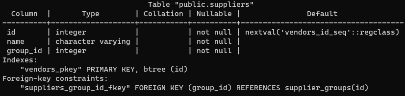
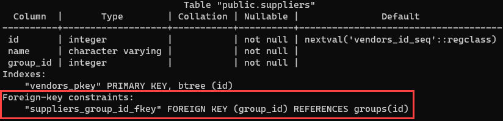

# Rename Table: bosqichma-bosqich qo'llanma

Ushbu qoʻllanma sizga `ALTER TABLE` iborasining PostgreSQL `RENAME` jadval bandidan foydalanib, jadval nomini qanday oʻzgartirishni koʻrsatadi.

Mavjud jadval nomini o'zgartirish uchun siz `ALTER TABLE` iborasidan quyidagi tarzda foydalanasiz:
```sql
ALTER TABLE table_name
RENAME TO new_table_name;
```

Ushbu bayonotda:
* Birinchidan, `ALTER TABLE` bandidan keyin nomini o'zgartirmoqchi bo'lgan jadval nomini belgilang.
* Ikkinchidan, `RENAME TO` bandidan keyin yangi jadval nomini bering.

Agar mavjud bo'lmagan jadval nomini o'zgartirmoqchi bo'lsangiz, PostgreSQL xatolik chiqaradi. Bunga yo'l qo'ymaslik uchun `IF EXISTS` opsiyasini quyidagi tarzda qo'shishingiz kerak:
```sql
ALTER TABLE IF EXISTS table_name
RENAME TO new_table_name;
```

Bunday holda, agar `table_name` mavjud bo'lmasa, PostgreSQL o'rniga bildirishnoma chiqaradi.

Bir nechta jadvallar nomini o'zgartirish uchun bir nechta `ALTER TABLE RENAME TO` operatorlarini bajarishingiz kerak. `ALTER TABLE` iborasi yordamida bir nechta jadval nomini o'zgartirish mumkin emas.

## PostgreSQL `RENAME TABLE` misollar

Quyidagi bayonot `vendors` deb nomlangan yangi jadvalni yaratadi:
```sql
DROP TABLE IF EXISTS vendors;
CREATE TABLE vendors (
    id serial PRIMARY KEY,
    name VARCHAR NOT NULL
);
```
`vendors` jadvalini `suppliers` nomiga o'zgartirish uchun siz quyidagi `ALTER TABLE RENAME TO` iborasidan foydalanasiz:
```sql
ALTER TABLE vendors RENAME TO suppliers;
```
Har bir `vendor` yoki `supplier` bir guruhga tegishli deylik. Ushbu munosabatlarni boshqarish uchun quyidagi tarzda `supplier_groups` jadvalini qo'shishingiz kerak:
```sql
CREATE TABLE supplier_groups (
    id serial PRIMARY KEY,
    name VARCHAR NOT NULL
);
```

Shuningdek, `suppliers` jadvaliga `group_id` nomli yangi ustun qo'shishingiz kerak. Bu ustun `supplier_groups` jadvalining `id` ustuniga bog'langan tashqi kalit ustunidir:
```sql
ALTER TABLE suppliers 
ADD COLUMN group_id INT NOT NULL;

ALTER TABLE suppliers 
ADD FOREIGN KEY (group_id) REFERENCES supplier_groups (id);
```

To'liq `supplier` ma'lumotlarini so'rash vaqtini tejash uchun siz `suppliers` va `supplier_groups` jadvaliga o'xshash ko'rinish yaratishingiz mumkin:
```sql
CREATE VIEW supplier_data 
AS SELECT
    s.id,
    s.name,
    g.name  supply_group
FROM
    suppliers s
INNER JOIN supplier_groups g ON g.id = s.group_id;
```
Jadval nomini yangisiga o'zgartirganingizda, PostgreSQL o'zining tashqi kalit cheklovlari, ko'rinishlar va indekslar kabi bog'liq ob'ektlarini avtomatik ravishda yangilaydi. Avval `suppliers` jadvalini tekshiramiz:
```sql
\d suppliers
```



Chiqarish shuni ko'rsatadiki, `suppliers` jadvalida `supplier_groups` jadvaliga havola qiluvchi tashqi kalit cheklovi mavjud.

Endi siz `supplier_groups` jadvalini `groups` quyidagicha nomlashingiz mumkin:
```sql
ALTER TABLE supplier_groups RENAME TO groups;
```
`suppliers` jadvalini quyidagicha tavsiflash orqali siz `suppliers` jadvalidagi xorijiy kalit cheklovlarini tekshirishingiz mumkin:
```
\d suppliers
```



Chiqishdan aniq ko'rinib turibdiki, chet el kaliti cheklovi yangilangan va buning o'rniga `groups` jadvaliga havola qilingan.

Quyidagi bayonot `supplier_data` ko'rinishini ko'rsatadi:
```
\d+ supplier_data
```


Natija shuni ko'rsatadiki, ko'rinishning `SELECT` iborasidagi `supplier_groups` jadvali ham `groups` jadvaliga yangilangan.

Ushbu qo'llanmada siz `ALTER TABLE` iborasining PostgreSQL `RENAME` bandidan foydalanib, jadval nomini o'zgartirishni o'rgandingiz.
© [postgresqltutorial.com](https://www.postgresqltutorial.com/postgresql-tutorial/postgresql-rename-table/)