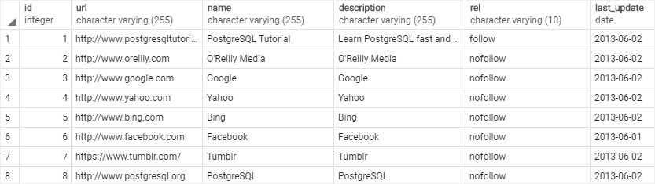

# Delete

Ushbu qoʻllanmada siz PostgreSQL `DELETE` bayonotidan jadvaldagi maʼlumotlarni oʻchirish uchun qanday foydalanishni oʻrganasiz.

PostgreSQL `DELETE` bayonoti jadvaldan bir yoki bir nechta satrlarni o'chirish imkonini beradi.

Quyida `DELETE` iborasining asosiy sintaksisi ko'rsatilgan:

```sql
DELETE FROM table_name
WHERE condition;
```

Ushbu sintaksisda:

* Birinchidan, `DELETE FROM` kalit so'zlaridan keyin ma'lumotlarni o'chirmoqchi bo'lgan jadval nomini belgilang.
* Ikkinchidan, `WHERE` bandidagi shartdan foydalanib, jadvaldan qaysi qatorlarni o'chirish kerakligini belgilang.

`WHERE` bandi ixtiyoriy. Agar siz `WHERE` bandini o'tkazib yuborsangiz, `DELETE` iborasi jadvaldagi barcha qatorlarni o'chiradi.

`DELETE` bayonoti o'chirilgan qatorlar sonini qaytaradi. Agar `DELETE` iborasi hech qanday qatorni o'chirmagan bo'lsa, u nolni qaytaradi.

O'chirilgan qator(lar)ni mijozga qaytarish uchun siz `RETURNING` bandidan quyidagi tarzda foydalanasiz:

```sql
DELETE FROM table_name
WHERE condition
RETURNING (select_list | *)
```

Yulduzcha (`*`) `table_name` o'chirilgan qatorning barcha ustunlarini qaytarish imkonini beradi.

Muayyan ustunlarni qaytarish uchun siz ularni `RETURNING` kalit so'zidan keyin ko'rsatasiz.

> E'tibor bering, `DELETE` iborasi faqat jadvaldan ma'lumotlarni olib tashlaydi. Bu jadval tuzilishini o'zgartirmaydi. Agar siz jadval tuzilishini o'zgartirmoqchi bo'lsangiz, masalan, ustunni olib tashlash, `ALTER TABLE` iborasidan foydalaning.

## PostgreSQL DELETE bayonotiga misollar

Namoyish uchun namuna jadvalini tuzamiz.

Quyidagi bayonotlar `links` deb nomlangan yangi jadval yaratadi va ba'zi namunaviy ma'lumotlarni kiritadi:

```sql
DROP TABLE IF EXISTS links;

CREATE TABLE links (
    id serial PRIMARY KEY,
    url varchar(255) NOT NULL,
    name varchar(255) NOT NULL,
    description varchar(255),
    rel varchar(10),
    last_update date DEFAULT now()
);

INSERT INTO  
   links 
VALUES 
   ('1', 'https://www.postgresqltutorial.com', 'PostgreSQL Tutorial', 'Learn PostgreSQL fast and easy', 'follow', '2013-06-02'),
   ('2', 'http://www.oreilly.com', 'O''Reilly Media', 'O''Reilly Media', 'nofollow', '2013-06-02'),
   ('3', 'http://www.google.com', 'Google', 'Google', 'nofollow', '2013-06-02'),
   ('4', 'http://www.yahoo.com', 'Yahoo', 'Yahoo', 'nofollow', '2013-06-02'),
   ('5', 'http://www.bing.com', 'Bing', 'Bing', 'nofollow', '2013-06-02'),
   ('6', 'http://www.facebook.com', 'Facebook', 'Facebook', 'nofollow', '2013-06-01'),
   ('7', 'https://www.tumblr.com/', 'Tumblr', 'Tumblr', 'nofollow', '2013-06-02'),
   ('8', 'http://www.postgresql.org', 'PostgreSQL', 'PostgreSQL', 'nofollow', '2013-06-02');
```

Mana `links` jadvalining mazmuni:

```sql
SELECT * FROM links;
```



### 1. Jadvaldan bitta qatorni o'chirish uchun PostgreSQL `DELETE` dan foydalanish

Quyidagi ibora `links` jadvalidan id 8 bo'lgan bitta qatorni o'chirish uchun `DELETE` iborasidan foydalanadi:

```sql
DELETE FROM links
WHERE id = 8;
```

Bayonot bitta satr o'chirilganligini ko'rsatadigan 1ni qaytaradi:

```sql
DELETE 1
```

Quyidagi ibora 10 idli qatorni o'chirish uchun `DELETE` iborasidan foydalanadi:

```sql
DELETE FROM links
WHERE id = 10;
```

10 idli qator mavjud emasligi sababli, bayonot 0 ni qaytaradi:

```sql
DELETE 0
```

### 2. Qatorni o'chirish va o'chirilgan qatorni qaytarish uchun PostgreSQL `DELETE` dan foydalanish

Quyidagi bayonot id 7 bo'lgan qatorni o'chiradi va o'chirilgan qatorni mijozga qaytaradi:

```sql
DELETE FROM links
WHERE id = 7
RETURNING *;
```

PostgreSQL quyidagi o'chirilgan qatorni qaytaradi:


### 3. Jadvaldan bir nechta satrlarni o'chirish uchun PostgreSQL `DELETE` dan foydalanish

Quyidagi bayonot `links` jadvalidan ikkita satrni o'chiradi va o'chirilgan satrlarning `id` ustunidagi qiymatlarni qaytaradi:

```sql
DELETE FROM links
WHERE id IN (6,5)
RETURNING *;
```
Chiqish:

### 4. Jadvaldagi barcha qatorlarni o'chirish uchun PostgreSQL DELETE dan foydalanish

Quyidagi ibora `links` jadvalidagi barcha qatorlarni oʻchirish uchun `WHERE` bandisiz `DELETE` iborasidan foydalanadi:

```sql
DELETE FROM links;
```

`links` jadvali hozir boʻsh.

* Jadvaldan bir yoki bir nechta satrlarni o'chirish uchun `DELETE FROM` bayonotidan foydalaning.
* Qaysi qatorlarni o'chirishni belgilash uchun `WHERE` bandidan foydalaning.
* O'chirilgan qatorlarni qaytarish uchun `RETURNING` bandidan foydalaning.

© [postgresqltutorial.com](https://www.postgresqltutorial.com/postgresql-tutorial/postgresql-delete/)