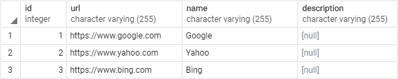
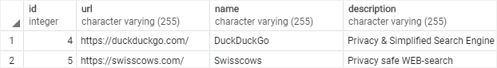
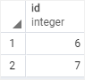

# Insert multiple rows

Ushbu qo'llanmada siz jadvalga bir nechta qatorlarni kiritish uchun bitta PostgreSQL `INSERT` bayonotidan qanday foydalanishni o'rganasiz.

Bitta `INSERT` iborasi yordamida jadvalga bir nechta qatorlar kiritish uchun siz quyidagi sintaksisdan foydalanasiz:

```sql
INSERT INTO table_name (column_list)
VALUES
    (value_list_1),
    (value_list_2),
    ...
    (value_list_n);
```

Ushbu sintaksisda:

* Birinchidan, `INSERT INTO` kalit so'zlaridan keyin ma'lumotlarni kiritmoqchi bo'lgan jadval nomini belgilang.

* Ikkinchidan, jadval nomidan keyin keladigan qavslar ichida jadvalning kerakli ustunlarini yoki barcha ustunlarini ko'rsating.

* Uchinchidan, `VALUES` kalit so'zidan keyin vergul bilan ajratilgan qatorlar ro'yxatini taqdim eting.

Bir nechta satr kiritish va kiritilgan qatorlarni qaytarish uchun siz `RETURNING` bandini quyidagi tarzda qo'shasiz:

```sql
INSERT INTO table_name (column_list)
VALUES
    (value_list_1),
    (value_list_2),
    ...
    (value_list_n)
RETURNING * | output_expression;
```

Namuna jadvalini o'rnatish:

Quyidagi bayonot `links` deb nomlangan yangi jadval yaratadi:

```sql
DROP TABLE IF EXISTS links;

CREATE TABLE links (
    id SERIAL PRIMARY KEY,
    url VARCHAR(255) NOT NULL,
    name VARCHAR(255) NOT NULL,
    description VARCHAR(255)
);
```
Quyidagi bayonot havolalar jadvaliga uchta qator qo'shish uchun `INSERT` iborasidan foydalanadi:

```sql
INSERT INTO 
    links (url, name)
VALUES
    ('https://www.google.com','Google'),
    ('https://www.yahoo.com','Yahoo'),
    ('https://www.bing.com','Bing');
```

PostgreSQL quyidagi xabarni qaytaradi:

```sql
INSERT 0 3
```

Qo'shimchalar uchun siz quyidagi bayonotdan foydalanasiz:

```sql
SELECT * FROM links;
```

Chiqish:



## Bir nechta qatorlarni kiritish va kiritilgan qatorlarni qaytarish

Quyidagi bayonot `links` jadvaliga ikkita qator qo'shish uchun `INSERT` iborasidan foydalanadi va kiritilgan qatorlarni qaytaradi:

```sql
INSERT INTO 
    links(url,name, description)
VALUES
    ('https://duckduckgo.com/','DuckDuckGo','Privacy & Simplified Search Engine'),
    ('https://swisscows.com/','Swisscows','Privacy safe WEB-search')
RETURNING *;
```



Agar siz shunchaki kiritilgan `id` roʻyxatini qaytarmoqchi boʻlsangiz, `RETURNING` bandida id ustunini quyidagicha belgilashingiz mumkin:

```sql
INSERT INTO 
    links(url,name, description)
VALUES
    ('https://www.searchencrypt.com/','SearchEncrypt','Search Encrypt'),
    ('https://www.startpage.com/','Startpage','The world''s most private search engine')
RETURNING id;
```



* Jadvalga bir nechta satr qo'shish uchun `INSERT` iborasida bir nechta qiymatlar ro'yxatini belgilang.
* Kiritilgan qatorlarni qaytarish uchun `RETURNING` bandidan foydalaning.

© [postgresqltutorial.com](https://www.postgresqltutorial.com/postgresql-tutorial/postgresql-insert-multiple-rows/)