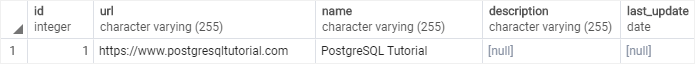
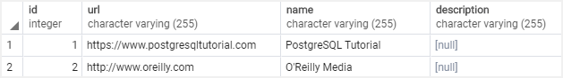
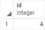

# Insert

Ushbu qo'llanmada siz jadvalga yangi qator qo'shish uchun PostgreSQL `INSERT` iborasidan qanday foydalanishni o'rganasiz.

PostgreSQL `INSERT` bayonoti jadvalga yangi qator qo'shish imkonini beradi.

Quyida `INSERT` iborasining eng asosiy sintaksisi tasvirlangan:

```sql
INSERT INTO table_name(column1, column2, …)
VALUES (value1, value2, …);
```

Ushbu sintaksisda:

* Birinchidan, `INSERT INTO` kalit so'zlaridan keyin ma'lumotlarni kiritmoqchi bo'lgan jadval nomini (`table_name`) va vergul bilan ajratilgan ustunlar ro'yxatini (column1, column2, ....) belgilang.

* Ikkinchidan, `VALUES` kalit so'zidan keyin qavslar (value1, value2, ...) ichida vergul bilan ajratilgan qiymatlar ro'yxatini taqdim eting. Ustunlar va qiymatlar ro'yxatidagi ustunlar va qiymatlar bir xil tartibda bo'lishi kerak.

`INSERT` iborasi quyidagi shaklga ega buyruq tegini qaytaradi:

```sql
INSERT oid count
```

`OID` ob'ekt identifikatoridir. PostgreSQL tizim jadvallari uchun asosiy kalit sifatida `OID` dan ichkaridan foydalangan. Odatda, `INSERT` iborasi 0 qiymati bilan OIDni qaytaradi. Hisoblash `INSERT` bayonoti muvaffaqiyatli kiritilgan qatorlar sonidir.

## RETURNING bandi

`INSERT` iborasida, shuningdek, kiritilgan qator ma'lumotlarini qaytaruvchi ixtiyoriy `RETURNING` bandi mavjud.

Agar siz butun kiritilgan qatorni qaytarmoqchi bo'lsangiz, `RETURNING` kalit so'zidan keyin yulduzcha (`*`) qo'ying:

```sql
INSERT INTO table_name(column1, column2, …)
VALUES (value1, value2, …)
RETURNING *;
```

Agar siz kiritilgan qatorning ba'zi ma'lumotlarini qaytarishni istasangiz, `RETURNING` bandidan keyin bir yoki bir nechta ustunlarni belgilashingiz mumkin.

Masalan, quyidagi ibora kiritilgan qatorning `id`ni qaytaradi:

```sql
INSERT INTO table_name(column1, column2, …)
VALUES (value1, value2, …)
RETURNING id;
```

Qaytarilgan qiymatni qayta nomlash uchun siz `AS` kalit so'zidan keyin chiqish nomidan foydalanasiz. Masalan:

```sql
INSERT INTO table_name(column1, column2, …)
VALUES (value1, value2, …)
RETURNING output_expression AS output_name;
```

## PostgreSQL `INSERT` bayonotiga misollar

Quyidagi bayonot ko'rsatish uchun `links` deb nomlangan yangi jadval yaratadi:

```sql
DROP TABLE IF EXISTS links;

CREATE TABLE links (
	id SERIAL PRIMARY KEY,
	url VARCHAR(255) NOT NULL,
	name VARCHAR(255) NOT NULL,
	description VARCHAR (255),
        last_update DATE
);
```

> E'tibor bering, siz keyingi qo'llanmada yangi jadval yaratishni o'rganasiz. Ushbu qo'llanmada siz faqat yangi jadval yaratish uchun uni bajarishingiz kerak.

### 1. PostgreSQL `INSERT` - Jadvalga bitta qatorni kiritish

Quyidagi bayonot `links` jadvaliga yangi qator qo'shadi:

```sql
INSERT INTO links (url, name)
VALUES('https://www.postgresqltutorial.com','PostgreSQL Tutorial');
```

Bayonot quyidagi natijani qaytaradi:

```sql
INSERT 0 1
```

Belgilar ma'lumotlarini kiritish uchun siz uni bitta qo'shtirnoq ichiga (') qo'shasiz, masalan, `"PostgreSQL Tutorial"`.

Agar siz `INSERT` bayonotida kerakli ustunlarni o'tkazib yuborsangiz, PostgreSQL xatolik chiqaradi. Agar ixtiyoriy ustunni o'tkazib yuborsangiz, PostgreSQL qo'shish uchun ustunning standart qiymatidan foydalanadi.

Ushbu misolda `description` ixtiyoriy ustundir, chunki unda `NOT NULL` cheklovi yo'q. Shuning uchun PostgreSQL tavsif ustuniga kiritish uchun `NULL` dan foydalanadi.

PostgreSQL avtomatik ravishda ketma-ket ustun uchun ketma-ket raqamni yaratadi, shuning uchun siz `INSERT` bayonotida ketma-ket ustun uchun qiymat berishingiz shart emas.

Quyidagi `SELECT` iborasi havolalar jadvalining mazmunini ko'rsatadi:

```sql
SELECT	* FROM links;
```



### 2. PostgreSQL `INSERT` - Bitta tirnoqni o'z ichiga olgan belgilar qatorini kiritish

Agar siz `O'Reilly Media` kabi bitta qo'shtirnoq (`'`) o'z ichiga olgan qatorni qo'shmoqchi bo'lsangiz, undan qochish uchun qo'shimcha bitta qo'shtirnoq (`'`) dan foydalanishingiz kerak. Masalan:

```sql
INSERT INTO links (url, name)
VALUES('http://www.oreilly.com','O''Reilly Media');
```

Chiqish:

```sql
INSERT 0 1
```

Quyidagi bayonot qo'shimchani tasdiqlaydi:



### 3. PostgreSQL `INSERT` - Sana qiymatini kiritish

`DATE` turidagi ustunga sana qiymatini kiritish uchun siz `"YYYY-AA-KK"` formatida sanadan foydalanasiz.

Quyidagi bayonot `links` jadvaliga belgilangan sana bilan yangi qator qo'shadi:

```sql
INSERT INTO links (url, name, last_update)
VALUES('https://www.google.com','Google','2013-06-01');
```

Chiqish:

```sql
INSERT 0 1
```

### 4. PostgreSQL `INSERT` - oxirgi qo'shish identifikatorini olish

Kiritilgan qatordan oxirgi kiritish identifikatorini olish uchun siz `INSERT` statementning `RETURNING` bandidan foydalanasiz.

Masalan, quyidagi ibora `links` jadvaliga yangi qator qo'shadi va oxirgi qo'shish identifikatorini qaytaradi:

```sql
INSERT INTO links (url, name)
VALUES('http://www.postgresql.org','PostgreSQL') 
RETURNING id;
```

Chiqish:



* Jadvalga ma'lumotlarni kiritish uchun PostgreSQL `INSERT` iborasidan foydalaning.

* Kiritilgan qatorlarni olish uchun `RETURNING` bandidan foydalaning.


© [postgresqltutorial.com](https://www.postgresqltutorial.com/postgresql-tutorial/postgresql-insert/)