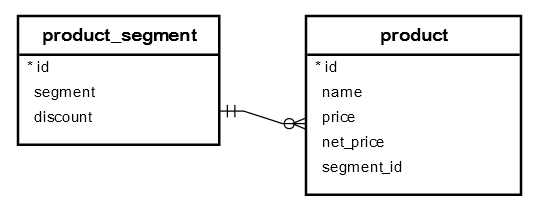

# Update join

Ushbu qoʻllanmada siz boshqa jadvaldagi qiymatlar asosida jadvaldagi maʼlumotlarni yangilash uchun PostgreSQL `UPDATE` qoʻshilish sintaksisidan qanday foydalanishni oʻrganasiz.

Baʼzan jadvaldagi maʼlumotlarni boshqa jadvaldagi qiymatlar asosida yangilashingiz kerak boʻladi. Bunday holda siz PostgreSQL `UPDATE` qo'shilish sintaksisidan quyidagi tarzda foydalanishingiz mumkin:

```sql
UPDATE t1
SET t1.c1 = new_value
FROM t2
WHERE t1.c2 = t2.c2;
```

`UPDATE` bayonida boshqa jadvalga qoʻshilish uchun siz `FROM` bandida birlashtirilgan jadvalni belgilaysiz va `WHERE` bandida birlashma shartini taqdim etasiz. `FROM` bandi `SET` bandidan keyin darhol paydo bo'lishi kerak.

`t1` jadvalining har bir qatori uchun `UPDATE` operatori `t2` jadvalining har bir qatorini tekshiradi. Agar `t1` jadvalining `c2` ustunidagi qiymat `t2` jadvalining `c2` ustunidagi qiymatga teng bo'lsa, `UPDATE` operatori `t1` jadvalining `c1` ustunidagi qiymatni yangi qiymatni (`new_value`) yangilaydi.

## PostgreSQL UPDATE JOIN misoli

Keling, PostgreSQL `UPDATE` qo'shilishi qanday ishlashini tushunish uchun misolni ko'rib chiqaylik. Namoyish uchun quyidagi ma'lumotlar bazasi jadvallaridan foydalanamiz:



Birinchidan, mahsulot segmentlarini, jumladan, katta hashamat, hashamat va massani saqlaydigan `product_segment` deb nomlangan yangi jadval yarating.

`product_segment` jadvalida `discount` ustuni mavjud boʻlib, unda maʼlum segmentga asoslangan chegirma foizi saqlanadi. Misol uchun, grand luxury segmentiga ega mahsulotlar `5%` chegirmaga ega, hashamatli va ommaviy mahsulotlar mos ravishda `6%` va `10%` chegirmalarga ega.

```sql
CREATE TABLE product_segment (
    id SERIAL PRIMARY KEY,
    segment VARCHAR NOT NULL,
    discount NUMERIC (4, 2)
);


INSERT INTO 
    product_segment (segment, discount)
VALUES
    ('Grand Luxury', 0.05),
    ('Luxury', 0.06),
    ('Mass', 0.1);
```

Ikkinchidan, mahsulot ma'lumotlarini saqlaydigan `product` nomli boshqa jadval yarating. `product` jadvalida segmentlar jadvalining `id`iga bog'langan `segment_id` tashqi kalit ustuni mavjud.

```sql
CREATE TABLE product(
    id SERIAL PRIMARY KEY,
    name VARCHAR NOT NULL,
    price NUMERIC(10,2),
    net_price NUMERIC(10,2),
    segment_id INT NOT NULL,
    FOREIGN KEY(segment_id) REFERENCES product_segment(id)
);


INSERT INTO 
    product (name, price, segment_id) 
VALUES 
    ('diam', 804.89, 1),
    ('vestibulum aliquet', 228.55, 3),
    ('lacinia erat', 366.45, 2),
    ('scelerisque quam turpis', 145.33, 3),
    ('justo lacinia', 551.77, 2),
    ('ultrices mattis odio', 261.58, 3),
    ('hendrerit', 519.62, 2),
    ('in hac habitasse', 843.31, 1),
    ('orci eget orci', 254.18, 3),
    ('pellentesque', 427.78, 2),
    ('sit amet nunc', 936.29, 1),
    ('sed vestibulum', 910.34, 1),
    ('turpis eget', 208.33, 3),
    ('cursus vestibulum', 985.45, 1),
    ('orci nullam', 841.26, 1),
    ('est quam pharetra', 896.38, 1),
    ('posuere', 575.74, 2),
    ('ligula', 530.64, 2),
    ('convallis', 892.43, 1),
    ('nulla elit ac', 161.71, 3);
```

Uchinchidan, har bir mahsulotning sof narxini mahsulot segmentidagi chegirma asosida hisoblashingiz kerak, deylik. Buning uchun siz `UPDATE` qo'shilish bayonotini quyidagicha qo'llashingiz mumkin:

```sql
UPDATE product
SET net_price = price - price * discount
FROM product_segment
WHERE product.segment_id = product_segment.id;
```

So'rovni quyidagicha qisqartirish uchun jadval taxalluslaridan foydalanishingiz mumkin:

```sql
UPDATE 
    product p
SET 
    net_price = price - price * discount
FROM 
    product_segment s
WHERE 
    p.segment_id = s.id;
```

Ushbu bayonot `product` jadvalini `product_segment` jadvaliga birlashtiradi. Ikkala jadvalda ham mos keladigan bo'lsa, `product_segment` jadvalidan chegirma oladi, quyidagi formula asosida sof narxni hisoblab chiqadi va `net_price` ustunini yangilaydi.

```sql
net_price = price - price * discount;
```

Quyidagi `SELECT` bayonoti yangilanishni tekshirish uchun `product` jadvali ma'lumotlarini oladi:

```sql
SELECT * FROM product;
```


Ko'rib turganingizdek, `net_price` ustuni to'g'ri qiymatlar bilan yangilangan.

Ushbu qo'llanmada siz boshqa jadvaldagi qiymatlar asosida jadvaldagi ma'lumotlarni yangilash uchun PostgreSQL `UPDATE` qo'shilish bayonotidan qanday foydalanishni o'rgandingiz.

© [postgresqltutorial.com](https://www.postgresqltutorial.com/postgresql-tutorial/postgresql-update-join/)