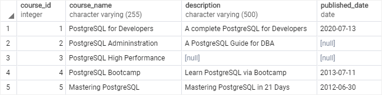
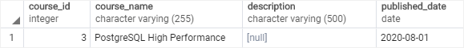
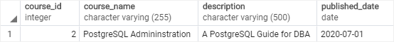

# Update

Ushbu qo'llanmada siz jadvaldagi mavjud ma'lumotlarni yangilash uchun PostgreSQL UPDATE bayonotidan qanday foydalanishni o'rganasiz.

PostgreSQL `UPDATE` bayonoti jadvaldagi ma'lumotlarni o'zgartirishga imkon beradi. Quyida `UPDATE` bayonotining sintaksisi tasvirlangan:

```sql
UPDATE table_name
SET column1 = value1,
    column2 = value2,
    ...
WHERE condition;
```

Ushbu sintaksisda:

* Birinchidan, `UPDATE` kalit so'zidan keyin ma'lumotlarni yangilamoqchi bo'lgan jadval nomini belgilang.

* Ikkinchidan, `SET` kalit so'zidan keyin ustunlar va ularning yangi qiymatlarini belgilang. `SET` bandida ko'rinmaydigan ustunlar asl qiymatlarini saqlab qoladi.

* Uchinchidan, `WHERE` bandi shartida qaysi qatorlarni yangilash kerakligini aniqlang.

`WHERE` bandi ixtiyoriy. Agar siz `WHERE` bandini o'tkazib yuborsangiz, `UPDATE` bayonoti jadvaldagi barcha qatorlarni yangilaydi.

`UPDATE` bayonoti muvaffaqiyatli bajarilganda, u quyidagi buyruq tegini qaytaradi:

```sql
UPDATE count
```

`count` - bu qiymatlari o'zgarmagan qatorlarni o'z ichiga olgan yangilangan qatorlar soni.

`UPDATE` bayonotida yangilangan qatorlarni qaytaradigan ixtiyoriy `RETURNING` bandi mavjud:

```sql
UPDATE table_name
SET column1 = value1,
    column2 = value2,
    ...
WHERE condition
RETURNING * | output_expression AS output_name;
```

## PostgreSQL UPDATE misollari

Keling, PostgreSQL `UPDATE` bayonotidan foydalanishga misollar keltiraylik.

Namuna jadvalini o'rnatish

Quyidagi bayonotlar kurslar deb nomlangan jadvalni yaratadi va unga ba'zi ma'lumotlarni kiritadi:

```sql
DROP TABLE IF EXISTS courses;

CREATE TABLE courses(
	course_id serial primary key,
	course_name VARCHAR(255) NOT NULL,
	description VARCHAR(500),
	published_date date
);

INSERT INTO 
	courses(course_name, description, published_date)
VALUES
	('PostgreSQL for Developers','A complete PostgreSQL for Developers','2020-07-13'),
	('PostgreSQL Admininstration','A PostgreSQL Guide for DBA',NULL),
	('PostgreSQL High Performance',NULL,NULL),
	('PostgreSQL Bootcamp','Learn PostgreSQL via Bootcamp','2013-07-11'),
	('Mastering PostgreSQL','Mastering PostgreSQL in 21 Days','2012-06-30');
```

Quyidagi bayonot kurslar jadvalidagi ma'lumotlarni qaytaradi:

```sql
SELECT * FROM courses;
```



### 1. PostgreSQL UPDATE -- bitta qatorni yangilash

Quyidagi bayonotda kursni id 3 bilan yangilash uchun `UPDATE` bayonotidan foydalaniladi. U `published_date` `NULL`dan `"2020-08-01"` ga o'zgartiriladi.

```sql
UPDATE courses
SET published_date = '2020-08-01' 
WHERE course_id = 3;
```

Bayonot bitta satr yangilanganligini ko'rsatuvchi quyidagi xabarni qaytaradi:

```sql
UPDATE 1
```

Quyidagi bayonot yangilanishni tekshirish uchun `id` 3 bilan kursni tanlaydi:

```sql
SELECT * 
FROM courses
WHERE course_id = 3;
```



### 2. PostgreSQL UPDATE -- qatorni yangilash va yangilangan qatorni qaytarish

Quyidagi bayonot 2-kurs identifikatorini yangilaydi. Kursning `published_date` `2020-07-01` ga o'zgartiradi va yangilangan kursni qaytaradi.

```sql
UPDATE courses
SET published_date = '2020-07-01'
WHERE course_id = 2
RETURNING *;
```



* Jadvalning bir yoki bir nechta ustunlaridagi ma'lumotlarni yangilash uchun PostgreSQL `UPDATE` bayonotidan foydalaning.
* `UPDATE` bayonotidan yangilangan qatorlarni qaytarish uchun `RETURNING` bandidan foydalaning

© [postgresqltutorial.com](https://www.postgresqltutorial.com/postgresql-tutorial/postgresql-update/)