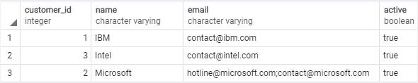

# Upsert

Ushbu qo'llanmada siz qo'shilayotgan qator jadvalda allaqachon mavjud bo'lsa, ma'lumotlarni kiritish yoki yangilash uchun PostgreSQL `Upsert` xususiyatidan qanday foydalanishni o'rganasiz.

Relyatsion ma'lumotlar bazalarida `Upsert` atamasi birlashma deb ataladi. G'oya shundan iboratki, siz jadvalga yangi qator qo'shganingizda, PostgreSQL agar u allaqachon mavjud bo'lsa, qatorni yangilaydi, aks holda u yangi qatorni kiritadi. Shuning uchun biz harakatni yuqori deb ataymiz (yangilash yoki qo'shish birikmasi). 

PostgreSQL-da yuqoriga qo'yish xususiyatidan foydalanish uchun siz `INSERT ON CONFLICT` bayonotidan quyidagi tarzda foydalanasiz:
 
```sql
INSERT INTO table_name(column_list) 
VALUES(value_list)
ON CONFLICT target action;
```

PostgreSQL `upsert` qo'yish xususiyatini qo'llab-quvvatlash uchun `INSERT` bayonotiga `ON CONFLICT target action` bandini qo'shdi.

Ushbu bayonotda `target` quyidagilardan biri bo'lishi mumkin:

* (column_name) - ustun nomi.
* `ON CONSTRAINT constraint_name` - bu erda cheklov nomi UNIQUE cheklovning nomi bo'lishi mumkin.
* `WHERE predikati` -- predikatli WHERE gap.

`action` quyidagilardan biri bo'lishi mumkin:

* `DO NOTHING` - agar qator jadvalda allaqachon mavjud bo'lsa, hech narsa qilmang degan ma'noni anglatadi.
* `DO UPDATE SET column_1 = value_1, .. WHERE condition` -- jadvaldagi ayrim maydonlarni yangilang.

> E'tibor bering, `ON CONFLICT` bandi faqat PostgreSQL 9.5 da mavjud. Agar oldingi versiyadan foydalanayotgan bo'lsangiz, yuqoriga qo'yish xususiyatiga ega bo'lish uchun vaqtinchalik yechim kerak bo'ladi.

Agar siz MySQL bilan ham ishlayotgan bo'lsangiz, yuqoriga qo'yish xususiyati MySQL-dagi ikki nusxadagi kalitlarni yangilash bayonotiga qo'shishga o'xshashligini topasiz.

## PostgreSQL yuklash misollari

Quyidagi bayonot PostgreSQL upsert xususiyatini namoyish qilish uchun `customers` deb nomlangan yangi jadval yaratadi.

```sql
DROP TABLE IF EXISTS customers;

CREATE TABLE customers (
	customer_id serial PRIMARY KEY,
	name VARCHAR UNIQUE,
	email VARCHAR NOT NULL,
	active bool NOT NULL DEFAULT TRUE
);
```

`customers` jadvali to'rtta ustundan iborat: `customer_id`, `name`, `email` va `active`. `name` ustunida mijozlar nomlarining o'ziga xosligini kafolatlash uchun noyob cheklov mavjud.

Quyidagi `INSERT` iborasi `customers` jadvaliga ba'zi qatorlarni kiritadi.

```sql
INSERT INTO 
    customers (name, email)
VALUES 
    ('IBM', 'contact@ibm.com'),
    ('Microsoft', 'contact@microsoft.com'),
    ('Intel', 'contact@intel.com');
```


Aytaylik, Microsoft aloqa elektron pochta manzilini` contact@microsoft.com` manzilidan `hotline@microft.com` ga o'zgartiradi, biz UNI `UPDATE` bayonoti yordamida yangilashimiz mumkin. Biroq, yuqoriga qo'yish xususiyatini namoyish qilish uchun biz quyidagi `INSERT ON CONFLICT` bayonotidan foydalanamiz:

```sql
INSERT INTO customers (NAME, email)
VALUES('Microsoft','hotline@microsoft.com') 
ON CONFLICT ON CONSTRAINT customers_name_key 
DO NOTHING;
```

Bayonotda agar mijoz nomi  `customers` jadvalida mavjud boʻlsa, unga eʼtibor bermaslik (hech narsa qilmang) koʻrsatilgan.

Quyidagi bayonot yuqoridagi bayonotga ekvivalentdir, lekin u `INSERT` iborasining maqsadi sifatida noyob cheklash nomi o'rniga `name` ustunidan foydalanadi.

```sql
INSERT INTO customers (name, email)
VALUES('Microsoft','hotline@microsoft.com') 
ON CONFLICT (name) 
DO NOTHING;
```

Aytaylik, siz allaqachon mavjud bo'lgan mijozni kiritishda yangi elektron pochtani eski elektron pochta manzili bilan birlashtirmoqchisiz, bu holda siz `INSERT` iborasining harakati sifatida `UPDATE` bandidan foydalanasiz:

```sql
INSERT INTO customers (name, email)
VALUES('Microsoft','hotline@microsoft.com') 
ON CONFLICT (name) 
DO 
   UPDATE SET email = EXCLUDED.email || ';' || customers.email;
```

Chiqish:
```sql
INSERT 0 1
```

Quyidagi bayonot yuqorilikni tasdiqlaydi:



Ushbu qo'llanmada siz `INSERT ON CONFLICT` bayonotidan foydalangan holda PostgreSQL-ni yangilash xususiyati haqida bilib oldingiz.

© [postgresqltutorial.com](https://www.postgresqltutorial.com/postgresql-tutorial/postgresql-upsert/)


