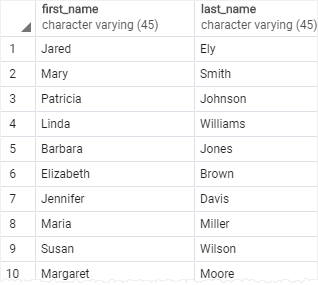
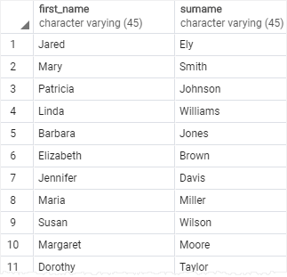
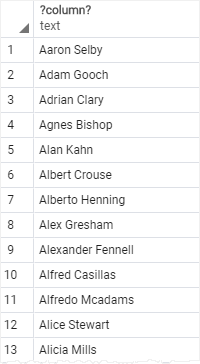
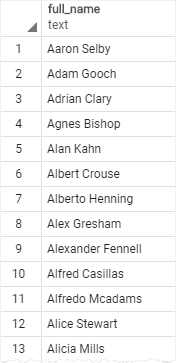

# Column alias

Ushbu qo'llanmada siz PostgreSQL ustun taxalluslari va so'rovlardagi ustunlarga `vaqtinchalik nomlar` belgilash uchun `ustun taxalluslari`dan qanday foydalanish haqida bilib olasiz.

Ustun taxallusi sizga `SELECT` bayonotning tanlangan ro'yxatidagi ustun yoki ifodaga vaqtinchalik nom belgilash imkonini beradi. Ustun taxallusi so'rovni bajarish vaqtida vaqtincha mavjud.

Quyida ustun taxallusdan foydalanish sintaksisi tasvirlangan:

```sql
SELECT column_name AS alias_name
FROM table_name;
```

Ushbu sintaksisda `column_name`ga `alias_name` taxallus berilgan. `AS` kalit so'z ixtiyoriy, shuning uchun uni quyidagi tarzda o'tkazib yuborishingiz mumkin:

```sql
SELECT column_name alias_name
FROM table_name;
```

Quyidagi sintaksis SELECT banddagi ifoda uchun taxallusni qanday o'rnatishni ko'rsatadi:

```sql
SELECT expression AS alias_name
FROM table_name;
```

Ustun taxalluslarining asosiy maqsadi so'rov natijalarining sarlavhalarini yanada mazmunli qilishdir.

## PostgreSQL ustun taxalluslariga misollar

Namoyish uchun quyidagi [namunaviy](https://www.postgresqltutorial.com/wp-content/uploads/2019/05/dvdrental.zip) ma'lumotlar bazasida `customer` jadvalidan foydalanamiz.


## 1. `Ustun` misoliga ustun taxallusni belgilash

Quyidagi so'rov `customer` jadvaldagi barcha mijozlarning ismlari va familiyalarini qaytaradi :

```sql
SELECT 
   first_name, 
   last_name
FROM customer;
```



Agar siz `last_name` sarlavha nomini o'zgartirmoqchi bo'lsangiz, unga quyidagi kabi `ustun taxallus` yordamida yangi nom berishingiz mumkin:

```sql
SELECT 
   first_name, 
   last_name AS surname
FROM customer;
```

Ushbu so'rov `last_name` ustunning `surname` taxallus sifatida tayinlangan:



Yoki AS kalit so'zni quyidagi tarzda olib tashlash orqali uni qisqartirishingiz mumkin :

```sql
SELECT 
   first_name, 
   last_name surname
FROM customer;
```

## 2. `Ifoda` misoliga ustun taxallusni belgilash

Quyidagi so'rov barcha mijozlarning to'liq ismlarini qaytaradi. U ism, bo'sh joy va familiyani birlashtirib, to'liq ismni yaratadi:

```sql
SELECT 
   first_name || ' ' || last_name 
FROM 
   customer;
```

> E'tibor bering, PostgreSQLda siz bir yoki bir nechta satrlarni bitta satrga birlashtiradigan `"||"` birlashtiruvchi operator sifatida foydalanasiz.



Chiqishdan aniq ko'rinib turibdiki, ustunning `?column?` sarlavhasi mazmunli emas.

Buni tuzatish uchun siz `first_name || ' ' || last_name` iboraga ustun taxallusni belgilashingiz mumkin, masalan `full_name`:

```sql
SELECT
    first_name || ' ' || last_name AS full_name
FROM
    customer;
```



## 3. `Bo'shliqlarni` o'z ichiga olgan ustun taxalluslari

Agar ustun taxallusi bir yoki bir nechta bo'sh joyni o'z ichiga olsa, uni quyidagi kabi qo'sh tirnoq bilan o'rashingiz kerak:

```sql
column_name AS "column alias"
```

Masalan:

```sql
SELECT
    first_name || ' ' || last_name "full name"
FROM
    customer;
```

## Xulosa

* `column_name AS alias_name` yoki `expression AS alias_name` sintaksisi yordamida ustun yoki iboraga ustun taxallusni tayinlang.
* Kalit `AS` so'z ixtiyoriy.
* Boʻsh joy boʻlgan ustun taxallusni oʻrab olish uchun qoʻsh tirnoq (`"`) dan foydalaning.
