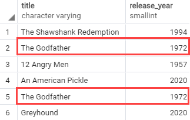

# UNION

Ushbu qo'llanmada siz PostgreSQL `UNION` operatoridan bir nechta so'rovlarning natijalar to'plamini bitta natijalar to'plamiga birlashtirish uchun qanday foydalanishni o'rganasiz.

`UNION` operatori ikkita yoki undan ortiq `SELECT` iboralarining natijalar to'plamini bitta natijalar to'plamiga birlashtiradi.

Quyida ikkita so'rov natijalari to'plamini birlashtirgan `UNION` operatorining sintaksisi tasvirlangan:

```
SELECT select_list_1
FROM table_expresssion_1
UNION
SELECT select_list_2
FROM table_expression_2
```

`UNION` operatoridan foydalangan holda ikkita so'rov natijalari to'plamini birlashtirish uchun so'rovlar quyidagi qoidalarga muvofiq bo'lishi kerak:

* Ikkala so'rovning tanlash ro'yxatidagi ustunlar soni va tartibi bir xil bo'lishi kerak.
* Ma'lumotlar turlari mos bo'lishi kerak.

`UNION` operatori birlashtirilgan ma'lumotlar to'plamidan barcha takroriy qatorlarni olib tashlaydi. Ikki nusxadagi qatorlarni saqlab qolish uchun siz `UNION ALL` dan foydalanasiz.

Quyidagi `Venn diagrammasi` `UNION` qanday ishlashini ko'rsatadi:


## `ORDER BY` bandi bilan PostgreSQL `UNION`

`UNION` operatori birinchi so'rov natijalari to'plamidagi qatorlarni ikkinchi so'rov natijalari to'plamidan oldin, keyin yoki qatorlar orasiga qo'yishi mumkin.

Yakuniy natijalar to'plamidagi qatorlarni saralash uchun siz ikkinchi so'rovda `ORDER BY` bandidan foydalanasiz.

Amalda siz tez-tez `UNION` operatoridan ma'lumotlar ombori yoki biznes razvedka tizimlarida mukammal normallashtirilmagan o'xshash jadvallardagi ma'lumotlarni birlashtirish uchun foydalanasiz.

## Namuna jadvallarini o'rnatish

Quyidagi iboralar ikkita jadval yaratadi: `top_rated_films` va `most_popular_films` va ushbu jadvallarga ma'lumotlarni kiriting:

```sql
DROP TABLE IF EXISTS top_rated_films;
CREATE TABLE top_rated_films(
	title VARCHAR NOT NULL,
	release_year SMALLINT
);

DROP TABLE IF EXISTS most_popular_films;
CREATE TABLE most_popular_films(
	title VARCHAR NOT NULL,
	release_year SMALLINT
);

INSERT INTO 
   top_rated_films(title,release_year)
VALUES
   ('The Shawshank Redemption',1994),
   ('The Godfather',1972),
   ('12 Angry Men',1957);

INSERT INTO 
   most_popular_films(title,release_year)
VALUES
   ('An American Pickle',2020),
   ('The Godfather',1972),
   ('Greyhound',2020);
```

Quyida `top_rated_films` jadvalidagi ma'lumotlar ko'rsatilgan:

```sql
SELECT * FROM top_rated_films;
```


## PostgreSQL `UNION` misollari
Keling, PostgreSQL `UNION` operatoridan foydalanishga misollar keltiraylik.

### 1. Oddiy PostgreSQL `UNION` misoli

Quyidagi bayonot ikkala jadvaldagi ma'lumotlarni birlashtirish uchun `UNION` operatoridan foydalanadi:

```sql
SELECT * FROM top_rated_films
UNION
SELECT * FROM most_popular_films;
Code language: SQL (Structured Query Language) (sql)
```

So'rov quyidagi natijani qaytaradi:


Natijalar to'plami natijalar to'plamida besh qatorni o'z ichiga oladi, chunki `UNION` operatori bitta takroriy qatorni olib tashlaydi.

### 2. PostgreSQL `UNION ALL` misoli

Quyidagi bayonot `UNION ALL` operatoridan `top_rated_films` va `most_popular_films` jadvalidagi natijalar to'plamini birlashtirish uchun foydalanadi:

```sql
SELECT * FROM top_rated_films
UNION ALL
SELECT * FROM most_popular_films;
```



Ushbu misolda takroriy qator natijalar to'plamida saqlanadi.

### 3. ORDER BY bandi misolida PostgreSQL UNION ALL

`UNION` operatori tomonidan qaytarilgan natijani saralash uchun siz oxirgi so'rovning `ORDER BY` bandini quyidagicha joylashtirasiz:

```sql
SELECT * FROM top_rated_films
UNION ALL
SELECT * FROM most_popular_films
ORDER BY title;
```


Agar siz har bir so'rovning oxiriga `ORDER BY` bandini qo'ysangiz, birlashtirilgan natijalar to'plami siz kutgandek tartiblanmaydi.

Chunki `UNION` operatori har bir so'rovdan saralangan natijalar to'plamini birlashtirganda, u yakuniy natijalar to'plamidagi qatorlar tartibini kafolatlamaydi.

Ushbu qo'llanmada siz PostgreSQL `UNION` va `UNION ALL`-dan bir nechta so'rovlardan olingan natijalar to'plamini bitta natijalar to'plamiga birlashtirish uchun qanday foydalanishni o'rgandingiz.

© [postgresqltutorial.com](https://www.postgresqltutorial.com/postgresql-tutorial/postgresql-union/)

