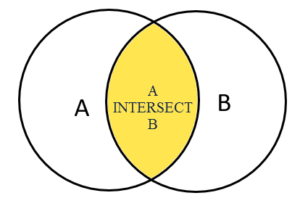
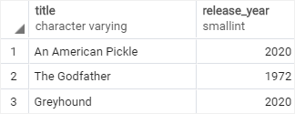
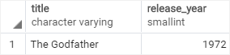

# INTERSECT

Ushbu qo'llanmada siz PostgreSQL `INTERSECT` operatoridan ikki yoki undan ortiq so'rovlarning natijalar to'plamini birlashtirish uchun qanday foydalanishni o'rganasiz.

`UNION` va `EXCEPT` operatorlari singari, PostgreSQL `INTERSECT` operatori ikkita yoki undan ortiq `SELECT` iboralarining natijalar to'plamini bitta natijalar to'plamiga birlashtiradi.

`INTERSECT` operatori ikkala natija to'plamida mavjud bo'lgan har qanday qatorlarni qaytaradi.

Quyidagi rasmda `INTERSECT` operatori tomonidan ishlab chiqarilgan yakuniy natijalar to'plami ko'rsatilgan.




Yakuniy natija to'plami `A` doirasi `B` doira bilan kesishgan sariq maydon bilan ifodalanadi.

Quyida `INTERSECT` operatorining sintaksisi tasvirlangan:

```sql
SELECT select_list
FROM A
INTERSECT
SELECT select_list
FROM B;
```

`INTERSECT` operatoridan foydalanish uchun `SELECT` iboralarida paydo bo'ladigan ustunlar quyidagi qoidalarga amal qilishi kerak:

* `SELECT` bandlarida ustunlar soni va ularning tartibi bir xil bo'lishi kerak.

* Ustunlarning ma'lumotlar turlari mos bo'lishi kerak.

## PostgreSQL `INTERSECT` bilan `ORDER BY` bandi

Agar siz `INTERSECT` operatori tomonidan qaytarilgan natijalar to'plamini saralashni xohlasangiz, so'rovlar ro'yxatidagi yakuniy so'rovga `ORDER BY` ni quyidagicha joylashtirasiz:

```sql
SELECT select_list
FROM A
INTERSECT
SELECT select_list
FROM B
ORDER BY sort_expression;
```

## PostgreSQL `INTERSECT` operatoriga misollar

Biz `UNION` darsligida yaratilgan `top_rated_films` va `most_popular_films` jadvallaridan foydalanamiz:

`top_rated_films` jadvali:


`most_popular_films` jadvali:



Eng yuqori baholangan filmlar bo'lgan mashhur filmlarni olish uchun siz `INTERSECT` operatoridan quyidagi tarzda foydalanasiz:

```sql
SELECT *
FROM most_popular_films 
INTERSECT
SELECT *
FROM top_rated_films;
```



Natijalar to'plami ikkala jadvalda paydo bo'ladigan bitta filmni qaytaradi.

Ushbu qo'llanmada siz bir nechta so'rovlar orqali qaytarilgan natijalar to'plamini birlashtirish uchun PostgreSQL `INTERSECT` operatoridan qanday foydalanishni o'rgandingiz.

© [postgresqltutorial.com](https://www.postgresqltutorial.com/postgresql-tutorial/postgresql-intersect/)