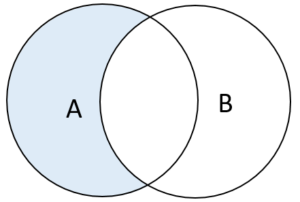
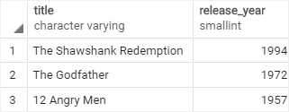
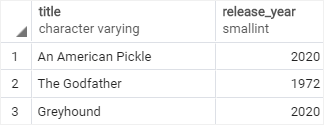
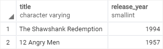

# EXCEPT

Ushbu qoʻllanmada PostgreSQL `EXCEPT` operatoridan ikkinchi soʻrovning chiqishida koʻrsatilmagan birinchi soʻrovdagi qatorlarni qaytarish uchun qanday foydalanishni oʻrganasiz. 

`UNION` va `INTERSECT` operatorlari singari, `EXCEPT` operatori ikki yoki undan ortiq so'rovlarning natijalar to'plamini solishtirish orqali qatorlarni qaytaradi.

`EXCEPT` operatori birinchi (chap) so'rovdan ikkinchi (o'ng) so'rovning chiqishida bo'lmagan alohida qatorlarni qaytaradi.

Quyida `EXCEPT` operatorining sintaksisi tasvirlangan.

```sql
SELECT select_list
FROM A
EXCEPT 
SELECT select_list
FROM B;
```
`EXCEPT`da ishtirok etadigan so'rovlar quyidagi qoidalarga amal qilishi kerak:

* Ikkala so'rovda ustunlar soni va ularning tartibi bir xil bo'lishi kerak.
* Tegishli ustunlarning ma'lumotlar turlari mos bo'lishi kerak.

Quyidagi `Venn diagrammasi` `EXCEPT` operatorini ko'rsatadi:



## PostgreSQL `EXCEPT` operator misollari

Biz `UNION` qoʻllanmasida yaratilgan `top_rated_films` va `most_popular_films` jadvallaridan foydalanamiz:

`top_rated_films` jadvali:



`most_popular_films` jadvali:



Quyidagi bayonot mashhur bo'lmagan eng yuqori baholangan filmlarni topish uchun `EXCEPT` operatoridan foydalanadi:

```sql
SELECT * FROM top_rated_films
EXCEPT 
SELECT * FROM most_popular_films;
```



Quyidagi bayonot `EXCEPT` operatori tomonidan qaytarilgan natijalar to'plamini saralash uchun so'rovdagi `ORDER BY` bandidan foydalanadi:

```sql
SELECT * FROM top_rated_films
EXCEPT 
SELECT * FROM most_popular_films
ORDER BY title;
```

E'tibor bering, biz filmlarni sarlavha bo'yicha saralash uchun bayonotning oxiriga `ORDER BY` bandini qo'yganmiz.

PostgreSQL `EXCEPT` operatoridan ikkinchi so'rovning natijalar to'plamida ko'rinmaydigan birinchi so'rovdagi qatorlarni olish uchun foydalaning.