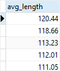

# ALL

Ushbu qoʻllanmada siz qiymatni quyi soʻrov tomonidan qaytarilgan qiymatlar roʻyxati bilan solishtirish uchun PostgreSQL `ALL` operatoridan qanday foydalanishni oʻrganasiz.

PostgreSQL `ALL` operatori qiymatni quyi so'rov tomonidan qaytarilgan qiymatlar ro'yxati bilan solishtirish orqali ma'lumotlarni so'rash imkonini beradi.

Quyida `ALL` operatorining sintaksisi tasvirlangan:

```sql
comparison_operator ALL (subquery)
```

Ushbu sintaksisda:
* `ALL` operatoridan oldin teng `(=)`, teng emas `(!=)`, katta `(>)`, katta yoki teng `(>=)`, kichik `(<)` va kichik yoki yoki kabi taqqoslash operatori bo'lishi kerak. `(<=)` ga teng.

* `ALL` operatoridan keyin pastki so'rov bo'lishi kerak, u ham qavslar bilan o'ralgan bo'lishi kerak.

Quyi so'rov ba'zi qatorlarni qaytaradi degan faraz bilan `ALL` operatori quyidagicha ishlaydi:

1. `column_name > ALL` (subquery) agar qiymat subquery tomonidan qaytarilgan eng katta qiymatdan katta bo'lsa, ifoda rost deb baholanadi.
2. `column_name >= ALL` (subquery) agar qiymat quyi so'rov tomonidan qaytarilgan eng katta qiymatdan katta yoki unga teng bo'lsa, ifoda rost deb baholanadi.
3. `column_name < ALL` (subquery) agar qiymat quyi so'rov tomonidan qaytarilgan eng kichik qiymatdan kichik bo'lsa, ifoda rost deb baholanadi.
4. `column_name <= ALL` (subquery) agar qiymat quyi so'rov tomonidan qaytarilgan eng kichik qiymatdan kichik yoki unga teng bo'lsa, ifoda rost deb baholanadi.
5. `column_name = ALL` (subquery) agar qiymat quyi so'rov tomonidan qaytarilgan har qanday qiymatga teng bo'lsa, ifoda rost deb baholanadi.
6. `column_name != ALL` (subquery) agar qiymat quyi so'rov tomonidan qaytarilgan qiymatga teng bo'lmasa, ifoda rost deb baholanadi.

Agar quyi so'rov hech qanday qatorni qaytarmasa, `ALL` operatori har doim `rost` deb baholaydi.

Namoyish uchun [namunaviy](https://www.postgresqltutorial.com/wp-content/uploads/2019/05/dvdrental.zip) ma'lumotlar bazasidagi film jadvalidan foydalanamiz.


Quyidagi so'rov barcha filmlarning `o'rtacha` uzunliklarini film reytingi bo'yicha guruhlangan holda qaytaradi:

```sql
SELECT
    ROUND(AVG(length), 2) avg_length
FROM
    film
GROUP BY
    rating
ORDER BY
    avg_length DESC;
```



Uzunliklari yuqoridagi o'rtacha uzunliklar ro'yxatidan katta bo'lgan barcha filmlarni topish uchun siz `ALL` va operatordan kattaroq (>) dan quyidagi tarzda foydalanasiz:

```sql
SELECT
    film_id,
    title,
    length
FROM
    film
WHERE
    length > ALL (
            SELECT
                ROUND(AVG (length),2)
            FROM
                film
            GROUP BY
                rating
    )
ORDER BY
    length;
```


Natijadan aniq ko'rinib turibdiki, so'rov uzunligi pastki so'rov tomonidan qaytarilgan o'rtacha uzunlik ro'yxatidagi eng katta qiymatdan katta bo'lgan barcha filmlarni qaytaradi.

Ushbu qo'llanmada siz qiymatni quyi so'rov tomonidan qaytarilgan qiymatlar ro'yxati bilan solishtirish uchun PostgreSQL `ALL` operatoridan qanday foydalanishni o'rgandingiz.