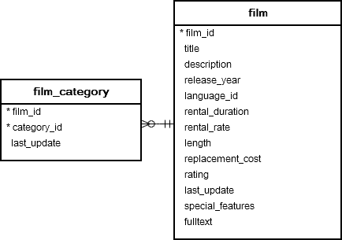
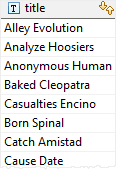
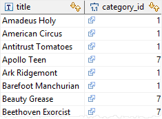

# ANY

Ushbu qo'llanmada siz PostgreSQL `ANY` operatoridan skalyar qiymatni quyi so'rov tomonidan qaytarilgan qiymatlar to'plami bilan solishtirish uchun qanday foydalanishni o'rganasiz.

PostgreSQL `ANY` operatori qiymatni quyi so'rov tomonidan qaytarilgan qiymatlar to'plamiga solishtiradi. Quyida `ANY` operatorining sintaksisi tasvirlangan:

```sql
expresion operator ANY(subquery)
```

Ushbu sintaksisda:
* Quyi so'rov aynan bitta ustunni qaytarishi kerak.
* `ANY` operatoridan oldin quyidagi taqqoslash operatorlaridan biri bo'lishi kerak =, <=, >, <, > va <>
* Agar quyi so'rovning har qanday qiymati shartga javob bersa, `ANY` operatori `true` qiymatini qaytaradi, aks holda u noto'g'ri qaytaradi.

E'tibor bering, `SOME` `ANY` so'zining sinonimi bo'lib, har qanday SQL iborasida `SOME` ni `ANY`ga almashtirishingiz mumkin degan ma'noni anglatadi.

## PostgreSQL ANY misollar

Namoyish uchun [namunaviy](https://www.postgresqltutorial.com/wp-content/uploads/2019/05/dvdrental.zip) ma'lumotlar bazasida quyidagi `film` va `film_category` jadvalidan foydalanamiz.



Quyidagi misol film toifasi bo'yicha guruhlangan filmning `maksimal` uzunligini qaytaradi:

```sql
SELECT
    MAX( length )
FROM
    film
INNER JOIN film_category
        USING(film_id)
GROUP BY
    category_id;
```

Ushbu so'rovdan uzunligi har qanday film toifasining maksimal uzunligidan katta yoki unga teng bo'lgan filmlarni topadigan quyidagi bayonotda quyi so'rov sifatida foydalanishingiz mumkin:

```sql
SELECT title
FROM film
WHERE length >= ANY(
    SELECT MAX( length )
    FROM film
    INNER JOIN film_category USING(film_id)
    GROUP BY  category_id );
```

Mana natija:



Har bir film toifasi uchun pastki so'rov maksimal uzunlikni topadi. Tashqi so'rov ushbu qiymatlarning barchasini ko'rib chiqadi va qaysi film uzunligi har qanday film toifasining maksimal uzunligidan kattaroq yoki unga teng ekanligini aniqlaydi.

E'tibor bering, agar quyi so'rov hech qanday qatorni qaytarmasa, butun so'rov bo'sh natijalar to'plamini qaytaradi.

## ANY vs. IN

`= ANY` `IN` operatoriga ekvivalent.

Quyidagi misol toifasi `Action` yoki `Drama` bo'lgan filmni oladi.

```sql
SELECT
    title,
    category_id
FROM
    film
INNER JOIN film_category
        USING(film_id)
WHERE
    category_id = ANY(
        SELECT
            category_id
        FROM
            category
        WHERE
            NAME = 'Action'
            OR NAME = 'Drama'
    );
```

Natijada:



Quyidagi ibora bir xil natijani beradigan `IN` operatoridan foydalanadi:

```sql
SELECT
    title,
    category_id
FROM
    film
INNER JOIN film_category
        USING(film_id)
WHERE
    category_id IN(
        SELECT
            category_id
        FROM
            category
        WHERE
            NAME = 'Action'
            OR NAME = 'Drama'
    );
```

E'tibor bering, `<> ANY` operatori `NOT IN` dan farq qiladi. Quyidagi ifoda:

```sql
x <> ANY (a,b,c) 
```
ga teng

```sql
x <> a OR <> b OR x <> c
```

Ushbu qo'llanmada siz qiymatni quyi so'rov tomonidan qaytarilgan qiymatlar to'plami bilan solishtirish uchun PostgreSQL `ANY` operatoridan qanday foydalanishni o'rgandingiz.

@ [postgresqltutorial.com](https://www.postgresqltutorial.com/postgresql-tutorial/postgresql-any/)

