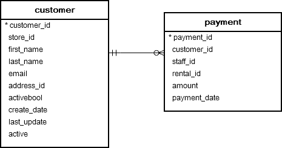
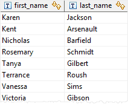
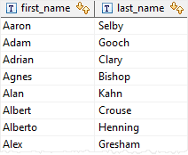
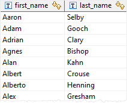

# EXISTS

Ushbu qo'llanmada siz quyi so'rovda qatorlar mavjudligini tekshirish uchun PostgreSQL `EXISTS` operatoridan qanday foydalanishni o'rganasiz.

`EXISTS` operatori mantiqiy operator bo'lib, quyi so'rovda qatorlar mavjudligini tekshiradi. \
Quyida `EXISTS` operatorining sintaksisi tasvirlangan:

```sql
EXISTS (subquery)
```

`EXISTS` quyi so'rov bo'lgan argumentni qabul qiladi.

Agar quyi so'rov kamida bitta qatorni qaytarsa, `EXISTS` natijasi to'g'ri bo'ladi. Agar quyi so'rov hech qanday qatorni qaytarmasa, `EXISTS` natijasi noto'g'ri bo'ladi.

`EXISTS` operatori ko'pincha o'zaro bog'liq pastki so'rov bilan ishlatiladi.

`EXISTS` operatorining natijasi satr tarkibiga emas, balki quyi so'rov tomonidan qaytarilgan qatorga bog'liq. Shuning uchun pastki so'rovning `SELECT` bandida paydo bo'ladigan ustunlar muhim emas.

Shu sababli, umumiy kodlash konventsiyasi `EXISTS` ni quyidagi shaklda yozishdir:

```sql
SELECT 
    column1
FROM 
    table_1
WHERE 
    EXISTS( SELECT 
                1 
            FROM 
                table_2 
            WHERE 
                column_2 = table_1.column_1);
```

E'tibor bering, agar quyi so'rov `NULL`ni qaytarsa, `EXISTS` natijasi haqiqatdir.

## PostgreSQL EXISTS misollari

Namoyish uchun [namunaviy](https://www.postgresqltutorial.com/wp-content/uploads/2019/05/dvdrental.zip) ma'lumotlar bazasida quyidagi `customer` va `payment` jadvallaridan foydalanamiz:



### A. Miqdori 11 dan ortiq bo'lgan kamida bitta to'lovga ega bo'lgan mijozlarni toping.

Quyidagi bayonot kamida bitta ijara haqini 11 dan ortiq miqdorda to'lagan mijozlarni qaytaradi:

```sql
SELECT first_name,
       last_name
FROM customer c
WHERE EXISTS
    (SELECT 1
     FROM payment p
     WHERE p.customer_id = c.customer_id
       AND amount > 11 )
ORDER BY first_name,
         last_name;
```

So'rov quyidagi natijani qaytaradi:



Ushbu misolda, `customer` jadvalidagi har bir mijoz uchun quyi soʻrov ushbu mijoz kamida bitta toʻlovni amalga oshirganligini (`p.customer_id = c.customer_id`) va summa 11 dan (`amount > 11`) katta ekanligini aniqlash uchun `payment` jadvalini tekshiradi.

### B. MAVJUD EMAS misol

`NOT` operatori EXISTS operatorining natijasini inkor etadi. `NOT EXISTS` `EXISTS` ga qarama-qarshidir. Bu shuni anglatadiki, agar quyi so'rov hech qanday qatorni qaytarmasa, `NOT EXISTS` haqiqatni qaytaradi.

Quyidagi misol mijozlar 11 dan ortiq to'lovni amalga oshirmaganligini ko'rsatadi.

```sql
SELECT first_name,
       last_name
FROM customer c
WHERE NOT EXISTS
    (SELECT 1
     FROM payment p
     WHERE p.customer_id = c.customer_id
       AND amount > 11 )
ORDER BY first_name,
         last_name;
```

Mana natija:



### C. `EXISTS` and `NULL`

Agar quyi so'rov `NULL` qiymatini qaytarsa, `EXISTS` rostni qaytaradi. Quyidagi misolga qarang:

```sql
SELECT
	first_name,
	last_name
FROM
	customer
WHERE
	EXISTS( SELECT NULL )
ORDER BY
	first_name,
	last_name;
```

Ushbu misolda quyi so'rov `NULL` qiymatini qaytardi, shuning uchun so'rov mijoz jadvalidagi barcha qatorlarni qaytardi.



Ushbu qo'llanmada siz quyi so'rovda qatorlar mavjudligini tekshirish uchun PostgreSQL `EXISTS` dan qanday foydalanishni o'rgandingiz.

@ [postgresqltutorial.com](https://www.postgresqltutorial.com/postgresql-tutorial/postgresql-exists/)