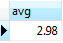
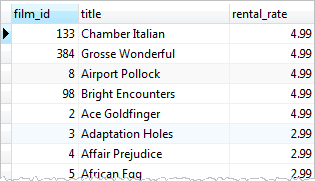
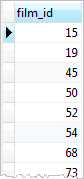
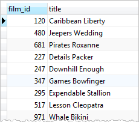
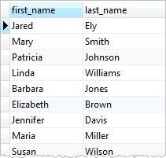

# Subquery

Ushbu qo'llanmada siz murakkab so'rovlarni yaratishga imkon beruvchi PostgreSQL `Subquery` dan qanday foydalanishni o'rganasiz.

Oddiy misol bilan boshlaylik.

Aytaylik, biz ijara stavkasi o'rtacha ijara stavkasidan yuqori bo'lgan filmlarni topmoqchimiz. Buni ikki bosqichda qilishimiz mumkin:

* `SELECT` bayonoti va oʻrtacha funksiyasidan (`AVG`) foydalanib, oʻrtacha ijara stavkasini toping.
* Biz xohlagan filmlarni topish uchun ikkinchi `SELECT` iborasidagi birinchi so'rov natijasidan foydalaning.

Quyidagi so'rov o'rtacha ijara stavkasini oladi:

```sql
SELECT
	AVG (rental_rate)
FROM
	film;
```



O'rtacha ijara stavkasi 2,98

Endi biz ijara stavkasi o'rtacha ijara stavkasidan yuqori bo'lgan filmlarni olishimiz mumkin:

```sql
SELECT
	film_id,
	title,
	rental_rate
FROM
	film
WHERE
	rental_rate > 2.98;
```



Kod juda oqlangan emas, bu ikki bosqichni talab qiladi. Biz birinchi so'rov natijasini bitta so'rovda ikkinchi so'rovga o'tkazish usulini xohlaymiz. Yechim pastki so'rovdan foydalanishdir.

Quyi soʻrov bu `SELECT`, `INSERT`, `DELETE` va `UPDATE` kabi boshqa soʻrovlar ichiga joylashtirilgan soʻrovdir. Ushbu qo'llanmada biz faqat `SELECT` iborasiga e'tibor qaratamiz.

Quyi so'rovni yaratish uchun biz ikkinchi so'rovni qavs ichiga qo'yamiz va uni `WHERE` bandida ifoda sifatida ishlatamiz:

```sql
SELECT
	film_id,
	title,
	rental_rate
FROM
	film
WHERE
	rental_rate > (
		SELECT
			AVG (rental_rate)
		FROM
			film
	);
```

Qavslar ichidagi so'rov quyi so'rov yoki ichki so'rov deb ataladi. Pastki so'rovni o'z ichiga olgan so'rov tashqi so'rov sifatida tanilgan.

PostgreSQL quyi so'rovni o'z ichiga olgan so'rovni quyidagi ketma-ketlikda bajaradi:

* Birinchidan, pastki so'rovni bajaradi.
* Ikkinchidan, natijani oladi va uni tashqi so'rovga o'tkazadi.
* Uchinchidan, tashqi so'rovni bajaradi.

## `IN` operatori bilan PostgreSQL `subquery`

Quyi so'rov nol yoki undan ko'p qatorlarni qaytarishi mumkin. Ushbu kichik so'rovdan foydalanish uchun siz `WHERE` bandidagi `IN` operatoridan foydalanasiz.

Masalan, qaytarilgan sanasi `2005-05-29` va `2005-05-30` orasida bo'lgan filmlarni olish uchun quyidagi so'rovdan foydalanasiz:

```sql
SELECT
	inventory.film_id
FROM
	rental
INNER JOIN inventory ON inventory.inventory_id = rental.inventory_id
WHERE
	return_date BETWEEN '2005-05-29'
AND '2005-05-30';
```



U bir nechta qatorlarni qaytaradi, shuning uchun biz ushbu so'rovni so'rovning `WHERE` bandida quyi so'rov sifatida ishlatishimiz mumkin:

```sql
SELECT
	film_id,
	title
FROM
	film
WHERE
	film_id IN (
		SELECT
			inventory.film_id
		FROM
			rental
		INNER JOIN inventory ON inventory.inventory_id = rental.inventory_id
		WHERE
			return_date BETWEEN '2005-05-29'
		AND '2005-05-30'
	);
```



## EXISTS operatori bilan PostgreSQL quyi so'rovi

Quyidagi ifoda `EXISTS` operatori bilan quyi so'rovdan qanday foydalanishni ko'rsatadi:

```sql
EXISTS subquery
```

Quyi so'rov `EXISTS` operatorining kirishi bo'lishi mumkin. Agar quyi so'rov istalgan qatorni qaytarsa, `EXISTS` operatori rostni qaytaradi. Agar quyi so'rov hech qanday qatorni qaytarmasa, `EXISTS` operatorining natijasi noto'g'ri bo'ladi.

`EXISTS` operatori faqat quyi so'rovdan qaytarilgan qatorlar soniga e'tibor beradi, qatorlar mazmuni emas, shuning uchun `EXISTS` operatorining umumiy kodlash konventsiyasi quyidagicha:

```sql
EXISTS (SELECT 1 FROM tbl WHERE condition);
```

Quyidagi so'rovga qarang:

```sql
SELECT
	first_name,
	last_name
FROM
	customer
WHERE
	EXISTS (
		SELECT
			1
		FROM
			payment
		WHERE
			payment.customer_id = customer.customer_id
	);
```



So'rov `customer_id` ustunidagi ichki birlashma kabi ishlaydi. Biroq, `payment` jadvalida mos keladigan qatorlar mavjud bo'lsa ham, `customer` jadvalidagi har bir satr uchun ko'pi bilan bitta qatorni qaytaradi.

Ushbu qo'llanmada siz PostgreSQL `subquery`dan murakkab so'rovlarni yaratish uchun qanday foydalanishni o'rgandingiz.