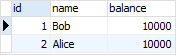
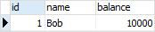
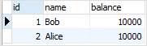
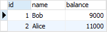
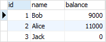

# PostgreSQL Transactions

Uxshbu qo'llanmada siz `BEGIN`, `COMMIT` va `ROLLBACK` iboralari yordamida PostgreSQL tranzaktsiyalarini qanday boshqarishni o'rganasiz

## Ma'lumotlar bazasi tranzaksiyasi nima

Ma'lumotlar bazasi tranzaksiyasi - bu bir yoki bir nechta operatsiyalardan iborat yagona ish birligi.

Tranzaktsiyaning klassik misoli - bu bir hisobdan ikkinchisiga bank o'tkazmasi. To'liq operatsiya jo'natuvchi va oluvchi hisoblari o'rtasidagi muvozanatni ta'minlashi kerak. Bu shuni anglatadiki, agar jo'natuvchi hisob `X` miqdorini o'tkazsa, oluvchi `X` miqdorini oladi, ko'p yoki kam emas.

PostgreSQL tranzaksiyasi atomik, izchil, izolyatsiyalangan va bardoshlidir. Ushbu xususiyatlar odatda `ACID` deb ataladi:

* Atomlik tranzaktsiyaning hamma yoki hech narsa usulida bajarilishini kafolatlaydi.

* Muvofiqlik ma'lumotlar bazasiga yozilgan ma'lumotlarning o'zgarishi haqiqiy bo'lishi va oldindan belgilangan qoidalarga rioya qilinishini ta'minlaydi. 

* Izolyatsiya tranzaksiya yaxlitligi boshqa tranzaktsiyalarga qanday ko'rinishini aniqlaydi.

* Chidamlilik amalga oshirilgan tranzaktsiyalar ma'lumotlar bazasida doimiy saqlanishini ta'minlaydi.

## Namuna jadvalini o'rnatish

Namoyish uchun hisoblar nomli yangi jadval yaratamiz:

```sql
DROP TABLE IF EXISTS accounts;

CREATE TABLE accounts (
    id INT GENERATED BY DEFAULT AS IDENTITY,
    name VARCHAR(100) NOT NULL,
    balance DEC(15,2) NOT NULL,
    PRIMARY KEY(id)
);
```

## Tranzaktsiyani boshlang

Quyidagi `INSERT` iborasini bajarganingizda:

```sql
INSERT INTO accounts(name,balance)
VALUES('Bob',10000);
```

PostgreSQL darhol `accounts` jadvaliga yangi qatorni kiritdi. Bunday holda, siz tranzaksiya qachon boshlanishini bilmaysiz va uni orqaga qaytarish kabi modifikatsiyani ushlab turolmaysiz.

Tranzaktsiyani boshlash uchun siz quyidagi bayonotdan foydalanasiz:

```sql
BEGIN TRANSACTION;
```

yoki

```sql
BEGIN WORK;
```

yoki shunchaki:

```sql
BEGIN;
```

Masalan, quyidagi bayonotlar yangi operatsiyani boshlaydi va `accounts` jadvaliga yangi hisobni kiritadi:

```sql
BEGIN;

INSERT INTO accounts(name,balance)
VALUES('Alice',10000);
Code language: SQL (Structured Query Language) (sql)
```

Joriy seansdan `accounts` jadvalini so'rash orqali o'zgarishlarni ko'rishingiz mumkin:

```sql
SELECT 
    id,
    name,
    balance
FROM 
    accounts;
```



Biroq, agar siz yangi seansni boshlasangiz va yuqoridagi so'rovni bajarsangiz, o'zgarishni ko'rmaysiz.

```sql
SELECT 
    id,
    name,
    balance
FROM 
    accounts;
```



## Tranzaktsiyani amalga oshiring

O'zgartirish boshqa seanslarga (yoki foydalanuvchilarga) ko'rinadigan bo'lishi uchun siz `COMMIT WORK` bayonotidan foydalanib tranzaktsiyani amalga oshirishingiz kerak:

```sql
COMMIT WORK;
```

yoki

```sql
COMMIT TRANSACTION;
```

yoki oddiygina:

```sql
COMMIT;
```

Quyidagi `COMMIT` bayonoti Elisning hisobini `accounts` jadvaliga kiritadi:

```sql
COMMIT;
```

Boshqa seanslardan `accounts` jadvalini so'rash orqali o'zgarishlarni ko'rishingiz mumkin:

```sql
SELECT 
    id,
    name,
    balance
FROM 
    accounts;
```


`COMMIT` bayonotini bajargandan so'ng, PostgreSQL, shuningdek, agar buzilish sodir bo'lsa, o'zgarish bardoshli bo'lishini kafolatlaydi.


Hammasini bir joyga qo'ying.

```sql
-- start a transaction
BEGIN;

-- insert a new row into the accounts table
INSERT INTO accounts(name,balance)
VALUES('Alice',10000);

-- commit the change (or roll it back later)
COMMIT;
```

## PostgreSQL `COMMIT`: Bank hisobini o'tkazish misoli

Ushbu namoyishda biz sizga `1000 USD` ni Bobning hisobidan Elisning hisobiga qanday o'tkazishni ko'rsatamiz. Har bir operatsiyaning o'zgarishini ko'rish uchun ikkita seansdan foydalanamiz.

Birinchi seansda yangi tranzaksiyani boshlang:

```sql
BEGIN;
```

va 1 identifikatorli Bobning hisobidan `1000 USD` ayirish:

```sql
UPDATE accounts 
SET balance = balance - 1000
WHERE id = 1;
```

Ikkinchi seansda ikkala hisobning balansini tekshiring:

```sql
SELECT 
    id,
    name,
    balance
FROM 
    accounts;
```

Chiqish:



Ko'rib turganingizdek, o'zgarish boshqa seanslarda ko'rinmaydi.

Keyin Elisning hisobiga bir xil miqdorni (1000USD) qo'shing:

```sql
UPDATE accounts
SET balance = balance + 1000
WHERE id = 2; 
```

Bu oʻzgarish biz amalga oshirmagunimizcha ikkinchi seansda ham koʻrinmaydi:

```sql
COMMIT;
```

Endi siz istalgan seansdagi o'zgarishlarni ko'rishingiz mumkin:

```sql
SELECT 
    id,
    name,
    balance
FROM 
    accounts;
```



Hammasini bir joyga qo'ying.

```sql
-- start a transaction
BEGIN;

-- deduct 1000 from account 1
UPDATE accounts 
SET balance = balance - 1000
WHERE id = 1;

-- add 1000 to account 2
UPDATE accounts
SET balance = balance + 1000
WHERE id = 2; 

-- select the data from accounts
SELECT id, name, balance
FROM accounts;

-- commit the transaction
COMMIT;
```

## Tranzaksiyani orqaga qaytarish

Joriy tranzaktsiyani orqaga qaytarish yoki o'zgartirishni bekor qilish uchun siz quyidagi bayonotlardan birini ishlatasiz:

```sql
ROLLBACK WORK;
```

yoki

```sql
ROLLBACK TRANSACTION;
```

yoki qisqasi:

```sql
ROLLBACK;
```

Aytaylik, siz Bobning hisobidan Elisning hisobiga 1500 dollar o'tkazmoqchisiz. Biroq, siz tasodifan Elisning o'rniga Jekning hisobiga pul yuborasiz. Va siz butun tranzaksiyani qaytarib olishni xohlaysiz.

Birinchidan, hisoblar jadvaliga Jekning hisobini qo'shing:

```sql
INSERT INTO accounts(name, balance)
VALUES('Jack',0);
```

Keyin, Bobning hisobidan miqdorni olib tashlang:

```sql
BEGIN;

UPDATE accounts 
SET balance = balance - 1500
WHERE id = 1;
```

Keyin, xuddi shu miqdorni Elisning hisobiga qo'shing:

```sql
UPDATE accounts
SET balance = balance + 1500
WHERE id = 3; 
```

Biroq, Elisning akkauntida id 2 bor. Demak, bu xato edi.

O'zgartirishni bekor qilish uchun siz `ROLLBACK` iborasini bajarasiz:

```sql
ROLLBACK;
```

Nihoyat, barcha hisoblarning qoldiqlarini tekshiring:

```sql
SELECT 
    id,
    name,
    balance
FROM 
    accounts;
```



Chiqarishda aniq ko'rinib turganidek, hisobdagi qoldiqlar tranzaksiyadan oldingi holatda bo'lgani kabi qoladi.

Hammasini qattiqroq qo'ying.

```sql
-- begin the transaction
BEGIN;

-- deduct the amount from the account 1
UPDATE accounts 
SET balance = balance - 1500
WHERE id = 1;

-- add the amount from the account 3 (instead of 2)
UPDATE accounts
SET balance = balance + 1500
WHERE id = 3; 

-- roll back the transaction
ROLLBACK;
```

Ushbu qo'llanmada siz `BEGIN`, `COMMIT` va `ROLLBACK` iboralari orqali PostgreSQL tranzaksiyalarini qanday boshqarishni o'rgandingiz.

© [postgresqltutorial.com](https://www.postgresqltutorial.com/postgresql-tutorial/postgresql-transaction/)